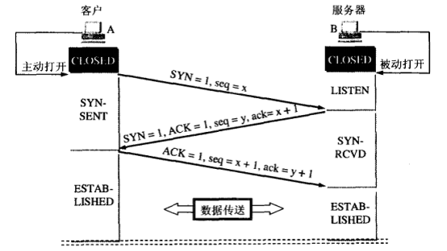
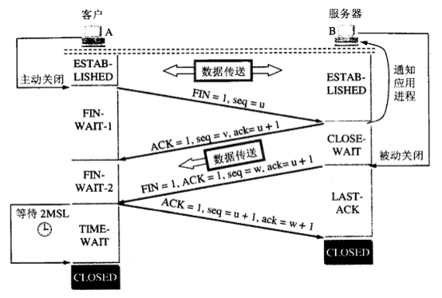

<!-- markdown-toc start - Don't edit this section. Run M-x markdown-toc-generate-toc again -->
**Table of Contents**

- [Python语言特性](#python语言特性)
    - [1 Python的函数参数传递](#1-python的函数参数传递)
    - [2 Python中的元类(metaclass)](#2-python中的元类metaclass)
    - [3 @staticmethod和@classmethod](#3-staticmethod和classmethod)
    - [4 类变量和实例变量](#4-类变量和实例变量)
    - [5 Python自省](#5-python自省)
    - [6 字典推导式](#6-字典推导式)
    - [7 Python中单下划线和双下划线](#7-python中单下划线和双下划线)
    - [8 字符串格式化:%和.format](#8-字符串格式化和format)
    - [9 迭代器和生成器](#9-迭代器和生成器)
    - [10 `*args` and `**kwargs`](#10-args-and-kwargs)
    - [11 面向切面编程AOP和装饰器](#11-面向切面编程aop和装饰器)
    - [12 鸭子类型](#12-鸭子类型)
    - [13 Python中重载](#13-python中重载)
    - [14 新式类和旧式类](#14-新式类和旧式类)
    - [15 `__new__`和`__init__`的区别](#15-__new__和__init__的区别)
    - [16 单例模式](#16-单例模式)
        - [1 使用`__new__`方法](#1-使用__new__方法)
        - [2 共享属性](#2-共享属性)
        - [3 装饰器版本](#3-装饰器版本)
        - [4 import方法](#4-import方法)
    - [17 Python中的作用域](#17-python中的作用域)
    - [18 GIL线程全局锁](#18-gil线程全局锁)
    - [19 协程](#19-协程)
    - [20 闭包](#20-闭包)
    - [21 lambda函数](#21-lambda函数)
    - [22 Python函数式编程](#22-python函数式编程)
    - [23 Python里的拷贝](#23-python里的拷贝)
    - [24 Python垃圾回收机制](#24-python垃圾回收机制)
        - [1 引用计数](#1-引用计数)
        - [2 标记-清除机制](#2-标记-清除机制)
        - [3 分代技术](#3-分代技术)
    - [25 Python的List](#25-python的list)
    - [26 Python的is](#26-python的is)
    - [27 read,readline和readlines](#27-readreadline和readlines)
    - [28 Python2和3的区别](#28-python2和3的区别)
    - [29 super.`__init__`()](#29-super-init)
    - [30 range-and-xrange](#30-range-and-xrange)
- [操作系统](#操作系统)
    - [1 select,poll和epoll](#1-selectpoll和epoll)
    - [2 调度算法](#2-调度算法)
    - [3 死锁](#3-死锁)
    - [4 程序编译与链接](#4-程序编译与链接)
        - [1 预处理](#1-预处理)
        - [2 编译](#2-编译)
        - [3 汇编](#3-汇编)
        - [4 链接](#4-链接)
    - [5 静态链接和动态链接](#5-静态链接和动态链接)
    - [6 虚拟内存技术](#6-虚拟内存技术)
    - [7 分页和分段](#7-分页和分段)
        - [分页与分段的主要区别](#分页与分段的主要区别)
    - [8 页面置换算法](#8-页面置换算法)
    - [9 边沿触发和水平触发](#9-边沿触发和水平触发)
- [数据库](#数据库)
    - [1 事务](#1-事务)
    - [2 数据库索引](#2-数据库索引)
    - [3 Redis原理](#3-redis原理)
    - [4 乐观锁和悲观锁](#4-乐观锁和悲观锁)
    - [5 MVCC](#5-mvcc)
    - [6 MyISAM和InnoDB](#6-myisam和innodb)
- [网络](#网络)
    - [1 三次握手](#1-三次握手)
    - [2 四次挥手](#2-四次挥手)
    - [3 ARP协议](#3-arp协议)
    - [4 urllib和urllib2的区别](#4-urllib和urllib2的区别)
    - [5 Post和Get](#5-post和get)
    - [6 Cookie和Session](#6-cookie和session)
    - [7 apache和nginx的区别](#7-apache和nginx的区别)
    - [8 网站用户密码保存](#8-网站用户密码保存)
    - [9 HTTP和HTTPS](#9-http和https)
    - [10 XSRF和XSS](#10-xsrf和xss)
    - [11 幂等 Idempotence](#11-幂等-idempotence)
    - [12 RESTful架构(SOAP,RPC)](#12-restful架构soaprpc)
    - [13 SOAP](#13-soap)
    - [14 RPC](#14-rpc)
    - [15 CGI和WSGI](#15-cgi和wsgi)
    - [16 中间人攻击](#16-中间人攻击)
    - [17 c10k问题](#17-c10k问题)
    - [18 socket](#18-socket)
    - [19 浏览器缓存](#19-浏览器缓存)
    - [20 HTTP1.0和HTTP1.1](#20-http10和http11)
    - [21 Ajax](#21-ajax)
- [*NIX](#nix)
    - [unix进程间通信方式(IPC)](#unixipc)
- [数据结构](#数据结构)
    - [1 红黑树](#1-红黑树)
- [编程题](#编程题)
    - [1 台阶问题/斐波纳挈](#1-台阶问题斐波纳挈)
    - [2 变态台阶问题](#2-变态台阶问题)
    - [3 矩形覆盖](#3-矩形覆盖)
    - [4 杨氏矩阵查找](#4-杨氏矩阵查找)
    - [5 去除列表中的重复元素](#5-去除列表中的重复元素)
    - [6 链表成对调换](#6-链表成对调换)
    - [7 创建字典的方法](#7-创建字典的方法)
        - [1 直接创建](#1-直接创建)
        - [2 工厂方法](#2-工厂方法)
        - [3 fromkeys()方法](#3-fromkeys方法)
    - [8 合并两个有序列表](#8-合并两个有序列表)
    - [9 交叉链表求交点](#9-交叉链表求交点)
    - [10 二分查找](#10-二分查找)
    - [11 快排](#11-快排)
    - [12 找零问题](#12-找零问题)
    - [13 广度遍历和深度遍历二叉树](#13-广度遍历和深度遍历二叉树)
    - [14 二叉树节点](#14-)
    - [15 层次遍历](#15-)
    - [16 深度遍历](#16-)
    - [17 前中后序遍历](#17-前中后序遍历)
    - [18 求最大树深](#18-求最大树深)
    - [19 求两棵树是否相同](#19-求两棵树是否相同)
    - [20 前序中序求后序](#20-前序中序求后序)
    - [21 单链表逆置](#21-单链表逆置)
    - [22 两个字符串是否是变位词](#22-两个字符串是否是变位词)
<!-- markdown-toc end -->

# Python语言特性

## 1 Python的函数参数传递

看两个例子:

```python
a = 1
def fun(a):
    a = 2
fun(a)
print a  # 1
```

```python
a = []
def fun(a):
    a.append(1)
fun(a)
print a  # [1]
```

所有的变量都可以理解是内存中一个对象的“引用”，或者，也可以看似c中void*的感觉。

通过`id`来看引用`a`的内存地址可以比较理解：

```python
a = 1
def fun(a):
    print "func_in",id(a)   # func_in 41322472
    a = 2
    print "re-point",id(a), id(2)   # re-point 41322448 41322448
print "func_out",id(a), id(1)  # func_out 41322472 41322472
fun(a)
print a  # 1
```

注：具体的值在不同电脑上运行时可能不同。

可以看到，在执行完`a = 2`之后，`a`引用中保存的值，即内存地址发生变化，由原来`1`对象的所在的地址变成了`2`这个实体对象的内存地址。

而第2个例子`a`引用保存的内存值就不会发生变化：

```python
a = []
def fun(a):
    print "func_in",id(a)  # func_in 53629256
    a.append(1)
print "func_out",id(a)     # func_out 53629256
fun(a)
print a  # [1]
```

这里记住的是类型是属于对象的，而不是变量。而对象有两种,“可更改”（mutable）与“不可更改”（immutable）对象。在python中，strings, tuples, 和numbers是不可更改的对象，而list,dict等则是可以修改的对象。(这就是这个问题的重点)

当一个引用传递给函数的时候,函数自动复制一份引用,这个函数里的引用和外边的引用没有半毛关系了.所以第一个例子里函数把引用指向了一个不可变对象,当函数返回的时候,外面的引用没半毛感觉.而第二个例子就不一样了,函数内的引用指向的是可变对象,对它的操作就和定位了指针地址一样,在内存里进行修改.

如果还不明白的话,这里有更好的解释: http://stackoverflow.com/questions/986006/how-do-i-pass-a-variable-by-reference

## 2 Python中的元类(metaclass)

这个非常的不常用,但是像ORM这种复杂的结构还是会需要的,详情请看:http://stackoverflow.com/questions/100003/what-is-a-metaclass-in-python

## 3 @staticmethod和@classmethod

Python其实有3个方法,即静态方法(staticmethod),类方法(classmethod)和实例方法,如下:

```python
def foo(x):
    print "executing foo(%s)"%(x)

class A(object):
    def foo(self,x):
        print "executing foo(%s,%s)"%(self,x)

    @classmethod
    def class_foo(cls,x):
        print "executing class_foo(%s,%s)"%(cls,x)

    @staticmethod
    def static_foo(x):
        print "executing static_foo(%s)"%x

a=A()

```

这里先理解下函数参数里面的self和cls.这个self和cls是对类或者实例的绑定,对于一般的函数来说我们可以这么调用`foo(x)`,这个函数就是最常用的,它的工作跟任何东西(类,实例)无关.对于实例方法,我们知道在类里每次定义方法的时候都需要绑定这个实例,就是`foo(self, x)`,为什么要这么做呢?因为实例方法的调用离不开实例,我们需要把实例自己传给函数,调用的时候是这样的`a.foo(x)`(其实是`foo(a, x)`).类方法一样,只不过它传递的是类而不是实例,`A.class_foo(x)`.注意这里的self和cls可以替换别的参数,但是python的约定是这俩,还是不要改的好.

对于静态方法其实和普通的方法一样,不需要对谁进行绑定,唯一的区别是调用的时候需要使用`a.static_foo(x)`或者`A.static_foo(x)`来调用.

|\\|实例方法|类方法|静态方法|
|:--|:--|:--|:--|
|a = A()|a.foo(x)|a.class_foo(x)|a.static_foo(x)|
|A|不可用|A.class_foo(x)|A.static_foo(x)|

更多关于这个问题:http://stackoverflow.com/questions/136097/what-is-the-difference-between-staticmethod-and-classmethod-in-python

## 4 类变量和实例变量

```python
class Person:
    name="aaa"

p1=Person()
p2=Person()
p1.name="bbb"
print p1.name  # bbb
print p2.name  # aaa
print Person.name  # aaa
```

类变量就是供类使用的变量,实例变量就是供实例使用的.

这里`p1.name="bbb"`是实例调用了类变量,这其实和上面第一个问题一样,就是函数传参的问题,`p1.name`一开始是指向的类变量`name="aaa"`,但是在实例的作用域里把类变量的引用改变了,就变成了一个实例变量,self.name不再引用Person的类变量name了.

可以看看下面的例子:

```python
class Person:
    name=[]

p1=Person()
p2=Person()
p1.name.append(1)
print p1.name  # [1]
print p2.name  # [1]
print Person.name  # [1]
```

参考:http://stackoverflow.com/questions/6470428/catch-multiple-exceptions-in-one-line-except-block

## 5 Python自省

这个也是python彪悍的特性.

自省就是面向对象的语言所写的程序在运行时,所能知道对象的类型.简单一句就是运行时能够获得对象的类型.比如type(),dir(),getattr(),hasattr(),isinstance().

## 6 字典推导式

可能你见过列表推导时,却没有见过字典推导式,在2.7中才加入的:

```python
d = {key: value for (key, value) in iterable}
```

## 7 Python中单下划线和双下划线

```python
>>> class MyClass():
...     def __init__(self):
...             self.__superprivate = "Hello"
...             self._semiprivate = ", world!"
...
>>> mc = MyClass()
>>> print mc.__superprivate
Traceback (most recent call last):
  File "<stdin>", line 1, in <module>
AttributeError: myClass instance has no attribute '__superprivate'
>>> print mc._semiprivate
, world!
>>> print mc.__dict__
{'_MyClass__superprivate': 'Hello', '_semiprivate': ', world!'}
```

`__foo__`:一种约定,Python内部的名字,用来区别其他用户自定义的命名,以防冲突.

`_foo`:一种约定,用来指定变量私有.程序员用来指定私有变量的一种方式.

`__foo`:这个有真正的意义:解析器用`_classname__foo`来代替这个名字,以区别和其他类相同的命名.

详情见:http://stackoverflow.com/questions/1301346/the-meaning-of-a-single-and-a-double-underscore-before-an-object-name-in-python

或者: http://www.zhihu.com/question/19754941

## 8 字符串格式化:%和.format

.format在许多方面看起来更便利.对于`%`最烦人的是它无法同时传递一个变量和元组.你可能会想下面的代码不会有什么问题:

```
"hi there %s" % name
```

但是,如果name恰好是(1,2,3),它将会抛出一个TypeError异常.为了保证它总是正确的,你必须这样做:

```
"hi there %s" % (name,)   # 提供一个单元素的数组而不是一个参数
```

但是有点丑..format就没有这些问题.你给的第二个问题也是这样,.format好看多了.

你为什么不用它?

* 不知道它(在读这个之前)
* 为了和Python2.5兼容(譬如logging库建议使用`%`([issue #4](https://github.com/taizilongxu/interview_python/issues/4)))

http://stackoverflow.com/questions/5082452/python-string-formatting-vs-format

## 9 迭代器和生成器

[聊聊 Python 中生成器和协程那点事儿](http://manjusaka.itscoder.com/2016/09/11/something-about-yield-in-python/)

这个是stackoverflow里python排名第一的问题,值得一看: http://stackoverflow.com/questions/231767/what-does-the-yield-keyword-do-in-python

这是中文版: http://taizilongxu.gitbooks.io/stackoverflow-about-python/content/1/README.html

## 10 `*args` and `**kwargs`

用`*args`和`**kwargs`只是为了方便并没有强制使用它们.

如果我们不确定要往函数中传入多少个参数，或者我们想往函数中以列表和元组的形式传参数时，那就使要用`*args`；

如果我们不知道要往函数中传入多少个关键词参数，或者想传入字典的值作为关键词参数时，那就要使用`**kwargs`；

当你不确定你的函数里将要传递多少参数时你可以用`*args`.例如,它可以传递任意数量的参数:

```python
>>> def print_everything(*args):
        for count, thing in enumerate(args):
...         print '{0}. {1}'.format(count, thing)
...
>>> print_everything('apple', 'banana', 'cabbage')
0. apple
1. banana
2. cabbage
```

相似的,`**kwargs`允许你使用没有事先定义的参数名:

```python
>>> def table_things(**kwargs):
...     for name, value in kwargs.items():
...         print '{0} = {1}'.format(name, value)
...
>>> table_things(apple = 'fruit', cabbage = 'vegetable')
cabbage = vegetable
apple = fruit
```

你也可以混着用.命名参数首先获得参数值然后所有的其他参数都传递给`*args`和`**kwargs`.命名参数在列表的最前端.例如:

```
def table_things(titlestring, **kwargs)
```

`*args`和`**kwargs`可以同时在函数的定义中,但是`*args`必须在`**kwargs`前面.

当调用函数时你也可以用`*`和`**`语法.例如:

```python
>>> def print_three_things(a, b, c):
...     print 'a = {0}, b = {1}, c = {2}'.format(a,b,c)
...
>>> mylist = ['aardvark', 'baboon', 'cat']
>>> print_three_things(*mylist)

a = aardvark, b = baboon, c = cat
```

就像你看到的一样,它可以传递列表(或者元组)的每一项并把它们解包.注意必须与它们在函数里的参数相吻合.当然,你也可以在函数定义或者函数调用时用*.

http://stackoverflow.com/questions/3394835/args-and-kwargs

## 11 面向切面编程AOP和装饰器

这个AOP一听起来有点懵,同学面阿里的时候就被问懵了...

装饰器是一个很著名的设计模式，经常被用于有切面需求的场景，较为经典的有插入日志、性能测试、事务处理等。装饰器是解决这类问题的绝佳设计，有了装饰器，我们就可以抽离出大量函数中与函数功能本身无关的雷同代码并继续重用。概括的讲，**装饰器的作用就是为已经存在的对象添加额外的功能。**

这个问题比较大,推荐: http://stackoverflow.com/questions/739654/how-can-i-make-a-chain-of-function-decorators-in-python

中文: http://taizilongxu.gitbooks.io/stackoverflow-about-python/content/3/README.html

## 12 鸭子类型

“当看到一只鸟走起来像鸭子、游泳起来像鸭子、叫起来也像鸭子，那么这只鸟就可以被称为鸭子。”

我们并不关心对象是什么类型，到底是不是鸭子，只关心行为。

比如在python中，有很多file-like的东西，比如StringIO,GzipFile,socket。它们有很多相同的方法，我们把它们当作文件使用。

又比如list.extend()方法中,我们并不关心它的参数是不是list,只要它是可迭代的,所以它的参数可以是list/tuple/dict/字符串/生成器等.

鸭子类型在动态语言中经常使用，非常灵活，使得python不想java那样专门去弄一大堆的设计模式。

## 13 Python中重载

引自知乎:http://www.zhihu.com/question/20053359

函数重载主要是为了解决两个问题。

1. 可变参数类型。
2. 可变参数个数。

另外，一个基本的设计原则是，仅仅当两个函数除了参数类型和参数个数不同以外，其功能是完全相同的，此时才使用函数重载，如果两个函数的功能其实不同，那么不应当使用重载，而应当使用一个名字不同的函数。

好吧，那么对于情况 1 ，函数功能相同，但是参数类型不同，python 如何处理？答案是根本不需要处理，因为 python 可以接受任何类型的参数，如果函数的功能相同，那么不同的参数类型在 python 中很可能是相同的代码，没有必要做成两个不同函数。

那么对于情况 2 ，函数功能相同，但参数个数不同，python 如何处理？大家知道，答案就是缺省参数。对那些缺少的参数设定为缺省参数即可解决问题。因为你假设函数功能相同，那么那些缺少的参数终归是需要用的。

好了，鉴于情况 1 跟 情况 2 都有了解决方案，python 自然就不需要函数重载了。

## 14 新式类和旧式类

这个面试官问了,我说了老半天,不知道他问的真正意图是什么.

[stackoverflow](http://stackoverflow.com/questions/54867/what-is-the-difference-between-old-style-and-new-style-classes-in-python)

这篇文章很好的介绍了新式类的特性: http://www.cnblogs.com/btchenguang/archive/2012/09/17/2689146.html

新式类很早在2.2就出现了,所以旧式类完全是兼容的问题,Python3里的类全部都是新式类.这里有一个MRO问题可以了解下(新式类是广度优先,旧式类是深度优先),<Python核心编程>里讲的也很多.

## 15 `__new__`和`__init__`的区别

这个`__new__`确实很少见到,先做了解吧.

1. `__new__`是一个静态方法,而`__init__`是一个实例方法.
2. `__new__`方法会返回一个创建的实例,而`__init__`什么都不返回.
3. 只有在`__new__`返回一个cls的实例时后面的`__init__`才能被调用.
3. 当创建一个新实例时调用`__new__`,初始化一个实例时用`__init__`.

[stackoverflow](http://stackoverflow.com/questions/674304/pythons-use-of-new-and-init)

ps: `__metaclass__`是创建类时起作用.所以我们可以分别使用`__metaclass__`,`__new__`和`__init__`来分别在类创建,实例创建和实例初始化的时候做一些小手脚.

## 16 单例模式

这个绝对常考啊.绝对要记住1~2个方法,当时面试官是让手写的.

### 1 使用`__new__`方法

```python
class Singleton(object):
    def __new__(cls, *args, **kw):
        if not hasattr(cls, '_instance'):
            orig = super(Singleton, cls)
            cls._instance = orig.__new__(cls, *args, **kw)
        return cls._instance

class MyClass(Singleton):
    a = 1
```

### 2 共享属性

创建实例时把所有实例的`__dict__`指向同一个字典,这样它们具有相同的属性和方法.

```python

class Borg(object):
    _state = {}
    def __new__(cls, *args, **kw):
        ob = super(Borg, cls).__new__(cls, *args, **kw)
        ob.__dict__ = cls._state
        return ob

class MyClass2(Borg):
    a = 1
```

### 3 装饰器版本


```python
def singleton(cls, *args, **kw):
    instances = {}
    def getinstance():
        if cls not in instances:
            instances[cls] = cls(*args, **kw)
        return instances[cls]
    return getinstance

@singleton
class MyClass:
  ...
```

### 4 import方法

作为python的模块是天然的单例模式

```python
# mysingleton.py
class My_Singleton(object):
    def foo(self):
        pass

my_singleton = My_Singleton()

# to use
from mysingleton import my_singleton

my_singleton.foo()

```

## 17 Python中的作用域

Python 中，一个变量的作用域总是由在代码中被赋值的地方所决定的。

当 Python 遇到一个变量的话他会按照这样的顺序进行搜索：

本地作用域（Local）→当前作用域被嵌入的本地作用域（Enclosing locals）→全局/模块作用域（Global）→内置作用域（Built-in）

## 18 GIL线程全局锁

线程全局锁(Global Interpreter Lock),即Python为了保证线程安全而采取的独立线程运行的限制,说白了就是一个核只能在同一时间运行一个线程.

见[Python 最难的问题](http://www.oschina.net/translate/pythons-hardest-problem)

解决办法就是多进程和下面的协程(协程也只是单CPU,但是能减小切换代价提升性能).

## 19 协程

知乎被问到了,呵呵哒,跪了

简单点说协程是进程和线程的升级版,进程和线程都面临着内核态和用户态的切换问题而耗费许多切换时间,而协程就是用户自己控制切换的时机,不再需要陷入系统的内核态.

Python里最常见的yield就是协程的思想!可以查看第九个问题.


## 20 闭包

闭包(closure)是函数式编程的重要的语法结构。闭包也是一种组织代码的结构，它同样提高了代码的可重复使用性。

当一个内嵌函数引用其外部作作用域的变量,我们就会得到一个闭包. 总结一下,创建一个闭包必须满足以下几点:

1. 必须有一个内嵌函数
2. 内嵌函数必须引用外部函数中的变量
3. 外部函数的返回值必须是内嵌函数

感觉闭包还是有难度的,几句话是说不明白的,还是查查相关资料.

重点是函数运行后并不会被撤销,就像16题的instance字典一样,当函数运行完后,instance并不被销毁,而是继续留在内存空间里.这个功能类似类里的类变量,只不过迁移到了函数上.

闭包就像个空心球一样,你知道外面和里面,但你不知道中间是什么样.

## 21 lambda函数

其实就是一个匿名函数,为什么叫lambda?因为和后面的函数式编程有关.

推荐: [知乎](http://www.zhihu.com/question/20125256)


## 22 Python函数式编程

这个需要适当的了解一下吧,毕竟函数式编程在Python中也做了引用.

推荐: [酷壳](http://coolshell.cn/articles/10822.html)

python中函数式编程支持:

filter 函数的功能相当于过滤器。调用一个布尔函数`bool_func`来迭代遍历每个seq中的元素；返回一个使`bool_seq`返回值为true的元素的序列。

```python
>>>a = [1,2,3,4,5,6,7]
>>>b = filter(lambda x: x > 5, a)
>>>print b
>>>[6,7]
```

map函数是对一个序列的每个项依次执行函数，下面是对一个序列每个项都乘以2：

```python
>>> a = map(lambda x:x*2,[1,2,3])
>>> list(a)
[2, 4, 6]
```

reduce函数是对一个序列的每个项迭代调用函数，下面是求3的阶乘：

```python
>>> reduce(lambda x,y:x*y,range(1,4))
6
```

## 23 Python里的拷贝

引用和copy(),deepcopy()的区别

```python
import copy
a = [1, 2, 3, 4, ['a', 'b']]  #原始对象

b = a  #赋值，传对象的引用
c = copy.copy(a)  #对象拷贝，浅拷贝
d = copy.deepcopy(a)  #对象拷贝，深拷贝

a.append(5)  #修改对象a
a[4].append('c')  #修改对象a中的['a', 'b']数组对象

print 'a = ', a
print 'b = ', b
print 'c = ', c
print 'd = ', d

输出结果：
a =  [1, 2, 3, 4, ['a', 'b', 'c'], 5]
b =  [1, 2, 3, 4, ['a', 'b', 'c'], 5]
c =  [1, 2, 3, 4, ['a', 'b', 'c']]
d =  [1, 2, 3, 4, ['a', 'b']]
```

## 24 Python垃圾回收机制

[详细资料] (http://www.jianshu.com/p/1e375fb40506)

Python GC主要使用引用计数（reference counting）来跟踪和回收垃圾。在引用计数的基础上，通过“标记-清除”（mark and sweep）解决容器对象可能产生的循环引用问题，通过“分代回收”（generation collection）以空间换时间的方法提高垃圾回收效率。

### 1 引用计数

PyObject是每个对象必有的内容，其中`ob_refcnt`就是做为引用计数。当一个对象有新的引用时，它的`ob_refcnt`就会增加，当引用它的对象被删除，它的`ob_refcnt`就会减少.引用计数为0时，该对象生命就结束了。

优点:

1. 简单
2. 实时性

缺点:

1. 维护引用计数消耗资源
2. 循环引用

### 2 标记-清除机制

基本思路是先按需分配，等到没有空闲内存的时候从寄存器和程序栈上的引用出发，遍历以对象为节点、以引用为边构成的图，把所有可以访问到的对象打上标记，然后清扫一遍内存空间，把所有没标记的对象释放。

### 3 分代技术

分代回收的整体思想是：将系统中的所有内存块根据其存活时间划分为不同的集合，每个集合就成为一个“代”，垃圾收集频率随着“代”的存活时间的增大而减小，存活时间通常利用经过几次垃圾回收来度量。

Python默认定义了三代对象集合，索引数越大，对象存活时间越长。

举例：
当某些内存块M经过了3次垃圾收集的清洗之后还存活时，我们就将内存块M划到一个集合A中去，而新分配的内存都划分到集合B中去。当垃圾收集开始工作时，大多数情况都只对集合B进行垃圾回收，而对集合A进行垃圾回收要隔相当长一段时间后才进行，这就使得垃圾收集机制需要处理的内存少了，效率自然就提高了。在这个过程中，集合B中的某些内存块由于存活时间长而会被转移到集合A中，当然，集合A中实际上也存在一些垃圾，这些垃圾的回收会因为这种分代的机制而被延迟。

## 25 Python的List

推荐: http://www.jianshu.com/p/J4U6rR

## 26 Python的is

is是对比地址,==是对比值

## 27 read,readline和readlines

* read        读取整个文件
* readline    读取下一行,使用生成器方法
* readlines   读取整个文件到一个迭代器以供我们遍历

## 28 Python2和3的区别
推荐：[Python 2.7.x 与 Python 3.x 的主要差异](http://chenqx.github.io/2014/11/10/Key-differences-between-Python-2-7-x-and-Python-3-x/)

## 29 super init
super() lets you avoid referring to the base class explicitly, which can be nice. But the main advantage comes with multiple inheritance, where all sorts of fun stuff can happen. See the standard docs on super if you haven't already.

Note that the syntax changed in Python 3.0: you can just say super().`__init__`() instead of super(ChildB, self).`__init__`() which IMO is quite a bit nicer.

http://stackoverflow.com/questions/576169/understanding-python-super-with-init-methods

## 30 range and xrange
都在循环时使用，xrange内存性能更好。
for i in range(0, 20):
for i in xrange(0, 20):
What is the difference between range and xrange functions in Python 2.X?
 range creates a list, so if you do range(1, 10000000) it creates a list in memory with 9999999 elements.
 xrange is a sequence object that evaluates lazily.

http://stackoverflow.com/questions/94935/what-is-the-difference-between-range-and-xrange-functions-in-python-2-x

## 31 到底什么是Python？你可以在回答中与其他技术进行对比（也鼓励这样做）。

答案

下面是一些关键点：

1. Python是一种解释型语言。这就是说，与C语言和C的衍生语言不同，Python代码在运行之前不需要编译。其他解释型语言还包括PHP和Ruby。
2. Python是动态类型语言，指的是你在声明变量时，不需要说明变量的类型。你可以直接编写类似`x=111`和`x="I'm a string"`这样的代码，程序不会报错。
3. Python非常适合面向对象的编程（OOP），因为它支持通过组合（composition）与继承（inheritance）的方式定义类（class）。Python中没有访问说明符（access specifier，类似C++中的`public`和`private`），这么设计的依据是“大家都是成年人了”。
4. 在Python语言中，函数是第一类对象（first-class objects）。这指的是它们可以被指定给变量，函数既能返回函数类型，也可以接受函数作为输入。类（class）也是第一类对象。
5. Python代码编写快，但是运行速度比编译语言通常要慢。好在Python允许加入基于C语言编写的扩展，因此我们能够优化代码，消除瓶颈，这点通常是可以实现的。`numpy`就是一个很好地例子，它的运行速度真的非常快，因为很多算术运算其实并不是通过Python实现的。
6. Python用途非常广泛——网络应用，自动化，科学建模，大数据应用，等等。它也常被用作“胶水语言”，帮助其他语言和组件改善运行状况。
7. Python让困难的事情变得容易，因此程序员可以专注于算法和数据结构的设计，而不用处理底层的细节。

## 32 Python和多线程（multi-threading）。这是个好主意码？列举一些让Python代码以并行方式运行的方法。

答案

Python并不支持真正意义上的多线程。Python中提供了多线程包，但是如果你想通过多线程提高代码的速度，使用多线程包并不是个好主意。Python中有一个被称为`Global Interpreter Lock`（GIL）的东西，它会确保任何时候你的多个线程中，只有一个被执行。线程的执行速度非常之快，会让你误以为线程是并行执行的，但是实际上都是轮流执行。经过GIL这一道关卡处理，会增加执行的开销。这意味着，如果你想提高代码的运行速度，使用threading包并不是一个很好的方法。

不过还是有很多理由促使我们使用threading包的。如果你想同时执行一些任务，而且不考虑效率问题，那么使用这个包是完全没问题的，而且也很方便。但是大部分情况下，并不是这么一回事，你会希望把多线程的部分外包给操作系统完成（通过开启多个进程），或者是某些调用你的Python代码的外部程序（例如Spark或Hadoop），又或者是你的Python代码调用的其他代码（例如，你可以在Python中调用C函数，用于处理开销较大的多线程工作）。

为什么提这个问题

因为GIL就是个混账东西（A-hole）。很多人花费大量的时间，试图寻找自己多线程代码中的瓶颈，直到他们明白GIL的存在。

## 33 with


## 34 装饰器


# 操作系统

## 1 select,poll和epoll

其实所有的I/O都是轮询的方法,只不过实现的层面不同罢了.

这个问题可能有点深入了,但相信能回答出这个问题是对I/O多路复用有很好的了解了.其中tornado使用的就是epoll的.

[selec,poll和epoll区别总结](http://www.cnblogs.com/Anker/p/3265058.html)

基本上select有3个缺点:

1. 连接数受限
2. 查找配对速度慢
3. 数据由内核拷贝到用户态

poll改善了第一个缺点

epoll改了三个缺点.

关于epoll的: http://www.cnblogs.com/my_life/articles/3968782.html

## 2 调度算法

1. 先来先服务(FCFS, First Come First Serve)
2. 短作业优先(SJF, Shortest Job First)
3. 最高优先权调度(Priority Scheduling)
4. 时间片轮转(RR, Round Robin)
5. 多级反馈队列调度(multilevel feedback queue scheduling)

实时调度算法:

1. 最早截至时间优先 EDF
2. 最低松弛度优先 LLF

## 3 死锁
原因:

1. 竞争资源
2. 程序推进顺序不当

必要条件:

1. 互斥条件
2. 请求和保持条件
3. 不剥夺条件
4. 环路等待条件

处理死锁基本方法:

1. 预防死锁(摒弃除1以外的条件)
2. 避免死锁(银行家算法)
3. 检测死锁(资源分配图)
4. 解除死锁
    1. 剥夺资源
    2. 撤销进程


## 4 程序编译与链接

推荐: http://www.ruanyifeng.com/blog/2014/11/compiler.html

Bulid过程可以分解为4个步骤:预处理(Prepressing), 编译(Compilation)、汇编(Assembly)、链接(Linking)

以c语言为例:

### 1 预处理

预编译过程主要处理那些源文件中的以“#”开始的预编译指令，主要处理规则有：

1. 将所有的“#define”删除，并展开所用的宏定义
2. 处理所有条件预编译指令，比如“#if”、“#ifdef”、 “#elif”、“#endif”
3. 处理“#include”预编译指令，将被包含的文件插入到该编译指令的位置，注：此过程是递归进行的
4. 删除所有注释
5. 添加行号和文件名标识，以便于编译时编译器产生调试用的行号信息以及用于编译时产生编译错误或警告时可显示行号
6. 保留所有的#pragma编译器指令。

### 2 编译

编译过程就是把预处理完的文件进行一系列的词法分析、语法分析、语义分析及优化后生成相应的汇编代码文件。这个过程是整个程序构建的核心部分。

### 3 汇编

汇编器是将汇编代码转化成机器可以执行的指令，每一条汇编语句几乎都是一条机器指令。经过编译、链接、汇编输出的文件成为目标文件(Object File)

### 4 链接

链接的主要内容就是把各个模块之间相互引用的部分处理好，使各个模块可以正确的拼接。
链接的主要过程包块 地址和空间的分配（Address and Storage Allocation）、符号决议(Symbol Resolution)和重定位(Relocation)等步骤。

## 5 静态链接和动态链接

静态链接方法：静态链接的时候，载入代码就会把程序会用到的动态代码或动态代码的地址确定下来
静态库的链接可以使用静态链接，动态链接库也可以使用这种方法链接导入库

动态链接方法：使用这种方式的程序并不在一开始就完成动态链接，而是直到真正调用动态库代码时，载入程序才计算(被调用的那部分)动态代码的逻辑地址，然后等到某个时候，程序又需要调用另外某块动态代码时，载入程序又去计算这部分代码的逻辑地址，所以，这种方式使程序初始化时间较短，但运行期间的性能比不上静态链接的程序

## 6 虚拟内存技术

虚拟存储器是指具有请求调入功能和置换功能,能从逻辑上对内存容量加以扩充的一种存储系统.

## 7 分页和分段

分页: 用户程序的地址空间被划分成若干固定大小的区域，称为“页”，相应地，内存空间分成若干个物理块，页和块的大小相等。可将用户程序的任一页放在内存的任一块中，实现了离散分配。

分段: 将用户程序地址空间分成若干个大小不等的段，每段可以定义一组相对完整的逻辑信息。存储分配时，以段为单位，段与段在内存中可以不相邻接，也实现了离散分配。

### 分页与分段的主要区别

1. 页是信息的物理单位,分页是为了实现非连续分配,以便解决内存碎片问题,或者说分页是由于系统管理的需要.段是信息的逻辑单位,它含有一组意义相对完整的信息,分段的目的是为了更好地实现共享,满足用户的需要.
2. 页的大小固定,由系统确定,将逻辑地址划分为页号和页内地址是由机器硬件实现的.而段的长度却不固定,决定于用户所编写的程序,通常由编译程序在对源程序进行编译时根据信息的性质来划分.
3. 分页的作业地址空间是一维的.分段的地址空间是二维的.

## 8 页面置换算法

1. 最佳置换算法OPT:不可能实现
2. 先进先出FIFO
3. 最近最久未使用算法LRU:最近一段时间里最久没有使用过的页面予以置换.
4. clock算法

## 9 边沿触发和水平触发

边缘触发是指每当状态变化时发生一个 io 事件，条件触发是只要满足条件就发生一个 io 事件

# 数据库

## 1 事务

**数据库事务(Database Transaction)** ，是指作为单个逻辑工作单元执行的一系列操作，要么完全地执行，要么完全地不执行。
一方面，当多个应用程序并发访问数据库时，事务可以在应用程序间提供一个隔离方法，防止互相干扰。另一方面，事务为数据库操作序列提供了一个从失败恢复正常的方法。

### 事务的四个特性

事务具有四个特性：原子性（Atomicity）、一致性（Consistency）、隔离型（Isolation）、持久性（Durability），简称ACID。

**原子性（Atomicity）** 事务的原子性是指事务中的操作不可拆分，只允许全部执行或者全部不执行。

**一致性（Consistency）** 事务的一致性是指事务的执行不能破坏数据库的一致性，一致性也称为完整性。一个事务在执行后，数据库必须从一个一致性状态转变为另一个一致性状态。

**隔离型（Isolation）** 事务的隔离型是指并发的事务相互隔离，不能互相干扰。

**持久性（Durability）** 事务的持久性是指事务一旦提交，对数据的状态变更应该被永久保存。

### 数据库隔离级别

对于同时运行的多个事务,当这些事务访问数据库中相同的数据时,如果没有采取必要的隔离机制,就会导致各种并发问题:

**脏读**：对于两个事务T1，T2，T1读取了已经被T2更新但还没有提交的字段，之后，若T2回滚，T1读取到的内容就是临时无效的内容。

**不可重复读**：对于事务T1，T2，T1需要读取一个字段两次，在第一次和第二次读取之间，T2更新了该字段，导致T1第二次读取到的内容值不同。

**幻读**： 事务A读取与搜索条件相匹配的若干行。事务B以插入或删除行等方式来修改事务A的结果集，然后再提交。 幻读与不可重复读之间的区别是幻读强调的是新增或删除,而不可重复读强调的是修改。比如Mary两次查工资，中间有人改过工资，则两次结果不一样，这就是不可重复读。Mary要查工资一千的人数，第一次查到了10个，中间有人增加了一条工资为一千的人，下次查的时候就变成了11个，好像第一次查询的是幻觉一样。

### 事务的四个隔离级别 
实际工作中事务几乎都是并发的，完全做到互相之间不干扰会严重牺牲性能，为了平衡隔离型和性能，SQL92规范定义了四个事务隔离级别：读未提交（Read Uncommitted）、读已提交（Read Committed）、可重复读（Repeatable Read）、串行化（Serializable）。四个级别逐渐增强，每个级别解决上个级别的一个问题。

**读未提交（Read Uncommitted）** 另一个事务修改了数据，但尚未提交，而本事务中的SELECT会读到这些未被提交的数据（脏读）。 脏读是指另一个事务修改了数据，但尚未提交，而本事务中的SELECT会读到这些未被提交的数据。

**读已提交（Read Committed）** 本事务读取到的是最新的数据（其他事务提交后的）。问题是，在同一个事务里，前后两次相同的SELECT会读到不同的结果（不可重复读）。

**不可重复读** 是指同一个事务执行过程中，另外一个事务提交了新数据，因此本事务先后两次读到的数据结果会不一致。

**可重复读（Repeatable Read）** 在同一个事务里，SELECT的结果是事务开始时间点的状态，同样的SELECT操作读到的结果会是一致的。但是，会有幻读现象。
可重复读保证了同一个事务里，查询的结果都是事务开始时的状态（一致性）。但是，如果另一个事务同时提交了新数据，本事务再更新时，就会发现了这些新数据，貌似之前读到的数据是幻觉，这就是幻读。

**串行化（Serializable）** 所有事务只能一个接一个串行执行，不能并发。

### 隔离级别的选择

事务隔离级别越高，越能保证数据的一致性，但对并发性能影响越大，一致性和高性能必须有所取舍或折中。
一般情况下，多数应用程序可以选择将数据库的隔离级别设置为读已提交，这样可以避免脏读，也可以得到不错的并发性能。尽管这个隔离级别会导致不可重复度、幻读，但这种个别场合应用程序可以通过主动加锁进行并发控制。

Oracle支持两种隔离级别，READ COMMITED和SERIALIZABLE默认的事务隔离级别是READ COMMITED

MYSQL支持4中隔离界别，默认的是`REPEATED READ`

## 2 数据库索引

推荐:
 [MySQL索引原理及慢查询优化](http://tech.meituan.com/mysql-index.html)

[MySQL索引背后的数据结构及算法原理](http://blog.codinglabs.org/articles/theory-of-mysql-index.html)

聚集索引,非聚集索引,B-Tree,B+Tree,最左前缀原理

**建立数据库索引的作用**

数据库索引是将数据库表中的`某一列或几列`以特定的数据结构存起来，比如B-Tree，Hash等，这样查找的时候就可以不用从头插到尾要O(n)，
这样可以缩短到O(log)级别甚至O(1)。
建立索引之后查找和修改，排序等操作可以省很多时间。
索引是对数据库表中一个或多个列（例如，employee 表的姓名 (name) 列）的值进行排序的结构。如果想按特定职员的姓来查找他或她，
则与在表中搜索所有的行相比，索引有助于更快地获取信息。
例如这样一个查询：select * from table1 where id=10000。如果没有索引，必须遍历整个表，直到ID等于10000的这一行被找到为止；
有了索引之后(必须是在ID这一列上建立的索引)，即可在索引中查找。由于索引是经过某种算法优化过的，因而查找次数要少的多。可见，索引是用来定位的。
数据库索引好比是一本书前面的目录，能加快数据库的查询速度。

**聚簇索引与非聚簇索引**

索引分为聚簇索引和非聚簇索引两种，聚簇索引 是按照数据存放的物理位置为顺序的，就像书中的目录，内容是按照页码顺序排列的，
而非聚簇索引就不一样了；聚簇索引能提高多行检索的速度，而非聚簇索引对于单行的检索很快。
注意一个表只能有一个聚集索引，但是可以由多个非聚集索引。

**唯一索引 主键索引 聚集索引**

接下来说以下三种不同的索引： 根据数据库的功能，可以在数据库设计器中创建三种索引：唯一索引、主键索引和聚集索引。 
提示：尽管唯一索引有助于定位信息，但为获得最佳性能结果，建议改用主键或唯一约束。

* 唯一索引
唯一索引是不允许其中任何两行具有相同索引值的索引。不是只能建一个索引。 当现有数据中存在重复的键值时，
大多数数据库不允许将新创建的唯一索引与表一起保存。数据库还可能防止添加将在表中创建重复键值的新数据。
例如，如果在employee表中职员的姓(lname)上创建了唯一索引，则任何两个员工都不能同姓。

* 主键索引
数据库表经常有一列或多列组合，其值唯一标识表中的每一行。该列称为表的主键。在数据库关系图中为表定义主键将自动创建主键索引，
主键索引是唯一索引的特定类型。该索引要求主键中的每个值都唯一。当在查询中使用主键索引时，它还允许对数据的快速访问。

* 聚集索引
在聚集索引中，表中行的物理顺序与键值的逻辑（索引）顺序相同。一个表只能包含一个聚集索引。如果某索引不是聚集索引，
则表中行的物理顺序与键值的逻辑顺序不匹配。与非聚集索引相比，聚集索引通常提供更快的数据访问速度。

* 索引列 可以基于数据库表中的单列或多列创建索引。多列索引可以区分其中一列可能有相同值的行。

* 如果经常同时搜索两列或多列或按两列或多列排序时，索引也很有帮助。例如，如果经常在同一查询中为姓和名两列设置判据，
那么在这两列上创建多列索引将很有意义。

## 3 Redis原理


## 4 乐观锁和悲观锁

悲观锁：假定会发生并发冲突，屏蔽一切可能违反数据完整性的操作

乐观锁：假设不会发生并发冲突，只在提交操作时检查是否违反数据完整性。

## 5 MVCC


## 6 MyISAM和InnoDB

Myisam与InnoDB的区别：

最主要的一点是MyIsam不支持`事务操作，外键以及行级锁`，而InnoDB支持这些功能。MyIsam只支持表级锁，当多线程并发操作数据库时，
就会为整个表上锁，而InnoDB 则从行上锁。但这也是不一定的，如果一个SQL语句不能确定扫描范围的话，也会为整个表上锁，
比如： update table set num=1 where name like “%aaa%”

但是MyIsam的`读的速度`比InnoDB更加快一些，InnoDB不保存表的行数，比如要执行count(*)的话，它就会扫描整个表，但是如果是MyIsam的话，直接返回行数

InnoDB执行Drop from table 时，不会重新建表，而是一行一行删除。如果执行大量的select操作选择MyIsam，如果有大量的insert和update操作，选择InnoDB。

AUTO_INCREMENT 对于AUTO_INCREMENT类型的字段，InnoDB中必须包含只有该字段的索引，但是在MyISAM表中，可以和其他字段一起建立联合索引

表的存储方面：InnoDB的存储方式是一个表空间数据文件，一个日志文件，而MyIsam的存储方式是索引文件（.MYI（myindex）），
数据文件(.MYD(mydata))，表存储定义文件(.frm)

`MyISAM 适合于一些需要大量查询的应用，但其对于有大量写操作并不是很好`。甚至你只是需要update一个字段，整个表都会被锁起来，而别的进程，
就算是读进程都无法操作直到读操作完成。另外，MyISAM 对于 SELECT COUNT(*) 这类的计算是超快无比的。

InnoDB 的趋势会是一个非常复杂的存储引擎，对于一些小的应用，它会比 MyISAM 还慢。但是它支持“行锁” ，于是在写操作比较多的时候，会更优秀。
并且，他还支持更多的高级应用，比如：事务。

## 7 范式
◆ 第一范式（1NF）：强调的是`列的原子性`，即列不能够再分成其他几列。 考虑这样一个表：【联系人】（姓名，性别，电话） 如果在实际场景中，
一个联系人有家庭电话和公司电话，那么这种表结构设计就没有达到 1NF。要符合 1NF 我们只需把列（电话）拆分，
即：【联系人】（姓名，性别，家庭电话，公司电话）。1NF 很好辨别，但是 2NF 和 3NF 就容易搞混淆。

◆ 第二范式（2NF）：首先是 1NF，另外包含两部分内容，一是表必须有一个主键；二是没有包含在主键中的列必须`完全依赖于主键`，
而不能只依赖于主键的一部分。 考虑一个订单明细表：【OrderDetail】（OrderID，ProductID，UnitPrice，Discount，Quantity，ProductName）。 
因为我们知道在一个订单中可以订购多种产品，所以单单一个 OrderID 是不足以成为主键的，主键应该是（OrderID，ProductID）。
显而易见 Discount（折扣），Quantity（数量）完全依赖（取决）于主键（OderID，ProductID），而 UnitPrice，ProductName 只依赖于 ProductID。
所以 OrderDetail 表不符合 2NF。不符合 2NF 的设计容易产生冗余数据。 可以把【OrderDetail】表拆分为
【OrderDetail】（OrderID，ProductID，Discount，Quantity）和【Product】（ProductID，UnitPrice，ProductName）
来消除原订单表中UnitPrice，ProductName多次重复的情况。

◆ 第三范式（3NF）：首先是 2NF，另外非主键列必须直接依赖于主键，`不能存在传递依赖`。即不能存在：非主键列 A 依赖于非主键列 B，
非主键列 B 依赖于主键的情况。 考虑一个订单表【Order】（OrderID，OrderDate，CustomerID，CustomerName，CustomerAddr，CustomerCity）
主键是（OrderID）。 其中 OrderDate，CustomerID，CustomerName，CustomerAddr，CustomerCity 等非主键列都完全依赖于主键（OrderID），
所以符合 2NF。不过问题是 CustomerName，CustomerAddr，CustomerCity 直接依赖的是 CustomerID（非主键列），而不是直接依赖于主键，
它是通过传递才依赖于主键，所以不符合 3NF。 通过拆分【Order】为【Order】（OrderID，OrderDate，CustomerID）和
【Customer】（CustomerID，CustomerName，CustomerAddr，CustomerCity）从而达到 3NF。 第二范式（2NF）和第三范式（3NF）的概念很容易混淆，
区分它们的关键点在于，
**2NF：非主键列是否完全依赖于主键，还是依赖于主键的一部分；3NF：非主键列是直接依赖于主键，还是直接依赖于非主键列**。

# 网络

## 1 三次握手



1. 第一次握手：建立连接时发送SYN会选择一个初始序号（ISN），每个连接的ISN都是不同的。客户端发送数据包(SYN=1，seq=x)到服务器，
并进入SYN_SENT状态，等待服务器确认；
2. 第二次握手：服务器收到数据包包，必须确认客户的SYN（ACK=1，ack=x+1），同时自己也发送一个SYN包（SYN=1，seq=y），即SYN+ACK包，
此时服务器进入SYN_RECV状态；
3. 第三次握手：客户端收到服务器的SYN＋ACK包，向服务器发送确认包ACK=1(ack=y+1)，此包发送完毕，客户端和服务器进入ESTABLISHED状态，完成三次握手。

握手过程中传送的包里不包含数据，三次握手完毕后，客户端与服务器才正式开始传送数据。理想状态下，TCP连接一旦建立，
在通信双方中的任何一方主动关闭连接之前，TCP 连接都将被一直保持下去。

## 2 四次挥手

_注意: 中断连接端可以是客户端，也可以是服务器端. 下面仅以客户端断开连接举例, 反之亦然._



1. 第一次挥手：主动断开连接一方向被动断开连接发送FIN数据包，FIN=1,seq=x，告诉被动断开连接一方“我要跟你断开连接了，我不会再给你发送数据了”，
这时主动断开连接方式可以接受数据的，如果一直没有收到被动连接方的确认包，则可以重新发送这个包。此时，主动断开连接方处于FIN_WAIT_1状态
2. 第二次挥手：被动连接方接收到FIN包以后，发送确认包ACK=1,ack=x+1（FIN和SYN一样占用一个序列号），这个动作是告诉主动断开连接方我知道你要断开了，
但是我还有数据没有发送完，等发送完了所有的数据就进行第三次挥手，此时被动断开连接方处于CLOSE_WAIT状态，主动断开连接方处于FIN_WAIT_2状态
3. 第三次挥手：被动断开连接方发送FIN=1，seq=y+1包，用来停止向主动断开连接方发送数据，也就是告诉主动断开连接方，我的数据也发完了，
我也不给你发数据了，此时被动断开连接方处于LAST_ACK状态，主动断开连接方处于TIME_WAIT 状态
4. 第四次挥手：等过了一定时间（2MSL（报文段最大生存时间）:为了保证最后ACK报文能够到达B，防止已失效连接请求报文段出现在此连接中）过后，
主动断开连接方发送确认包ACK=1, ack=y+2，至此，四次挥手已经完成。

* TCP的三次握手过程？为什么会采用三次握手，若采用二次握手可以吗？

答：建立连接的过程是利用客户服务器模式，假设主机A为客户端，主机B为服务器端。

（1）TCP的三次握手过程：主机A向B发送连接请求；主机B对收到的主机A的报文段进行确认；主机A再次对主机B的确认进行确认。

（2）采用三次握手是为了防止失效的连接请求报文段突然又传送到主机B，因而产生错误。失效的连接请求报文段是指：主机A发出的连接请求没有收到主机B的确认，于是经过一段时间后，主机A又重新向主机B发送连接请求，且建立成功，顺序完成数据传输。考虑这样一种特殊情况，主机A第一次发送的连接请求并没有丢失，而是因为网络节点导致延迟达到主机B，主机B以为是主机A又发起的新连接，于是主机B同意连接，并向主机A发回确认，但是此时主机A根本不会理会，主机B就一直在等待主机A发送数据，导致主机B的资源浪费。

（3）采用两次握手不行，原因就是上面说的实效的连接请求的特殊情况。

## 3 ARP协议

地址解析协议(Address Resolution Protocol)。它是IPv4网络层必不可少的协议，不过在IPv6中已不再适用，并被邻居发现协议（NDP）所替代。

**注意：ARP是解决同一个局域网上的主机和路由器ip和MAC地址的解析。**

1. 首先，每个主机都会在自己的`ARP缓冲区`中建立一个ARP列表，以表示IP地址和MAC地址之间的对应关系。
2. 当源主机要发送数据时，首先检查ARP列表中是否有对应IP地址的目的主机的MAC地址，如果有，则直接发送数据，如果没有，
就向本网段的所有主机发送ARP数据包，该数据包包括的内容有：源主机 IP地址，源主机MAC地址，目的主机的IP 地址。
3. 当本网络的所有主机收到该ARP数据包时，首先检查数据包中的IP地址是否是自己的IP地址，如果不是，则忽略该数据包，
如果是，则首先从数据包中取出源主机的IP和MAC地址写入到ARP列表中，如果已经存在，则覆盖，然后将自己的MAC地址写入ARP响应包中，
告诉源主机自己是它想要找的MAC地址。
4. 源主机收到ARP响应包后。将目的主机的IP和MAC地址写入ARP列表，并利用此信息发送数据。如果源主机一直没有收到ARP响应数据包，表示ARP查询失败。

**广播发送ARP请求，单播发送ARP响应。**

## 4 urllib和urllib2的区别

这个面试官确实问过,当时答的urllib2可以Post而urllib不可以.

1. urllib提供urlencode方法用来GET查询字符串的产生，而urllib2没有。这是为何urllib常和urllib2一起使用的原因。
2. urllib2可以接受一个Request类的实例来设置URL请求的headers，urllib仅可以接受URL。这意味着，你不可以伪装你的User Agent字符串等。


## 5 Post和Get
[GET和POST有什么区别？及为什么网上的多数答案都是错的](http://www.cnblogs.com/nankezhishi/archive/2012/06/09/getandpost.html)
[知乎回答](https://www.zhihu.com/question/31640769?rf=37401322)

get: [RFC 2616 - Hypertext Transfer Protocol -- HTTP/1.1](http://tools.ietf.org/html/rfc2616#section-9.3)
post: [RFC 2616 - Hypertext Transfer Protocol -- HTTP/1.1](http://tools.ietf.org/html/rfc2616#section-9.5)


## 6 Cookie和Session

||Cookie|Session|
|:--|:--|:--|
|储存位置|客户端|服务器端|
|目的|跟踪会话，也可以保存用户偏好设置或者保存用户名密码等|跟踪会话|
|安全性|不安全|安全|

session技术是要使用到cookie的，之所以出现session技术，主要是为了安全。

## 7 apache和nginx的区别

nginx 相对 apache 的优点：
* 轻量级，同样起web 服务，比apache 占用更少的内存及资源
* 抗并发，nginx 处理请求是异步非阻塞的，支持更多的并发连接，而apache 则是阻塞型的，在高并发下nginx 能保持低资源低消耗高性能
* 配置简洁
* 高度模块化的设计，编写模块相对简单
* 社区活跃

apache 相对nginx 的优点：
* rewrite ，比nginx 的rewrite 强大
* 模块超多，基本想到的都可以找到
* 少bug ，nginx 的bug 相对较多
* 超稳定

## 8 网站用户密码保存

1. 明文保存
2. 明文hash后保存,如md5
3. MD5+Salt方式,这个salt可以随机
4. 知乎使用了Bcrypy(好像)加密

## 9 HTTP和HTTPS


|状态码|定义|
|:--|:--|
|1xx 报告|接收到请求，继续进程|
|2xx 成功|步骤成功接收，被理解，并被接受|
|3xx 重定向|为了完成请求,必须采取进一步措施|
|4xx 客户端出错|请求包括错的顺序或不能完成|
|5xx 服务器出错|服务器无法完成显然有效的请求|

403: Forbidden
404: Not Found

HTTPS握手,对称加密,非对称加密,TLS/SSL,RSA

## 10 XSRF和XSS

* CSRF(Cross-site request forgery)跨站请求伪造
* XSS(Cross Site Scripting)跨站脚本攻击

CSRF重点在请求,XSS重点在脚本

## 11 幂等 Idempotence

HTTP方法的幂等性是指一次和多次请求某一个资源应该具有同样的**副作用**。(注意是副作用)

`GET http://www.bank.com/account/123456`，不会改变资源的状态，不论调用一次还是N次都没有副作用。请注意，这里强调的是一次和N次具有相同的副作用，而不是每次GET的结果相同。`GET http://www.news.com/latest-news`这个HTTP请求可能会每次得到不同的结果，但它本身并没有产生任何副作用，因而是满足幂等性的。

DELETE方法用于删除资源，有副作用，但它应该满足幂等性。比如：`DELETE http://www.forum.com/article/4231`，调用一次和N次对系统产生的副作用是相同的，即删掉id为4231的帖子；因此，调用者可以多次调用或刷新页面而不必担心引起错误。


POST所对应的URI并非创建的资源本身，而是资源的接收者。比如：`POST http://www.forum.com/articles`的语义是在`http://www.forum.com/articles`下创建一篇帖子，HTTP响应中应包含帖子的创建状态以及帖子的URI。两次相同的POST请求会在服务器端创建两份资源，它们具有不同的URI；所以，POST方法不具备幂等性。

PUT所对应的URI是要创建或更新的资源本身。比如：`PUT http://www.forum/articles/4231`的语义是创建或更新ID为4231的帖子。对同一URI进行多次PUT的副作用和一次PUT是相同的；因此，PUT方法具有幂等性。


## 12 RESTful架构(SOAP,RPC)

推荐: http://www.ruanyifeng.com/blog/2011/09/restful.html


## 13 SOAP

SOAP（原为Simple Object Access Protocol的首字母缩写，即简单对象访问协议）是交换数据的一种协议规范，使用在计算机网络Web服务（web service）中，交换带结构信息。SOAP为了简化网页服务器（Web Server）从XML数据库中提取数据时，节省去格式化页面时间，以及不同应用程序之间按照HTTP通信协议，遵从XML格式执行资料互换，使其抽象于语言实现、平台和硬件。

## 14 RPC

RPC（Remote Procedure Call Protocol）——远程过程调用协议，它是一种通过网络从远程计算机程序上请求服务，而不需要了解底层网络技术的协议。RPC协议假定某些传输协议的存在，如TCP或UDP，为通信程序之间携带信息数据。在OSI网络通信模型中，RPC跨越了传输层和应用层。RPC使得开发包括网络分布式多程序在内的应用程序更加容易。

总结:服务提供的两大流派.传统意义以方法调用为导向通称RPC。为了企业SOA,若干厂商联合推出webservice,制定了wsdl接口定义,传输soap.当互联网时代,臃肿SOA被简化为http+xml/json.但是简化出现各种混乱。以资源为导向,任何操作无非是对资源的增删改查，于是统一的REST出现了.

进化的顺序: RPC -> SOAP -> RESTful

## 15 CGI和WSGI
CGI是通用网关接口，是连接web服务器和应用程序的接口，用户通过CGI来获取动态数据或文件等。
CGI程序是一个独立的程序，它可以用几乎所有语言来写，包括perl，c，lua，python等等。

WSGI, Web Server Gateway Interface，是Python应用程序或框架和Web服务器之间的一种接口，WSGI的其中一个目的就是让用户可以用统一的语言(Python)编写前后端。

官方说明：[PEP-3333](https://www.python.org/dev/peps/pep-3333/)

## 16 中间人攻击

在GFW里屡见不鲜的,呵呵.

中间人攻击（Man-in-the-middle attack，通常缩写为MITM）是指攻击者与通讯的两端分别创建独立的联系，并交换其所收到的数据，使通讯的两端认为他们正在通过一个私密的连接与对方直接对话，但事实上整个会话都被攻击者完全控制。

## 17 c10k问题

所谓c10k问题，指的是服务器同时支持成千上万个客户端的问题，也就是concurrent 10 000 connection（这也是c10k这个名字的由来）。
推荐: http://www.kegel.com/c10k.html

## 18 socket

推荐: http://www.360doc.com/content/11/0609/15/5482098_122692444.shtml

Socket=Ip address+ TCP/UDP + port

## 19 浏览器缓存

推荐: http://www.cnblogs.com/skynet/archive/2012/11/28/2792503.html

304 Not Modified

## 20 HTTP1.0和HTTP1.1

推荐: http://blog.csdn.net/elifefly/article/details/3964766

1. 请求头Host字段,一个服务器多个网站
2. 长链接
3. 文件断点续传
3. 身份认证,状态管理,Cache缓存

## 21 Ajax
AJAX,Asynchronous JavaScript and XML（异步的 JavaScript 和 XML）, 是与在不重新加载整个页面的情况下，与服务器交换数据并更新部分网页的技术。

## 22 DNS
### 1、DNS的工作原理
DNS提供的服务是用来 **将域名转换为IP地址**的工作。TCP/IP协议详解中给的定义是：它是一种用于TCP/IP应用程序的分布式数据库，
它提供主机名字和IP地址之间的转换及有关电子邮件的选路信息。属于应用层协议。
它的基本工作原理如下图所示 ：


### 2、DNS的工作过程


* 在浏览器中输入www.qq.com域名，操作系统会先检查自己本地的hosts文件是否有这个网址映射关系，如果有，就先调用这个IP地址映射，完成域名解析。
* 如果hosts里没有这个域名的映射，则查找本地DNS解析器缓存，是否有这个网址映射关系，如果有，直接返回，完成域名解析。
* 如果hosts与本地DNS解析器缓存都没有相应的网址映射关系，首先会找TCP\/IP参数中设置的首选DNS服务器，在此我们叫它本地DNS服务器，此服务器收到查询时，如果要查询的域名，包含在本地配置区域资源中，则返回解析结果给客户机，完成域名解析，此解析具有权威性。
* 如果要查询的域名，不由本地DNS服务器区域解析，但该服务器已缓存了此网址映射关系，则调用这个IP地址映射，完成域名解析，此解析不具有权威性。
* 如果本地DNS服务器本地区域文件与缓存解析都失效，则根据本地DNS服务器的设置(是否设置转发器)进行查询，如果未用转发模式，本地DNS就把请求发至13台根DNS，根DNS服务器收到请求后会判断这个域名(.com)是谁来授权管理，并会返回一个负责该顶级域名服务器的一个IP。本地DNS服务器收到IP信息后，将会联系负责.com域的这台服务器。这台负责.com域的服务器收到请求后，如果自己无法解析，它就会找一个管理.com域的下一级DNS服务器地址(qq.com)给本地DNS服务器。当本地DNS服务器收到这个地址后，就会找qq.com域服务器，重复上面的动作，进行查询，直至找到www.qq.com主机。
* 如果用的是转发模式，此DNS服务器就会把请求转发至上一级DNS服务器，由上一级服务器进行解析，上一级服务器如果不能解析，或找根DNS或把转请求转至上上级，以此循环。不管是本地DNS服务器用的是转发，还是根提示，最后都是把结果返回给本地DNS服务器，由此DNS服务器再返回给客户机。

# *UNIX

## unix进程间通信方式(IPC)

1. 管道（Pipe）：管道可用于具有亲缘关系进程间的通信，允许一个进程和另一个与它有共同祖先的进程之间进行通信。
2. 命名管道（named pipe）：命名管道克服了管道没有名字的限制，因此，除具有管道所具有的功能外，它还允许无亲缘关系进程间的通信。命名管道在文件系统中有对应的文件名。命名管道通过命令mkfifo或系统调用mkfifo来创建。
3. 信号（Signal）：信号是比较复杂的通信方式，用于通知接受进程有某种事件发生，除了用于进程间通信外，进程还可以发送信号给进程本身；linux除了支持Unix早期信号语义函数sigal外，还支持语义符合Posix.1标准的信号函数sigaction（实际上，该函数是基于BSD的，BSD为了实现可靠信号机制，又能够统一对外接口，用sigaction函数重新实现了signal函数）。
4. 消息（Message）队列：消息队列是消息的链接表，包括Posix消息队列system V消息队列。有足够权限的进程可以向队列中添加消息，被赋予读权限的进程则可以读走队列中的消息。消息队列克服了信号承载信息量少，管道只能承载无格式字节流以及缓冲区大小受限等缺
5. 共享内存：使得多个进程可以访问同一块内存空间，是最快的可用IPC形式。是针对其他通信机制运行效率较低而设计的。往往与其它通信机制，如信号量结合使用，来达到进程间的同步及互斥。
6. 内存映射（mapped memory）：内存映射允许任何多个进程间通信，每一个使用该机制的进程通过把一个共享的文件映射到自己的进程地址空间来实现它。
7. 信号量（semaphore）：主要作为进程间以及同一进程不同线程之间的同步手段。
8. 套接口（Socket）：更为一般的进程间通信机制，可用于不同机器之间的进程间通信。起初是由Unix系统的BSD分支开发出来的，但现在一般可以移植到其它类Unix系统上：Linux和System V的变种都支持套接字。


# 数据结构

## 1 红黑树

红黑树与AVL的比较：

AVL是严格平衡树，因此在增加或者删除节点的时候，根据不同情况，旋转的次数比红黑树要多；

红黑是用非严格的平衡来换取增删节点时候旋转次数的降低；

所以简单说，如果你的应用中，搜索的次数远远大于插入和删除，那么选择AVL，如果搜索，插入删除次数几乎差不多，应该选择RB。

# 编程题

## 1 台阶问题/斐波纳挈

一只青蛙一次可以跳上1级台阶，也可以跳上2级。求该青蛙跳上一个n级的台阶总共有多少种跳法。

```python
fib = lambda n: n if n <= 2 else fib(n - 1) + fib(n - 2)
```

第二种记忆方法

```python
def memo(func):
    cache = {}
    def wrap(*args):
        if args not in cache:
            cache[args] = func(*args)
        return cache[args]
    return wrap


@memo
def fib(i):
    if i < 2:
        return 1
    return fib(i-1) + fib(i-2)
```

第三种方法

```python
def fib(n):
    a, b = 0, 1
    for _ in xrange(n):
        a, b = b, a + b
    return b
```

## 2 变态台阶问题

一只青蛙一次可以跳上1级台阶，也可以跳上2级……它也可以跳上n级。求该青蛙跳上一个n级的台阶总共有多少种跳法。

```python
fib = lambda n: n if n < 2 else 2 * fib(n - 1)
```

## 3 矩形覆盖

我们可以用`2*1`的小矩形横着或者竖着去覆盖更大的矩形。请问用n个`2*1`的小矩形无重叠地覆盖一个`2*n`的大矩形，总共有多少种方法？

>第`2*n`个矩形的覆盖方法等于第`2*(n-1)`加上第`2*(n-2)`的方法。

```python
f = lambda n: 1 if n < 2 else f(n - 1) + f(n - 2)
```

## 4 杨氏矩阵查找

在一个m行n列二维数组中，每一行都按照从左到右递增的顺序排序，每一列都按照从上到下递增的顺序排序。请完成一个函数，输入这样的一个二维数组和一个整数，判断数组中是否含有该整数。

使用Step-wise线性搜索。

```python
def get_value(l, r, c):
    return l[r][c]

def find(l, x):
    m = len(l) - 1
    n = len(l[0]) - 1
    r = 0
    c = n
    while c >= 0 and r <= m:
        value = get_value(l, r, c)
        if value == x:
            return True
        elif value > x:
            c = c - 1
        elif value < x:
            r = r + 1
    return False
```

## 5 去除列表中的重复元素

用集合

```python
list(set(l))
```

用字典

```python
l1 = ['b','c','d','b','c','a','a']
l2 = {}.fromkeys(l1).keys()
print l2
```

用字典并保持顺序

```python
l1 = ['b','c','d','b','c','a','a']
l2 = list(set(l1))
l2.sort(key=l1.index)
print l2
```

列表推导式

```python
l1 = ['b','c','d','b','c','a','a']
l2 = []
[l2.append(i) for i in l1 if not i in l2]
```

面试官提到的,先排序然后删除.

## 6 链表成对调换

`1->2->3->4`转换成`2->1->4->3`.

```python
class ListNode:
    def __init__(self, x):
        self.val = x
        self.next = None

class Solution:
    # @param a ListNode
    # @return a ListNode
    def swapPairs(self, head):
        if head != None and head.next != None:
            next = head.next
            head.next = self.swapPairs(next.next)
            next.next = head
            return next
        return head
```

## 7 创建字典的方法

### 1 直接创建

```python
dict = {'name':'earth', 'port':'80'}
```

### 2 工厂方法

```python
items=[('name','earth'),('port','80')]
dict2=dict(items)
dict1=dict((['name','earth'],['port','80']))
```

### 3 fromkeys()方法

```python
dict1={}.fromkeys(('x','y'),-1)
dict={'x':-1,'y':-1}
dict2={}.fromkeys(('x','y'))
dict2={'x':None, 'y':None}
```

## 8 合并两个有序列表

知乎远程面试要求编程

尾递归

```python
def _recursion_merge_sort2(l1, l2, tmp):
    if len(l1) == 0 or len(l2) == 0:
        tmp.extend(l1)
        tmp.extend(l2)
        return tmp
    else:
        if l1[0] < l2[0]:
            tmp.append(l1[0])
            del l1[0]
        else:
            tmp.append(l2[0])
            del l2[0]
        return _recursion_merge_sort2(l1, l2, tmp)

def recursion_merge_sort2(l1, l2):
    return _recursion_merge_sort2(l1, l2, [])
```

循环算法

```pyhton
def loop_merge_sort(l1, l2):
    tmp = []
    while len(l1) > 0 and len(l2) > 0:
        if l1[0] < l2[0]:
            tmp.append(l1[0])
            del l1[0]
        else:
            tmp.append(l2[0])
            del l2[0]
    tmp.extend(l1)
    tmp.extend(l2)
    return tmp
```

## 9 交叉链表求交点

去哪儿的面试,没做出来.

```python
class ListNode:
    def __init__(self, x):
        self.val = x
        self.next = None
def node(l1, l2):
    length1, lenth2 = 0, 0
    # 求两个链表长度
    while l1.next:
        l1 = l1.next
        length1 += 1
    while l2.next:
        l2 = l2.next
        length2 += 1
    # 长的链表先走
    if length1 > lenth2:
        for _ in range(length1 - length2):
            l1 = l1.next
    else:
        for _ in range(length2 - length1):
            l2 = l2.next
    while l1 and l2:
        if l1.next == l2.next:
            return l1.next
        else:
            l1 = l1.next
            l2 = l2.next
```

## 10 二分查找

```python
def binarySearch(l, t):
    low, high = 0, len(l) - 1
    while low < high:
        print low, high
        mid = (low + high) / 2
        if l[mid] > t:
            high = mid
        elif l[mid] < t:
            low = mid + 1
        else:
            return mid
    return low if l[low] == t else False

if __name__ == '__main__':
    l = [1, 4, 12, 45, 66, 99, 120, 444]
    print binarySearch(l, 12)
    print binarySearch(l, 1)
    print binarySearch(l, 13)
    print binarySearch(l, 444)
```

## 11 快排

```python
def qsort(seq):
    if seq==[]:
        return []
    else:
        pivot=seq[0]
        lesser=qsort([x for x in seq[1:] if x<pivot])
        greater=qsort([x for x in seq[1:] if x>=pivot])
        return lesser+[pivot]+greater

if __name__=='__main__':
    seq=[5,6,78,9,0,-1,2,3,-65,12]
    print(qsort(seq))
```

## 12 找零问题

```python
def  coinChange(values, money, coinsUsed):
    #values    T[1:n]数组
    #valuesCounts   钱币对应的种类数
    #money  找出来的总钱数
    #coinsUsed   对应于目前钱币总数i所使用的硬币数目
    for cents in range(1, money+1):
        minCoins = cents     #从第一个开始到money的所有情况初始
        for value in values:
            if value <= cents:
                temp = coinsUsed[cents - value] + 1
                if temp < minCoins:
                    minCoins = temp
        coinsUsed[cents] = minCoins
        print('面值为：{0} 的最小硬币数目为：{1} '.format(cents, coinsUsed[cents]) )

if __name__ == '__main__':
    values = [ 25, 21, 10, 5, 1]
    money = 63
    coinsUsed = {i:0 for i in range(money+1)}
    coinChange(values, money, coinsUsed)
```

## 13 广度遍历和深度遍历二叉树

给定一个数组，构建二叉树，并且按层次打印这个二叉树

```python
## 14 二叉树节点
class Node(object):
    def __init__(self, data, left=None, right=None):
        self.data = data
        self.left = left
        self.right = right

tree = Node(1, Node(3, Node(7, Node(0)), Node(6)), Node(2, Node(5), Node(4)))

## 15 层次遍历
def lookup(root):
    stack = [root]
    while stack:
        current = stack.pop(0)
        print current.data
        if current.left:
            stack.append(current.left)
        if current.right:
            stack.append(current.right)
## 16 深度遍历
def deep(root):
    if not root:
        return
    print root.data
    deep(root.left)
    deep(root.right)

if __name__ == '__main__':
    lookup(tree)
    deep(tree)
```

## 17 前中后序遍历

深度遍历改变顺序就OK了

## 18 求最大树深

```python
def maxDepth(root):
        if not root:
            return 0
        return max(maxDepth(root.left), maxDepth(root.right)) + 1
```

## 19 求两棵树是否相同

```python
def isSameTree(p, q):
    if p == None and q == None:
        return True
    elif p and q :
        return p.val == q.val and isSameTree(p.left,q.left) and isSameTree(p.right,q.right)
    else :
        return False
```

## 20 前序中序求后序

推荐: http://blog.csdn.net/hinyunsin/article/details/6315502

```python
def rebuild(pre, center):
    if not pre:
        return
    cur = Node(pre[0])
    index = center.index(pre[0])
    cur.left = rebuild(pre[1:index + 1], center[:index])
    cur.right = rebuild(pre[index + 1:], center[index + 1:])
    return cur

def deep(root):
    if not root:
        return
    deep(root.left)
    deep(root.right)
    print root.data
```

## 21 单链表逆置

```python
class Node(object):
    def __init__(self, data=None, next=None):
        self.data = data
        self.next = next

link = Node(1, Node(2, Node(3, Node(4, Node(5, Node(6, Node(7, Node(8, Node(9)))))))))

def rev(link):
    pre = link
    cur = link.next
    pre.next = None
    while cur:
        tmp = cur.next
        cur.next = pre
        pre = cur
        cur = tmp
    return pre

root = rev(link)
while root:
    print root.data
    root = root.next
```

## 22 两个字符串是否是变位词

```python
class Anagram:
    """
    @:param s1: The first string
    @:param s2: The second string
    @:return true or false
    """
    def Solution1(s1,s2):
        alist = list(s2)

        pos1 = 0
        stillOK = True

        while pos1 < len(s1) and stillOK:
            pos2 = 0
            found = False
            while pos2 < len(alist) and not found:
                if s1[pos1] == alist[pos2]:
                    found = True
                else:
                    pos2 = pos2 + 1

            if found:
                alist[pos2] = None
            else:
                stillOK = False

            pos1 = pos1 + 1

        return stillOK

    print(Solution1('abcd','dcba'))

    def Solution2(s1,s2):
        alist1 = list(s1)
        alist2 = list(s2)

        alist1.sort()
        alist2.sort()


        pos = 0
        matches = True

        while pos < len(s1) and matches:
            if alist1[pos] == alist2[pos]:
                pos = pos + 1
            else:
                matches = False

        return matches

    print(Solution2('abcde','edcbg'))

    def Solution3(s1,s2):
        c1 = [0]*26
        c2 = [0]*26

        for i in range(len(s1)):
            pos = ord(s1[i])-ord('a')
            c1[pos] = c1[pos] + 1

        for i in range(len(s2)):
            pos = ord(s2[i])-ord('a')
            c2[pos] = c2[pos] + 1

        j = 0
        stillOK = True
        while j<26 and stillOK:
            if c1[j] == c2[j]:
                j = j + 1
            else:
                stillOK = False

        return stillOK

    print(Solution3('apple','pleap'))

```


