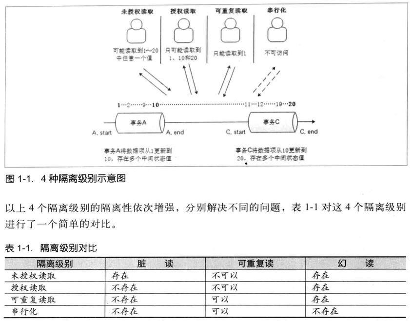
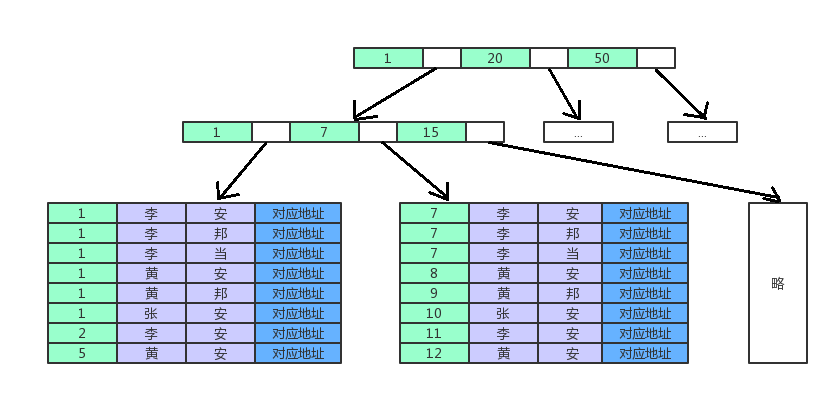
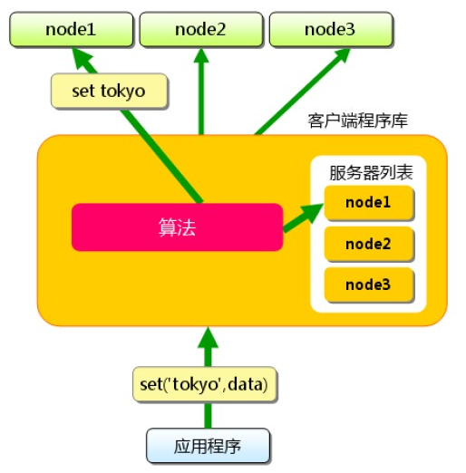
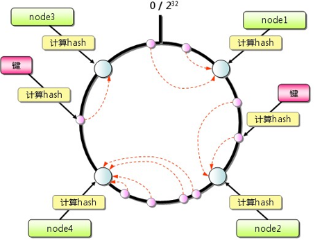
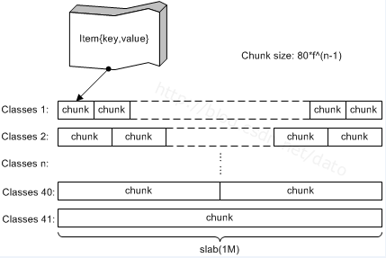
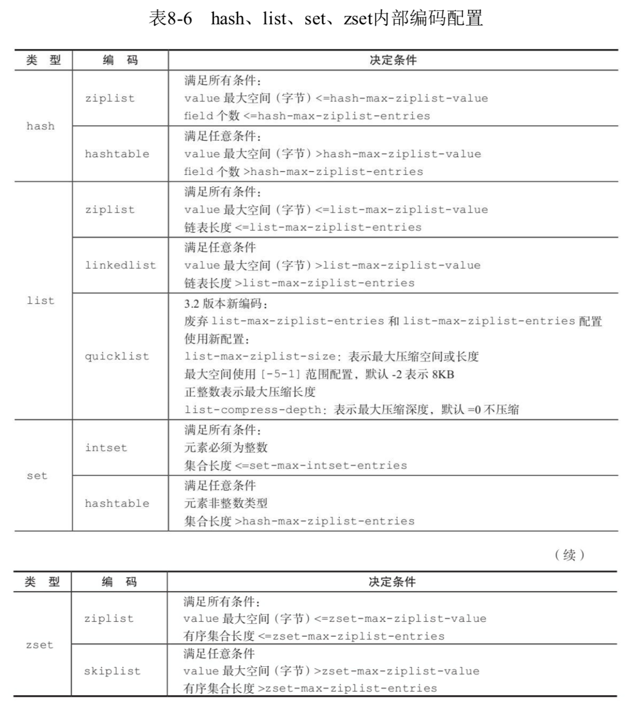
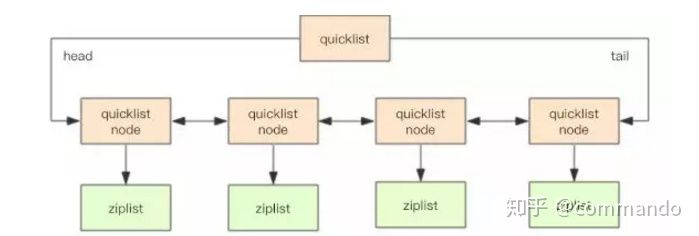
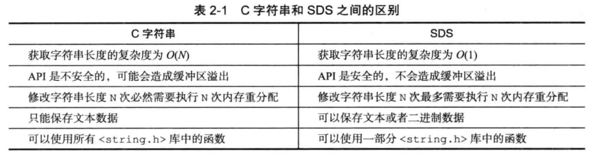

<!-- vim-markdown-toc GFM -->

* [数据库](#数据库)
    * [1 事务](#1-事务)
        * [事务的四个特性](#事务的四个特性)
        * [数据库隔离级别](#数据库隔离级别)
        * [事务的四个隔离级别](#事务的四个隔离级别)
        * [隔离级别的选择](#隔离级别的选择)
    * [2 数据库索引](#2-数据库索引)
        * [B-Tree和B+Tree](#b-tree和btree)
            * [B-Tree](#b-tree)
            * [B+Tree](#btree)
            * [带有顺序访问指针的B+Tree](#带有顺序访问指针的btree)
        * [b+树性质](#b树性质)
        * [联合索引的结构](#联合索引的结构)
        * [建索引的几大原则](#建索引的几大原则)
        * [建立数据库索引的作用](#建立数据库索引的作用)
        * [索引使用场景](#索引使用场景)
        * [聚簇索引与非聚簇索引](#聚簇索引与非聚簇索引)
        * [唯一索引 主键索引 聚集索引](#唯一索引-主键索引-聚集索引)
        * [MyISAM索引实现](#myisam索引实现)
        * [InnoDB索引实现](#innodb索引实现)
    * [3 缓存那些事，兼论redis和memcached](#3-缓存那些事兼论redis和memcached)
        * [memcached](#memcached)
            * [memcached的内存管理机制](#memcached的内存管理机制)
        * [Redis](#redis)
            * [Redis编码模式](#redis编码模式)
            * [Redis内存管理](#redis内存管理)
            * [Redis内部数据结构](#redis内部数据结构)
                * [SDS](#sds)
            * [6种的数据淘汰策略](#6种的数据淘汰策略)
            * [应用场景](#应用场景)
            * [单线程的redis为什么这么快](#单线程的redis为什么这么快)
    * [4 乐观锁和悲观锁](#4-乐观锁和悲观锁)
        * [悲观锁与乐观锁](#悲观锁与乐观锁)
            * [悲观锁](#悲观锁)
            * [乐观锁](#乐观锁)
            * [两种锁的使用场景](#两种锁的使用场景)
        * [乐观锁常见的两种实现方式](#乐观锁常见的两种实现方式)
        * [乐观锁的缺点](#乐观锁的缺点)
        * [CAS与synchronized的使用情景](#cas与synchronized的使用情景)
    * [5 MVCC（Multiversion Concurrency Control）](#5-mvccmultiversion-concurrency-control)
    * [6 MyISAM和InnoDB](#6-myisam和innodb)
    * [7 范式](#7-范式)

<!-- vim-markdown-toc -->

# 数据库

## 1 事务

**数据库事务(Database Transaction)** ，是指作为单个逻辑工作单元执行的一系列操作，要么完全地执行，要么完全地不执行。
一方面，当多个应用程序并发访问数据库时，事务可以在应用程序间提供一个隔离方法，防止互相干扰。另一方面，事务为数据库操作序列提供了一个从失败恢复正常的方法。

### 事务的四个特性

事务具有四个特性：原子性（Atomicity）、一致性（Consistency）、隔离型（Isolation）、持久性（Durability），简称ACID。

**原子性（Atomicity）** 事务的原子性是指事务中的操作不可拆分，只允许全部执行或者全部不执行。

**一致性（Consistency）** 事务的一致性是指事务的执行不能破坏数据库的一致性，一致性也称为完整性。一个事务在执行后，数据库必须从一个一致性状态转变为另一个一致性状态。

**隔离型（Isolation）** 事务的隔离性是指并发的事务相互隔离，不能互相干扰。

**持久性（Durability）** 事务的持久性是指事务一旦提交，对数据的状态变更应该被永久保存。

### 数据库隔离级别

对于同时运行的多个事务,当这些事务访问数据库中相同的数据时,如果没有采取必要的隔离机制,就会导致各种并发问题:

**脏读**：对于两个事务T1，T2，T1读取了已经被T2更新但还没有提交的字段，之后，若T2回滚，T1读取到的内容就是临时无效的内容。

**不可重复读**：对于事务T1，T2，T1需要读取一个字段两次，在第一次和第二次读取之间，T2更新或删除了该字段，导致T1第二次读取到的内容值不同。

**幻读**： 事务A读取与搜索条件相匹配的若干行。事务B以插入方式来修改事务A的结果集，然后再提交。  
**幻读与不可重复读之间的区别是幻读强调的是新增insert,而不可重复读强调的是修改update和删除delete**。  
比如Mary两次查工资，中间有人update或delete过工资，则两次结果不一样，这就是不可重复读。Mary要查工资一千的人数，第一次查到了10个，中间有人增加了一条工资为一千的人，下次查的时候就变成了11个，好像第一次查询的是幻觉一样。

### 事务的四个隔离级别 
实际工作中事务几乎都是并发的，完全做到互相之间不干扰会严重牺牲性能，为了平衡隔离型和性能，SQL92规范定义了四个事务隔离级别：读未提交（Read Uncommitted）、读已提交（Read Committed）、可重复读（Repeatable Read）、串行化（Serializable）。四个级别逐渐增强，每个级别解决上个级别的一个问题。

**读未提交（Read Uncommitted）** 另一个事务修改了数据，但尚未提交，而本事务中的SELECT会读到这些未被提交的数据（脏读）。 脏读是指另一个事务修改了数据，但尚未提交，而本事务中的SELECT会读到这些未被提交的数据。

**读已提交（Read Committed）** 本事务读取到的是最新的数据（其他事务提交后的）。问题是，在同一个事务里，前后两次相同的SELECT会读到不同的结果（不可重复读）。

**可重复读（Repeatable Read）** 在同一个事务里，SELECT的结果是事务开始时间点的状态，同样的SELECT操作读到的结果会是一致的。但是，会有幻读现象。
可重复读保证了同一个事务里，查询的结果都是事务开始时的状态（一致性）。但是，如果另一个事务同时提交了新数据，本事务再更新时，就会发现了这些新数据，貌似之前读到的数据是幻觉，这就是幻读。

**串行化（Serializable）** 所有事务只能一个接一个串行执行，不能并发。

### 隔离级别的选择

事务隔离级别越高，越能保证数据的一致性，但对并发性能影响越大，一致性和高性能必须有所取舍或折中。
一般情况下，多数应用程序可以选择将数据库的隔离级别设置为读已提交，这样可以避免脏读，也可以得到不错的并发性能。尽管这个隔离级别会导致不可重复度、幻读，但这种个别场合应用程序可以通过主动加锁进行并发控制。

Oracle支持两种隔离级别，READ COMMITED和SERIALIZABLE默认的事务隔离级别是READ COMMITED

MYSQL支持4中隔离界别，默认的是`REPEATED READ`

## 2 数据库索引
聚集索引,非聚集索引,B-Tree,B+Tree,最左前缀原理

推荐:
[MySQL索引原理及慢查询优化](https://tech.meituan.com/2014/06/30/mysql-index.html)

[MySQL索引背后的数据结构及算法原理](http://blog.codinglabs.org/articles/theory-of-mysql-index.html)

### B-Tree和B+Tree
目前大部分数据库系统及文件系统都采用B-Tree或其变种B+Tree作为索引结构，在本文的下一节会结合存储器原理及计算机存取原理讨论为什么B-Tree和B+Tree
在被如此广泛用于索引，这一节先单纯从数据结构角度描述它们。

#### B-Tree
为了描述B-Tree，首先定义一条数据记录为一个二元组[key, data]，key为记录的键值，对于不同数据记录，key是互不相同的；data为数据记录除key外的数据。
那么B-Tree是满足下列条件的数据结构：

d为大于1的一个正整数，称为B-Tree的度。

h为一个正整数，称为B-Tree的高度。

每个非叶子节点由n-1个key和n个指针组成，其中d<=n<=2d。

每个叶子节点最少包含一个key和两个指针，最多包含2d-1个key和2d个指针，叶节点的指针均为null 。

所有叶节点具有相同的深度，等于树高h。

key和指针互相间隔，节点两端是指针。

一个节点中的key从左到右非递减排列。

所有节点组成树结构。

每个指针要么为null，要么指向另外一个节点。

如果某个指针在节点node最左边且不为null，则其指向节点的所有key小于v(key1)，其中v(key1)为node的第一个key的值。

如果某个指针在节点node最右边且不为null，则其指向节点的所有key大于v(keym)，其中v(keym)为node的最后一个key的值。

如果某个指针在节点node的左右相邻key分别是keyi和keyi+1且不为null，则其指向节点的所有key小于v(keyi+1)且大于v(keyi)。

上图是一个d=2的B-Tree示意图。

由于B-Tree的特性，在B-Tree中按key检索数据的算法非常直观：首先从根节点进行二分查找，如果找到则返回对应节点的data，否则对相应区间的指针指向的
节点递归进行查找，直到找到节点或找到null指针，前者查找成功，后者查找失败。

关于B-Tree有一系列有趣的性质，例如一个度为d的B-Tree，设其索引N个key，则其树高h的上限为logd((N+1)/2)，检索一个key，其查找节点个数的渐进
复杂度为O(logdN)。从这点可以看出，B-Tree是一个非常有效率的索引数据结构。
另外，由于插入删除新的数据记录会破坏B-Tree的性质，因此在插入删除时，需要对树进行一个分裂、合并、转移等操作以保持B-Tree性质，本文不打算完整讨论
B-Tree这些内容，因为已经有许多资料详细说明了B-Tree的数学性质及插入删除算法，有兴趣的朋友可以在本文末的参考文献一栏找到相应的资料进行阅读。

#### B+Tree
B-Tree有许多变种，其中最常见的是B+Tree，例如MySQL就普遍使用B+Tree实现其索引结构。

与B-Tree相比，B+Tree有以下不同点：

每个节点的指针上限为2d而不是2d+1。

**内节点不存储data，只存储key；叶子节点不存储指针。**  
B+Tree更适合外存索引，原因和内节点出度d有关。从上面分析可以看到，d越大索引的性能越好，而出度的上限取决于节点内key和data的大小：

dmax=floor(pagesize/(keysize+datasize+pointsize))  
floor表示向下取整。由于B+Tree内节点去掉了data域，因此可以拥有更大的出度，拥有更好的性能。

上图是一个简单的B+Tree示意。

#### 带有顺序访问指针的B+Tree
一般在数据库系统或文件系统中使用的B+Tree结构都在经典B+Tree的基础上进行了优化，增加了顺序访问指针。

  
如上图所示，在B+Tree的每个叶子节点增加一个指向相邻叶子节点的指针，就形成了带有顺序访问指针的B+Tree。做这个优化的目的是为了提高区间访问的性能，
例如上图中如果要查询key为从18到49的所有数据记录，当找到18后，只需顺着节点和指针顺序遍历就可以一次性访问到所有数据节点，极大提到了区间查询效率。

### b+树性质

1. 通过上面的分析，我们知道IO次数取决于b+数的高度h(根据B-Tree的定义，可知检索一次最多需要访问h个节点)。  
假设当前数据表的数据为N，每个磁盘块的数据项的数量是m，则有 **h=㏒(m+1)N**，当数据量N一定的情况下，m越大，h越小(m通常超过100，因此h非常小，
通常不超过3)；而m = 磁盘块的大小 / 数据项的大小，磁盘块的大小也就是一个数据页的大小，是固定的，如果数据项占的空间越小，
数据项的数量越多，树的高度越低。这就是为什么每个数据项，即 **索引字段要尽量的小**，比如int占4字节，要比bigint 8字节少一半。这也是为什么b+树要求
把 **真实的数据放到叶子节点**而不是内层节点，一旦放到内层节点，磁盘块的数据项会大幅度下降，导致树增高。当数据项等于1时将会退化成线性表。
2. 当b+树的数据项是复合的数据结构，比如(name,age,sex)的时候，b+数是按照 **从左到右**的顺序来建立搜索树的，比如当(张三,20,F)这样的数据来检索的时候，
b+树会优先比较name来确定下一步的所搜方向，如果name相同再依次比较age和sex，最后得到检索的数据；但当(20,F)这样的没有name的数据来的时候，
b+树就不知道下一步该查哪个节点，因为建立搜索树的时候name就是第一个比较因子，必须要先根据name来搜索才能知道下一步去哪里查询。比如当(张三,F)这样的
数据来检索时，b+树可以用name来指定搜索方向，但下一个字段age的缺失，所以只能把名字等于张三的数据都找到，然后再匹配性别是F的数据了，这个是
非常重要的性质，即索引的 **最左匹配**特性。

### 联合索引的结构

假设(col1, col2,col3)是一个多列索引联合索引，联合索引也是一棵B+Tree， **非叶子节点存储的是第一个关键字的索引，而叶节点存储的则是三个关键字**
col1、col2、col3三个关键字的数据，且按照col1、col2、col3的顺序进行排序。

如上图所示，col1表示的是年龄，col2表示的是姓氏，col3表示的是名字。  
PS:对应地址指的是数据记录的地址。

如图，联合索引(年龄, 姓氏,名字)，叶节点上data域存储的是三个关键字的数据。且是按照年龄、姓氏、名字的顺序排列的。

因此，如果执行的是： 
select * from STUDENT where 姓氏='李' and 名字='安';   
或者 
select * from STUDENT where 名字='安';   
那么当执行查询的时候，是无法使用这个联合索引的。因为联合索引中是先根据年龄进行排序的。如果年龄没有先确定，直接对姓氏和名字进行查询的话，就相当于乱序查询一样，因此索引无法生效。因此查询是全表查询。

如果执行的是：  
select * from STUDENT where 年龄=1 and 姓氏='李';   
那么当执行查询的时候，索引是能生效的，从图中很直观的看出，age=1的是第一个叶子节点的前6条记录，在age=1的前提下，姓氏=’李’的是前3条。因此最终查询出来的是这三条，
从而能获取到对应记录的地址。 

如果执行的是：   
select * from STUDENT where 年龄=1 and 姓氏='黄' and 名字='安';   
那么索引也是生效的。

而如果执行的是：   
select * from STUDENT where 年龄=1 and 名字='安'; 
那么，索引年龄部分能生效，名字部分不能生效。也就是说索引部分生效。

因此联合索引结构就是B+Tree是按照第一个关键字进行索引，然后在叶子节点上按照第一个关键字、第二个关键字、第三个关键字…进行排序。

### 建索引的几大原则

1. **最左前缀匹配原则**，非常重要的原则，mysql会一直向右匹配直到遇到 **范围查询**(>、<、between、like)就停止匹配，
比如a = 1 and b = 2 and c > 3 and d = 4 如果建立(a,b,c,d)顺序的索引，d是用不到索引的，如果建立(a,b,d,c)的索引则都可以用到，a,b,d的顺序可以任意调整。 
2. =和in可以乱序，比如a = 1 and b = 2 and c = 3 建立(a,b,c)索引可以任意顺序，mysql的查询优化器会帮你优化成索引可以识别的形式。 
3. 尽量选择 **区分度高**的列作为索引,区分度的公式是count(distinct col)/count(*)，表示字段不重复的比例，比例越大我们扫描的记录数越少，唯一键的
区分度是1，而一些状态、性别字段可能在大数据面前区分度就是0，那可能有人会问，这个比例有什么经验值吗？使用场景不同，这个值也很难确定，
一般需要join的字段我们都要求是0.1以上，即平均1条扫描10条记录。
4. 索引列不能参与计算，保持列“干净”，比如from_unixtime(create_time) = ’2014-05-29’就不能使用到索引，原因很简单，b+树中存的都是数据表中的
字段值，但进行检索时，需要把所有元素都应用函数才能比较，显然成本太大。所以语句应该写成create_time = unix_timestamp(’2014-05-29’)。
5. 尽量的 **扩展**索引，不要新建索引。比如表中已经有a的索引，现在要加(a,b)的索引，那么只需要修改原来的索引即可。

### 建立数据库索引的作用
数据库索引是将数据库表中的`某一列或几列`以特定的数据结构(比如B-Tree，Hash等)存起来，这样查找的时候就可以不用从头查到尾要O(n)，
这样可以缩短到O(logn)级别甚至O(1)。建立索引之后查找和修改，排序等操作可以省很多时间。  

例如这样一个查询：select * from table1 where id=10000。如果没有索引，必须遍历整个表，直到ID等于10000的这一行被找到为止；
有了索引之后(必须是在ID这一列上建立的索引)，即可在索引中查找。由于索引是经过某种算法优化过的，因而查找次数要少的多。   
数据库索引好比是一本书前面的目录， **能加快数据库的查询速度**。

### 索引使用场景
既然索引可以加快查询速度，那么是不是只要是查询语句需要，就建上索引？答案是否定的。因为索引虽然加快了查询速度，但索引也是有 **代价**的：  
索引文件本身要消耗存储空间，同时索引会加重插入、删除和修改记录时的负担，另外，MySQL在运行时也要消耗资源维护索引，因此索引并不是越多越好。  
一般两种情况下不建议建索引。 
 
1. 第一种情况是表记录比较少，例如一两千条甚至只有几百条记录的表，没必要建索引，让查询做全表扫描就好了。至于多少条记录才算多，个人的经验是以2000
作为分界线，记录数不超过 2000可以考虑不建索引，超过2000条可以酌情考虑索引。
2. 另一种不建议建索引的情况是索引的选择性（区分度）较低。所谓索引的选择性（Selectivity），是指不重复的索引值（也叫基数，Cardinality）与表记录数（#T）
的比值：`Index Selectivity = Cardinality / #T`
显然选择性的取值范围为(0, 1]，选择性越高的索引价值越大

### 聚簇索引与非聚簇索引
索引分为聚簇索引和非聚簇索引两种，聚簇索引是按照数据存放的物理位置为顺序的，就像书中的目录，内容是按照页码顺序排列的，
而非聚簇索引就不一样了；聚簇索引能提高多行检索的速度，而非聚簇索引对于单行的检索很快。  
**注意一个表只能有一个聚集索引，但是可以由多个非聚集索引。**

### 唯一索引 主键索引 聚集索引
接下来说以下三种不同的索引： 根据数据库的功能，可以在数据库设计器中创建三种索引：唯一索引、主键索引和聚集索引。 
提示：尽管唯一索引有助于定位信息，但为获得最佳性能结果，建议改用主键或唯一约束。

* 唯一索引
**唯一索引是不允许其中任何两行具有相同索引值的索引**。当现有数据中存在重复的键值时，
大多数数据库不允许将新创建的唯一索引与表一起保存。数据库还可能防止添加将在表中创建重复键值的新数据。
例如，如果在employee表中职员的姓(lname)上创建了唯一索引，则任何两个员工都不能同姓。

* 主键索引
数据库表经常有一列或多列组合，其值唯一标识表中的每一行。该（多）列称为表的主键。在数据库关系图中为表定义主键将自动创建主键索引，
**主键索引是特殊的唯一索引**。该索引要求主键中的每个值都唯一。

### MyISAM索引实现
MyISAM引擎使用B+Tree作为索引结构，叶节点的data域存放的是数据记录的地址。下图是MyISAM索引的原理图：  
    
这里数据表一共有三列，假设我们以Col1为主键，上图是一个MyISAM表的主索引（Primary key）示意。可以看出MyISAM的索引文件仅仅保存数据记录的地址。
在MyISAM中，主索引和辅助索引（Secondary key）在结构上没有任何区别，只是 **主索引要求key是唯一的，而辅助索引的key可以重复**。如果我们在Col2上建立
一个辅助索引，则此索引的结构如下图所示：  
  

同样也是一颗B+Tree，data域保存数据记录的地址。因此，MyISAM中索引检索的算法为首先按照B+Tree搜索算法搜索索引，如果指定的Key存在，则取出其data域
的值，然后以data域的值为地址，读取相应数据记录。

**MyISAM的索引方式也叫做“非聚集”的，InnoDB的是聚集索引。**

### InnoDB索引实现
虽然InnoDB也使用B+Tree作为索引结构，但具体实现方式却与MyISAM截然不同。  
第一个重大区别是InnoDB的数据文件本身就是索引文件。从上文知道，MyISAM索引文件和数据文件是分离的，索引文件仅保存数据记录的 **地址**。而在InnoDB中，
表数据文件本身就是按B+Tree组织的一个索引结构，这棵树的叶节点data域保存了完整的数据记录。这个索引的key是数据表的 **主键**，因此InnoDB表数据文件本身就是主索引。

    
上图是InnoDB主索引（同时也是数据文件）的示意图，可以看到叶节点包含了完整的数据记录。这种索引叫做聚集索引。因为InnoDB的数据文件本身要按主键聚集，
所以InnoDB要求表必须有主键（MyISAM可以没有），如果没有显式指定，则MySQL系统会自动选择一个可以唯一标识数据记录的列作为主键，如果不存在这种列，
则MySQL自动为InnoDB表生成一个隐含字段作为主键，这个字段长度为6个字节，类型为长整形。

第二个与MyISAM索引的不同是InnoDB的辅助索引data域存储相应记录主键的值而不是地址。换句话说，InnoDB的所有辅助索引都引用主键作为data域。例如，
下图为定义在Col3上的一个辅助索引：  
   

这里以英文字符的ASCII码作为比较准则。聚集索引这种实现方式使得按主键的搜索十分高效，但是辅助索引搜索需要检索两遍索引：首先检索辅助索引获得主键，
然后用主键到主索引中检索获得记录。

了解不同存储引擎的索引实现方式对于正确使用和优化索引都非常有帮助，例如知道了InnoDB的索引实现后，就很容易明白为什么不建议使用过长的字段作为主键，
因为所有辅助索引都引用主索引，过长的主索引会令辅助索引变得过大。再例如，用非单调的字段作为主键在InnoDB中不是个好主意，因为InnoDB数据文件本身是
一颗B+Tree，非单调的主键会造成在插入新记录时数据文件为了维持B+Tree的特性而频繁的分裂调整，十分低效，而使用自增字段作为主键则是一个很好的选择。

## 3 缓存那些事，兼论redis和memcached
[缓存那些事](https://tech.meituan.com/cache_about.html)  
[memcached完全剖析系列](https://charlee.li/memcached-001.html)

### memcached
memcached本身不提供分布式解决方案。在服务端，memcached集群环境实际就是一个个memcached服务器的堆积，环境搭建较为简单；cache的分布式主要是在客户端
实现，通过客户端的路由处理来达到分布式解决方案的目的。

   
memcached客户端采用一致性hash算法作为路由策略

#### memcached的内存管理机制
    
**slab**是一个内存块，它是memcached一次申请内存的 **最小单位**。在启动memcached的时候一般会使用参数-m指定其可用内存，但是并不是在启动的那一刻所有的
内存就全部分配出去了，只有在需要的时候才会去申请，而且每次申请一定是一个slab。Slab的大小固定为 **1M**（1048576 Byte），一个slab由若干个大小相等的
**chunk**组成。每个chunk中都保存了一个item结构体、一对key和value。  
虽然在同一个slab中chunk的大小相等的，但是在不同的slab中chunk的大小并不一定相等，在memcached中按照chunk的大小不同，可以把slab分为很多
种类（class），默认情况下memcached把slab分为41类（class1～class40），在class 1中，chunk的大小为80字节，由于一个slab的大小是固定的
1048576字节（1M），因此在class1中最多可以有13107个chunk（也就是这个slab能存最多13107个小于80字节的key-value数据）。

memcached内存管理采取 **预分配、分组管理**的方式，分组管理就是我们上面提到的slab class，按照chunk的大小slab被分为很多种类。内存预分配过程是怎样的呢？
向memcached添加一个item时候，memcached首先会根据item的大小，来选择最合适的slab class：例如item的大小为190字节，默认情况下class 4的chunk
大小为160字节显然不合适，class 5的chunk大小为200字节，大于190字节，因此该item将放在class 5中（显然这里会有10字节的浪费是不可避免的），
计算好所要放入的chunk之后，memcached会去检查该类大小的chunk还有没有空闲的，如果没有，将会申请1M（1个slab）的空间并划分为该种类chunk。
例如我们第一次向memcached中放入一个190字节的item时，memcached会产生一个slab class 2（也叫一个page），并会用去一个chunk，剩余5241个
chunk供下次有适合大小item时使用，当我们用完这所有的5242个chunk之后，下次再有一个在160～200字节之间的item添加进来时，memcached会再次产生
一个class 5的slab（这样就存在了2个pages）。  

**总结**来看，memcached内存管理需要注意的几个方面：  
* chunk是在page里面划分的，而page固定为1m，所以chunk最大不能超过1m。  
* chunk实际占用内存要加48B，因为chunk数据结构本身需要占用48B。  
* 如果用户数据大于1m，则memcached会将其切割，放到多个chunk内。  
* 已分配出去的page不能回收。  
* 数据没有持久化，集群故障重启数据无法恢复  
对于key-value信息，最好不要超过1m的大小；同时信息长度最好相对是比较均衡稳定的，这样能够保障最大限度的使用内存；同时，memcached采用的LRU清理策略，合理甚至过期时间，提高命中率。

### Redis
[redis设计与实现笔记](https://blog.csdn.net/yangcs2009/article/details/50637165)  
[Redis数据结构](https://zhuanlan.zhihu.com/p/68607184)

#### Redis编码模式
  

* 字符串可以被编码为embstr(小于39字节）、raw（一般字符串）或int（为了节约内存，Redis会将字符串表示的64位有符号整数编码为整数来进行储存）；
  
 
  
* 列表可以被编码为ziplist或linkedlist，ziplist是为节约大小较小的列表空间而作的特殊表示。3.2版本开始使用quicklist，quickList 是 zipList 
和 linkedList 的混合体。它将 linkedList 按段切分，每一段使用 zipList 来紧凑存储，多个 zipList 之间使用双向指针串接起来。因为链表的附加空间
相对太高，prev 和 next 指针就要占去 16 个字节 (64bit 系统的指针是 8 个字节)，另外每个节点的内存都是单独分配，会加剧内存的碎片化，影响内存管理效率；  
* 集合可以被编码为intset或者hashtable，intset是只储存数字的小集合的特殊表示；  
* hash表可以编码为ziplist或者hashtable，zipmap是小hash表的特殊表示；  
* 有序集合可以被编码为ziplist或者skiplist格式，ziplist用于表示小的有序集合，而skiplist则用于表示任何大小的有序集合。  

#### Redis内存管理

**空间预分配**：如果对一个SDS进行修改，分为一下两种情况：

1. SDS长度（len的值）小于1MB，那么程序将分配和len属性同样大小的未使用空间，这时free和len属性值相同。举个例子，SDS的len将变成15字节，则程序
也会分配15字节的未使用空间，SDS的buf数组的实际长度变成15+15+1=31字节（额外一个字节用户保存空字符）。
2. SDS长度（len的值）大于等于1MB，程序会分配1MB的未使用空间。比如进行修改之后，SDS的len变成30MB，那么它的实际长度是30MB+1MB+1byte。

**惰性释放空间**：当执行sdstrim（截取字符串）之后，SDS不会立马释放多出来的空间，如果下次再进行拼接字符串操作，且拼接的没有刚才释放的空间大，
则那些未使用的空间就会排上用场。通过惰性释放空间避免了特定情况下操作字符串的内存重新分配操作。

**杜绝缓冲区溢出**：使用C字符串的操作时，如果字符串长度增加（如strcat操作）而忘记重新分配内存，很容易造成缓冲区的溢出；而SDS由于记录了长度，
相应的操作在可能造成缓冲区溢出时会自动重新分配内存，杜绝了缓冲区溢出。

#### Redis内部数据结构

##### SDS

#### 6种的数据淘汰策略
1. volatile-lru：从已设置过期时间的数据集（server.db[i].expires）中挑选最近最少使用的数据淘汰；
2. volatile-ttl：从已设置过期时间的数据集（server.db[i].expires）中挑选将要过期的数据淘汰；
3. volatile-random：从已设置过期时间的数据集（server.db[i].expires）中任意选择数据淘汰 ；
4. allkeys-lru：从数据集（server.db[i].dict）中挑选最近最少使用的数据淘汰；
5. allkeys-random：从数据集（server.db[i].dict）中任意选择数据淘汰；
6. no-enviction（驱逐）：禁止驱逐数据。

#### 应用场景
[应用场景](https://blog.csdn.net/hguisu/article/details/8836819)

* String：缓存、限流、计数器、分布式锁、分布式Session
* Hash：存储用户信息、用户主页访问量、组合查询
* List：微博关注人时间轴列表、简单队列
* Set：赞、踩、标签、好友关系
* Zset：排行榜

* 在主页中显示最新的项目列表：Redis使用的是常驻内存的缓存，速度非常快。LPUSH用来插入一个内容ID，作为关键字存储在列表头部。LTRIM用来限制列表中
的项目数最多为5000。如果用户需要的检索的数据量超越这个缓存容量，这时才需要把请求发送到数据库。  
* 删除和过滤：如果一篇文章被删除，可以使用LREM从缓存中彻底清除掉。  
* 排行榜及相关问题：排行榜（leader board）按照得分进行排序。ZADD命令可以直接实现这个功能，而ZREVRANGE命令可以用来按照得分来获取前100名的用户，
ZRANK可以用来获取用户排名，非常直接而且操作容易。  
* 按照用户投票和时间排序：排行榜，得分会随着时间变化。LPUSH和LTRIM命令结合运用，把文章添加到一个列表中。一项后台任务用来获取列表，并重新计算列表的排序，
ZADD命令用来按照新的顺序填充生成列表。列表可以实现非常快速的检索，即使是负载很重的站点。  
* 过期项目处理：使用Unix时间作为关键字，用来保持列表能够按时间排序。对current_time和time_to_live进行检索，完成查找过期项目的艰巨任务。
另一项后台任务使用ZRANGE…WITHSCORES进行查询，删除过期的条目。  
* 计数：进行各种数据统计的用途是非常广泛的，比如想知道什么时候封锁一个IP地址。INCRBY命令让这些变得很容易，通过原子递增保持计数；GETSET用来重置计数器；
过期属性用来确认一个关键字什么时候应该删除。  
* 特定时间内的特定项目：这是特定访问者的问题，可以通过给每次页面浏览使用SADD命令来解决。SADD不会将已经存在的成员添加到一个集合。
* Pub/Sub：在更新中保持用户对数据的映射是系统中的一个普遍任务。Redis的pub/sub功能使用了SUBSCRIBE、UNSUBSCRIBE和PUBLISH命令，让这个变得更加容易。
* 队列：在当前的编程中队列随处可见。除了push和pop类型的命令之外，Redis还有阻塞队列的命令，能够让一个程序在执行时被另一个程序添加到队列。

#### 单线程的redis为什么这么快

1. 纯内存操作
2. 单线程操作，避免了频繁的上下文切换
3. 采用了非阻塞I/O多路复用机制

## 4 乐观锁和悲观锁

[乐观锁与悲观锁](https://juejin.im/post/5b4977ae5188251b146b2fc8)

悲观锁：假定会发生并发冲突，屏蔽一切可能违反数据完整性的操作，访问的时候都要先获得锁，保证同一个时刻只有线程获得锁，读读也会阻塞；

乐观锁：假设不会发生并发冲突，只在提交操作时检查是否违反数据完整性。

Java乐观锁通过CAS实现，悲观锁通过synchronize实现。mysql乐观锁通过MVCC，也就是版本实现，悲观锁可以通过select... for update加上排它锁

### 悲观锁与乐观锁

乐观锁对应于生活中乐观的人总是想着事情往好的方向发展，悲观锁对应于生活中悲观的人总是想着事情往坏的方向发展。这两种人各有优缺点，不能不以场景而定
说一种人好于另外一种人。

#### 悲观锁
总是假设最坏的情况，每次去拿数据的时候都认为别人会修改，所以每次在拿数据的时候都会上锁，这样别人想拿这个数据就会阻塞直到它拿到锁（共享资源每次只给
一个线程使用，其它线程阻塞，用完后再把资源转让给其它线程）。传统的关系型数据库里边就用到了很多这种锁机制，比如行锁，表锁等，读锁，写锁等，都是在做操作
之前先上锁。Java中synchronized和ReentrantLock等独占锁就是悲观锁思想的实现。

#### 乐观锁
总是假设最好的情况，每次去拿数据的时候都认为别人不会修改，所以不会上锁，但是在更新的时候会判断一下在此期间别人有没有去更新这个数据，可以使用版 **本号机制和
CAS算法**实现。乐观锁适用于多读的应用类型，这样可以提高吞吐量，像数据库提供的类似于write_condition机制，其实都是提供的乐观锁。
在Java中java.util.concurrent.atomic包下面的原子变量类就是使用了乐观锁的一种实现方式CAS实现的。

#### 两种锁的使用场景
从上面对两种锁的介绍，我们知道两种锁各有优缺点，不可认为一种好于另一种，像乐观锁适用于写比较少的情况下（ **多读**场景），即冲突真的很少发生的时候，
这样可以省去了锁的开销，加大了系统的整个吞吐量。但如果是多写的情况，一般会经常产生冲突，这就会导致上层应用会不断的进行retry，这样反倒是降低了性能，
所以一般多写的场景下用悲观锁就比较合适。

### 乐观锁常见的两种实现方式

乐观锁一般会使用 **版本号机制或CAS算法**实现。

1. 版本号机制
一般是在数据表中加上一个数据版本号version字段，表示数据被修改的次数，当数据被修改时，version值会加一。当线程A要更新数据值时，在读取数据的同时也会读取version值，在提交更新时，若刚才读取到的version值为当前数据库中的version值相等时才更新，否则重试更新操作，直到更新成功。
举一个简单的例子：
假设数据库中帐户信息表中有一个 version 字段，当前值为 1 ；而当前帐户余额字段（ balance ）为 $100 。

操作员 A 此时将其读出（ version=1 ），并从其帐户余额中扣除 $50（ $100-$50 ）。
在操作员 A 操作的过程中，操作员B 也读入此用户信息（ version=1 ），并从其帐户余额中扣除 $20 （ $100-$20 ）。
操作员 A 完成了修改工作，将数据版本号加一（ version=2 ），连同帐户扣除后余额（ balance=$50 ），提交至数据库更新，此时由于提交数据版本大于数据库记录当前版本，数据被更新，数据库记录 version 更新为 2 。
操作员 B 完成了操作，也将版本号加一（ version=2 ）试图向数据库提交数据（ balance=$80 ），但此时比对数据库记录版本时发现，操作员 B 提交的数据版本号为 2 ，数据库记录当前版本也为 2 ，不满足 “ 提交版本必须大于记录当前版本才能执行更新 “ 的乐观锁策略，因此，操作员 B 的提交被驳回。

这样，就避免了操作员 B 用基于 version=1 的旧数据修改的结果覆盖操作员A 的操作结果的可能。

2. CAS算法
即compare and swap（比较与交换），是一种有名的无锁算法。无锁编程，即不使用锁的情况下实现多线程之间的变量同步，也就是在没有线程被阻塞的情况下实现变量的同步，
所以也叫非阻塞同步（Non-blocking Synchronization）。CAS算法涉及到三个操作数

需要读写的内存值 V
进行比较的值 A
拟写入的新值 B

当且仅当 V 的值等于 A时，CAS通过原子方式用新值B来更新V的值，否则不会执行任何操作（比较和替换是一个原子操作）。一般情况下是一个自旋操作，即不断的重试。

### 乐观锁的缺点

ABA 问题是乐观锁一个常见的问题

1. ABA 问题
如果一个变量V初次读取的时候是A值，并且在准备赋值的时候检查到它仍然是A值，那我们就能说明它的值没有被其他线程修改过了吗？很明显是不能的，因为在这段时间它的值可能
被改为其他值，然后又改回A，那CAS操作就会误认为它从来没有被修改过。这个问题被称为CAS操作的 "ABA"问题。

JDK 1.5 以后的 AtomicStampedReference 类就提供了此种能力，其中的 compareAndSet 方法就是首先检查当前引用是否等于预期引用，并且当前标志是否等于预期标志，
如果全部相等，则以原子方式将该引用和该标志的值设置为给定的更新值。

2. 循环时间长开销大
自旋CAS（也就是不成功就一直循环执行直到成功）如果长时间不成功，会给CPU带来非常大的执行开销。 如果JVM能支持处理器提供的pause指令那么效率会有一定的提升，
pause指令有两个作用，第一它可以延迟流水线执行指令（de-pipeline）,使CPU不会消耗过多的执行资源，延迟的时间取决于具体实现的版本，在一些处理器上延迟时间是零。
第二它可以避免在退出循环的时候因内存顺序冲突（memory order violation）而引起CPU流水线被清空（CPU pipeline flush），从而提高CPU的执行效率。

3. 只能保证一个共享变量的原子操作
CAS 只对单个共享变量有效，当操作涉及跨多个共享变量时 CAS 无效。但是从 JDK 1.5开始，提供了AtomicReference类来保证引用对象之间的原子性，你可以把多个变量
放在一个对象里来进行 CAS 操作.所以我们可以使用锁或者利用AtomicReference类把多个共享变量合并成一个共享变量来操作。

### CAS与synchronized的使用情景

简单的来说CAS适用于写比较少的情况下（多读场景，冲突一般较少），synchronized适用于写比较多的情况下（多写场景，冲突一般较多）

对于资源竞争较少（线程冲突较轻）的情况，使用synchronized同步锁进行线程阻塞和唤醒切换以及用户态内核态间的切换操作额外浪费消耗cpu资源；而CAS基于硬件实现，
不需要进入内核，不需要切换线程，操作自旋几率较少，因此可以获得更高的性能。
对于资源竞争严重（线程冲突严重）的情况，CAS自旋的概率会比较大，从而浪费更多的CPU资源，效率低于synchronized。

补充： Java并发编程这个领域中synchronized关键字一直都是元老级的角色，很久之前很多人都会称它为 “重量级锁” 。但是，在JavaSE 1.6之后进行了主要包括为了
减少获得锁和释放锁带来的性能消耗而引入的 偏向锁 和 轻量级锁 以及其它各种优化之后变得在某些情况下并不是那么重了。synchronized的底层实现主要依靠 Lock-Free 
的队列，基本思路是 自旋后阻塞，竞争切换后继续竞争锁，稍微牺牲了公平性，但获得了高吞吐量。在线程冲突较少的情况下，可以获得和CAS类似的性能；而线程冲突严重的情况下，性能远高于CAS。

## 5 MVCC（Multiversion Concurrency Control）

[浅谈数据库并发控制 - 锁和 MVCC](https://draveness.me/database-concurrency-control)

MVCC(Multiversion concurrency control) 就是 **同一份数据临时保留多版本的一种方式，进而实现并发控制**

## 6 MyISAM和InnoDB

Myisam与InnoDB的区别：

最主要的一点是MyIsam不支持`事务操作，外键以及行级锁`，而InnoDB支持这些功能。MyIsam只支持表级锁，当多线程并发操作数据库时，
就会为整个表上锁，而InnoDB 则从行上锁。但这也是不一定的，如果一个SQL语句不能确定扫描范围的话，也会为整个表上锁，
比如： update table set num=1 where name like “%aaa%”

但是MyIsam的`读的速度`比InnoDB更加快一些，InnoDB不保存表的行数，比如要执行count(*)的话，它就会扫描整个表，但是如果是MyIsam的话，直接返回行数

InnoDB执行Drop from table 时，不会重新建表，而是一行一行删除。如果执行大量的select操作选择MyIsam，如果有大量的insert和update操作，选择InnoDB。

AUTO_INCREMENT 对于AUTO_INCREMENT类型的字段，InnoDB中必须包含只有该字段的索引，但是在MyISAM表中，可以和其他字段一起建立联合索引

表的存储方面：InnoDB的存储方式是一个表空间数据文件，一个日志文件，而MyIsam的存储方式是索引文件（.MYI（myindex）），
数据文件(.MYD(mydata))，表存储定义文件(.frm)

`MyISAM 适合于一些需要大量查询的应用，但其对于有大量写操作并不是很好`。甚至你只是需要update一个字段，整个表都会被锁起来，而别的进程，
就算是读进程都无法操作直到读操作完成。另外，MyISAM 对于 SELECT COUNT(*) 这类的计算是超快无比的。

InnoDB 的趋势会是一个非常复杂的存储引擎，对于一些小的应用，它会比 MyISAM 还慢。但是它支持“行锁” ，于是在写操作比较多的时候，会更优秀。
并且，他还支持更多的高级应用，比如：事务。

## 7 范式
◆ 第一范式（1NF）：强调的是 **列的原子性**，即列不能够再分成其他几列。 考虑这样一个表：【联系人】（姓名，性别，电话） 如果在实际场景中，
一个联系人有家庭电话和公司电话，那么这种表结构设计就没有达到 1NF。要符合 1NF 我们只需把列（电话）拆分，
即：【联系人】（姓名，性别，家庭电话，公司电话）。1NF 很好辨别，但是 2NF 和 3NF 就容易搞混淆。

◆ 第二范式（2NF）：首先是 1NF，另外包含两部分内容，一是表必须有一个主键；二是没有包含在主键中的列必须 **完全依赖于主键**，
而不能只依赖于主键的一部分。 考虑一个订单明细表：【OrderDetail】（OrderID，ProductID，UnitPrice，Discount，Quantity，ProductName）。 
因为我们知道在一个订单中可以订购多种产品，所以单单一个 OrderID 是不足以成为主键的，主键应该是（OrderID，ProductID）。
显而易见 Discount（折扣），Quantity（数量）完全依赖（取决）于主键（OderID，ProductID），而 UnitPrice，ProductName 只依赖于 ProductID。
所以 OrderDetail 表不符合 2NF。不符合 2NF 的设计容易产生冗余数据。 可以把【OrderDetail】表拆分为
【OrderDetail】（OrderID，ProductID，Discount，Quantity）和【Product】（ProductID，UnitPrice，ProductName）
来消除原订单表中UnitPrice，ProductName多次重复的情况。

◆ 第三范式（3NF）：首先是 2NF，另外非主键列必须直接依赖于主键， **不能存在传递依赖**。即不能存在：非主键列 A 依赖于非主键列 B，
非主键列 B 依赖于主键的情况。 考虑一个订单表【Order】（OrderID，OrderDate，CustomerID，CustomerName，CustomerAddr，CustomerCity）
主键是（OrderID）。 其中 OrderDate，CustomerID，CustomerName，CustomerAddr，CustomerCity 等非主键列都完全依赖于主键（OrderID），
所以符合 2NF。不过问题是 CustomerName，CustomerAddr，CustomerCity 直接依赖的是 CustomerID（非主键列），而不是直接依赖于主键，
它是通过传递才依赖于主键，所以不符合 3NF。 通过拆分【Order】为【Order】（OrderID，OrderDate，CustomerID）和
【Customer】（CustomerID，CustomerName，CustomerAddr，CustomerCity）从而达到3NF。 

第二范式（2NF）和第三范式（3NF）的概念很容易混淆，
区分它们的关键点在于，
**2NF：非主键列是否完全依赖于主键，还是依赖于主键的一部分；3NF：非主键列是直接依赖于主键，还是直接依赖于非主键列**。
