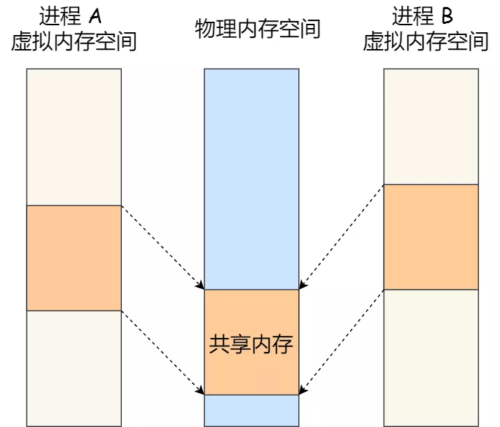
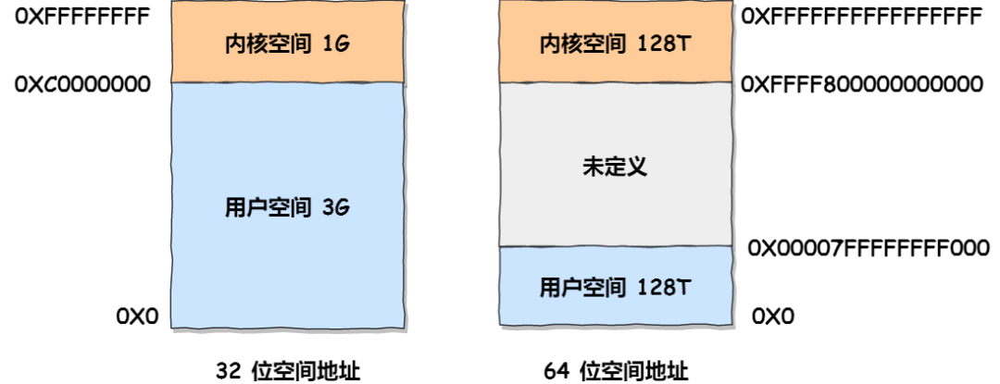
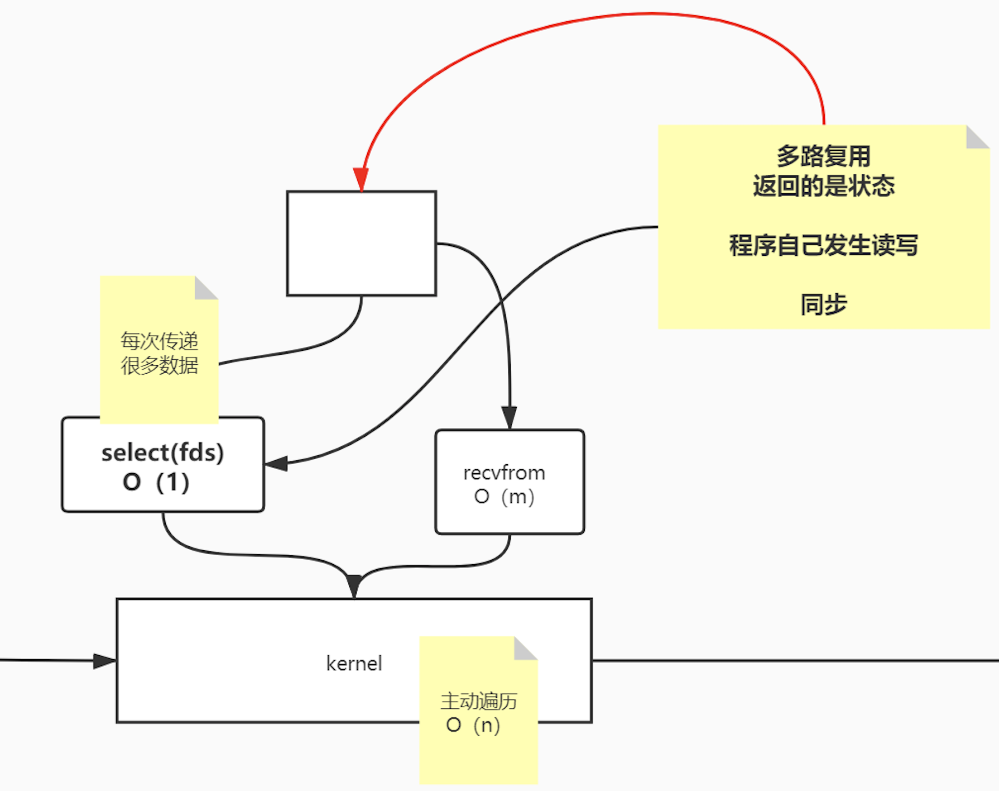
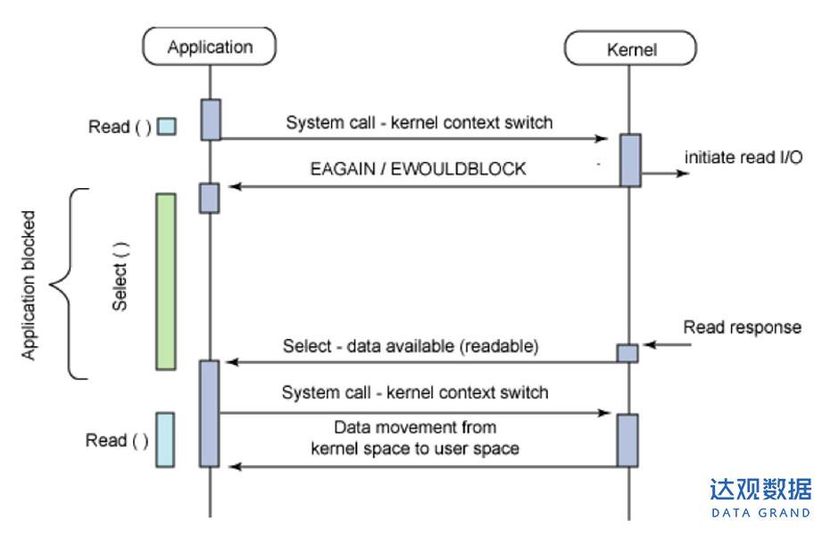
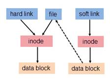
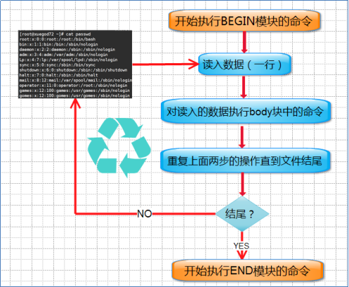

<!-- vim-markdown-toc GFM -->

* [1、unix进程间通信方式(IPC Inter-process communication)](#1unix进程间通信方式ipc-inter-process-communication)
* [2、Linux IO模式(同步IO和异步IO，阻塞IO和非阻塞IO)及 select、poll、epoll详解](#2linux-io模式同步io和异步io阻塞io和非阻塞io及-selectpollepoll详解)
    * [一 概念说明](#一-概念说明)
        * [用户空间与内核空间](#用户空间与内核空间)
        * [进程切换](#进程切换)
        * [进程的阻塞](#进程的阻塞)
        * [文件描述符fd](#文件描述符fd)
        * [缓存I/O](#缓存io)
        * [缓存 I/O 的缺点：](#缓存-io-的缺点)
    * [二 IO模式](#二-io模式)
        * [阻塞 I/O（blocking IO）](#阻塞-ioblocking-io)
        * [非阻塞 I/O（nonblocking IO）](#非阻塞-iononblocking-io)
        * [I/O 多路复用（ IO multiplexing）](#io-多路复用-io-multiplexing)
        * [异步 I/O（asynchronous IO）](#异步-ioasynchronous-io)
        * [总结](#总结)
            * [blocking和non-blocking的区别](#blocking和non-blocking的区别)
            * [synchronous IO和asynchronous IO的区别](#synchronous-io和asynchronous-io的区别)
    * [三 I/O 多路复用之select、poll、epoll详解](#三-io-多路复用之selectpollepoll详解)
        * [select](#select)
            * [Select实现过程](#select实现过程)
            * [select缺点](#select缺点)
        * [poll](#poll)
        * [epoll](#epoll)
            * [一 epoll操作过程](#一-epoll操作过程)
            * [redis epoll demo](#redis-epoll-demo)
            * [二 工作模式](#二-工作模式)
            * [三 代码演示](#三-代码演示)
            * [四 epoll总结](#四-epoll总结)
* [理解inode](#理解inode)
    * [inode是什么？](#inode是什么)
    * [inode的内容](#inode的内容)
    * [inode的大小](#inode的大小)
    * [inode号码](#inode号码)
    * [inode的特殊作用](#inode的特殊作用)
    * [Linux下删除正在进行读写操作的文件](#linux下删除正在进行读写操作的文件)
* [软链接（文件）和硬链接（文件）](#软链接文件和硬链接文件)
    * [inode](#inode)
    * [硬链接](#硬链接)
    * [符号链接](#符号链接)
* [awk、sed、grep](#awksedgrep)
    * [awk](#awk)
        * [语法结构](#语法结构)
        * [awk内置变量（预定义变量）](#awk内置变量预定义变量)
    * [sed](#sed)
        * [语法结构](#语法结构-1)
    * [grep](#grep)
        * [语法格式](#语法格式)

<!-- vim-markdown-toc -->


# 1、unix进程间通信方式(IPC Inter-process communication)

  

每个进程的用户地址空间都是独立的，一般而言是不能互相访问的，但内核空间是每个进程都共享的，所以进程之间要通信必须通过内核。

1. **管道（Pipe）**：所谓的管道，就是 **内核里面的一串缓存**。管道可用于具有亲缘关系进程间的通信，允许一个进程和另一个与它 **有共同祖先的进程**之间进行通信。
在linux系统中可以通过系统调用建立起一个单向的通信管道，且这种关系 **只能由父进程来建立**。
因此，每个管道都是 **单向**的，当需要双向通信时就需要建立起两个管道。管道两端的进程均将该管道看做一个文件，
一个进程负责往管道中写内容，而另一个从管道中读取。

管道有很多致命的 **缺点**，

* 比如只能在具有 **亲缘关系**的进程间通信，只能 **单向**传输数据，
* 另外管道的 **缓冲区是有限**的，管道制存在于 **内存**中，在管道创建时，为缓冲区分配一个页面大小，
* 管道所传送的是 **无格式字节流**，这就要求管道的读出方和写入方必须事先约定好数据的格式，
* 最后就是管道操作不当很容易 **阻塞**。因此管道虽然偶尔会见到，但是很少人会用。 
  
2. 命名管道（named pipe）：命名管道克服了管道没有名字的限制，因此，除具有管道所具有的功能外，它还允许无亲缘关系进程间的通信。
命名管道在文件系统中有对应的文件名。相对比管道，它是全双工的。命名管道通过命令mkfifo或系统调用mkfifo来创建。    
管道这种通信方式效率低，不适合进程间频繁地交换数据。

3. 消息（Message）队列： **消息队列是保存在内核中的消息链表**，包括Posix消息队列system V消息队列。有足够权限的进程可以向队列中添加消息，
被赋予读权限的进程则可以读走队列中的消息。
 
* 消息队列克服了信号承载信息量少，管道只能承载无格式字节流以及缓冲区大小受限等缺点**。 
* 缺点是一是通信不及时，二是消息体也有大小限制

消息队列生命周期随内核，如果没有释放消息队列或者没有关闭操作系统，消息队列会一直存在，而前面提到的匿名管道的生命周期，是随进程的创建而建立，
随进程的结束而销毁。

消息队列通信过程中， **存在用户态与内核态之间的数据拷贝开销**，因为进程写入数据到内核中的消息队列时，会发生从用户态拷贝数据到内核态的过程，
同理另一进程读取内核中的消息数据时，会发生从内核态拷贝数据到用户态的过程。



4. **共享内存**：共享内存的机制，就是拿出一块虚拟地址空间来，映射到相同的物理内存中，使得多个进程可以访问同一块内存空间，是 **最快**的可用IPC形式。
是针对其他通信机制运行效率较低而设计的。  
往往与其它通信机制，如信号量结合使用，来达到进程间的同步及互斥。  

 内存映射（mapped memory）：内存映射允许任何多个进程间通信，每一个使用该机制的进程通过把一个共享的文件映射到自己的进程地址空间
来实现它。 
 
5. 信号量（semaphore）：信号量实际上是一个整型的 **计数器**，主要用来控制多线程多进程对于共享资源访问，通常配合锁来实现。
同时只有一个进程或者线程操作共享资源，主要作为进程间以及同一进程不同线程之间的 **同步**手段。  

6. 信号（Signal）：信号是比较复杂的通信方式， **用于通知接受进程有某种事件发生**，除了用于进程间通信外，进程还可以发送信号给进程本身；
信号是进程间通信机制中唯一的 **异步通信机制**。  

7. **套接字（Socket）**：更为一般的进程间通信机制， **可用于不同机器之间的进程间通信**。起初是由Unix系统的BSD分支开发出来的，
但现在一般可以移植到其它类Unix系统上：Linux和System V的变种都支持套接字。

# 2、Linux IO模式(同步IO和异步IO，阻塞IO和非阻塞IO)及 select、poll、epoll详解
[转自](https://segmentfault.com/a/1190000003063859#articleHeader17)

同步IO和异步IO，阻塞IO和非阻塞IO分别是什么，到底有什么区别？不同的人在不同的上下文下给出的答案是不同的。所以先限定一下本文的上下文。

`本文讨论的背景是Linux环境下的network IO。`  
## 一 概念说明
在进行解释之前，首先要说明几个概念：  

- 用户空间和内核空间  
- 进程切换  
- 进程的阻塞  
- 文件描述符  
- 缓存 I/O  

### 用户空间与内核空间
  
现在操作系统都是采用虚拟存储器，那么对32位操作系统而言，它的寻址空间（虚拟存储空间）为4G（2的32次方）。操作系统的核心是内核，
独立于普通的应用程序，可以访问受保护的内存空间，也有访问底层硬件设备的所有权限。为了保证用户进程不能直接操作内核（kernel），
保证内核的安全，操心系统将虚拟空间划分为两部分，一部分为`内核空间`，一部分为`用户空间`。针对linux操作系统而言，将最高的1G字节
（从虚拟地址0xC0000000到0xFFFFFFFF），供内核使用，称为内核空间，而将较低的3G字节（从虚拟地址0x00000000到0xBFFFFFFF），
供各个进程使用，称为用户空间。

### 进程切换
为了控制进程的执行，内核必须有能力挂起正在CPU上运行的进程，并恢复以前挂起的某个进程的执行。这种行为被称为`进程切换`。因此可以说，
任何进程都是在操作系统内核的支持下运行的，是与内核紧密相关的。

从一个进程的运行转到另一个进程上运行，这个过程中经过下面这些变化：

1. 保存处理机上下文，包括程序计数器和其他寄存器。
2. 更新PCB信息。
3. 把进程的PCB移入相应的队列，如就绪、在某事件阻塞等队列。
4. 选择另一个进程执行，并更新其PCB。
5. 更新内存管理的数据结构。
6. 恢复处理机上下文。  

注：总而言之就是很耗资源，具体的可以参考这篇文章：[进程切换](http://guojing.me/linux-kernel-architecture/posts/process-switch/)

### 进程的阻塞
正在执行的进程，由于期待的某些事件未发生，如请求系统资源失败、等待某种操作的完成、新数据尚未到达或无新工作做等，则由系统自动执行
阻塞原语(Block)，使自己由运行状态变为阻塞状态。可见，进程的阻塞是进程 **自身**的一种主动行为，也因此只有处于运行态的进程（获得CPU），
才可能将其转为阻塞状态。`当进程进入阻塞状态，是不占用CPU资源的`。

### 文件描述符fd
文件描述符（File descriptor）是计算机科学中的一个术语，是一个用于表述指向文件的引用的抽象化概念。  
文件描述符在形式上是一个非负整数。实际上，它是一个索引值，指向内核为每一个进程所维护的该进程打开文件的记录表。当程序打开一个现有
文件或者创建一个新文件时，`内核向进程返回一个文件描述符`。在程序设计中，一些涉及底层的程序编写往往会围绕着文件描述符展开。但是文件
描述符这一概念往往只适用于UNIX、Linux这样的操作系统。

### 缓存I/O
缓存I/O又被称作标准I/O，大多数文件系统的默认I/O操作都是缓存I/O。在 [Linux 的缓存I/O机制中](https://blog.csdn.net/lne818/article/details/1006784)，操作系统会将I/O的数据缓存在文件系统
的页缓存（ page cache ）中，也就是说，`数据会先被拷贝到操作系统内核的缓冲区中，然后才会从操作系统内核的缓冲区拷贝到应用程序的地址空间`。

### 缓存 I/O 的缺点：
数据在传输过程中需要在应用程序地址空间和内核进行多次数据拷贝操作，这些数据拷贝操作所带来的CPU以及内存开销是非常大的。

## 二 IO模式
[5种网络IO模型](https://blog.csdn.net/xiexievv/article/details/44976215)  
[聊聊Linux 五种IO模型](https://www.jianshu.com/p/486b0965c296)

刚才说了，对于一次IO访问（以read举例），数据会先被拷贝到操作系统内核的缓冲区中，然后才会从操作系统内核的缓冲区拷贝到应用程序的
地址空间。所以说，当一个read操作发生时，它会经历`两个阶段`：

1. 等待数据准备 (Waiting for the data to be ready)
2. 将数据从内核拷贝到进程中 (Copying the data from the kernel to the process)

正式因为这两个阶段，linux系统产生了下面五种网络模式的方案。

- 阻塞 I/O（blocking IO）
- 非阻塞 I/O（nonblocking IO）
- I/O 多路复用（ IO multiplexing）
- 信号驱动 I/O（ signal driven IO）
- 异步 I/O（asynchronous IO）

注：由于signal driven IO在实际中并不常用，所以下面只提及剩下的四种IO Model。

### 阻塞 I/O（blocking IO）
在linux中，默认情况下所有的socket都是blocking，一个典型的读操作流程大概是这样：  


当用户进程调用了`recvfrom`这个系统调用，kernel就开始了IO的第一个阶段：准备数据（对于网络IO来说，很多时候数据在一开始还没有到达。
比如，还没有收到一个完整的UDP包。这个时候kernel就要等待足够的数据到来）。这个过程需要等待，也就是说数据被拷贝到操作系统内核的缓冲
区中是需要一个过程的。而在用户进程这边，整个进程会被阻塞（当然，是进程自己选择的阻塞）。当kernel一直等到数据准备好了，它就会将数据
从kernel中拷贝到用户内存，然后kernel返回结果，用户进程才解除block的状态，重新运行起来。

`所以，blocking IO的特点就是在IO执行的两个阶段都被block了。`

### 非阻塞 I/O（nonblocking IO）
linux下，可以通过设置socket使其变为non-blocking。当对一个non-blocking socket执行读操作时，流程是这个样子：  


当用户进程发出read操作时，如果kernel中的数据还没有准备好，那么它并不会block用户进程，而是立刻返回一个error。从用户进程角度讲，
它发起一个read操作后，并不需要等待，而是马上就得到了一个结果。用户进程判断结果是一个error时，它就知道数据还没有准备好，于是它可以
再次发送read操作。一旦kernel中的数据准备好了，并且又再次收到了用户进程的system call，那么它马上就将数据拷贝到了用户内存，然后返回。

`所以，nonblocking IO的特点是用户进程需要不断的主动询问kernel数据好了没有。`

### I/O 多路复用（ IO multiplexing）
IO multiplexing就是我们说的select，poll，epoll，有些地方也称这种IO方式为event driven IO。select/epoll的好处就在于
`单个process就可以同时处理多个网络连接的IO`。它的基本原理就是select，poll，epoll这个function会不断的轮询所负责的所有socket，
当某个socket有数据到达了，就通知用户进程。  


`当用户进程调用了select，那么整个进程会被block`，而同时，kernel会“监视”所有select负责的socket，当任何一个socket中的数据准备
好了，select就会返回。这个时候用户进程再调用read操作，将数据从kernel拷贝到用户进程。

`所以，I/O 多路复用的特点是通过一种机制一个进程能同时等待多个文件描述符，而这些文件描述符（套接字描述符）其中的任意一个进入读就绪状态，select()函数就可以返回。`  

这个图和blocking IO的图其实并没有太大的不同，事实上，还更差一些。因为这里需要使用两个system call (select 和 recvfrom)，
而blocking IO只调用了一个system call (recvfrom)。但是，用select的优势在于它可以 **同时处理多个connection**。

所以，如果处理的连接数不是很高的话，使用select/epoll的web server不一定比使用multi-threading + blocking IO的
web server性能更好，可能延迟还更大。select/epoll的优势并不是对于单个连接能处理得更快，而是在于能处理更多的连接。

在IO multiplexing Model中，实际中，对于每一个socket，一般都设置成为non-blocking，但是，如上图所示，整个用户的process
其实是一直被block的。只不过process是被select这个函数block，而不是被socket IO给block。

### 异步 I/O（asynchronous IO）
Linux下的asynchronous IO其实用得很少。先看一下它的流程：  


用户进程发起read操作之后，立刻就可以开始去做其它的事。而另一方面，从kernel的角度，当它收到一个asynchronous read之后，首先它
会立刻返回，所以不会对用户进程产生任何block。然后，kernel会等待数据准备完成，然后将数据拷贝到用户内存，当这一切都完成之后，
kernel会给用户进程发送一个signal，告诉它read操作完成了。

### 总结
#### blocking和non-blocking的区别
调用blocking IO会一直block住对应的进程直到操作完成，而non-blocking IO在kernel还准备数据的情况下会立刻返回。

#### synchronous IO和asynchronous IO的区别
在说明synchronous IO和asynchronous IO的区别之前，需要先给出两者的定义。POSIX的定义是这样子的：

- A synchronous I/O operation causes the requesting process to be blocked until that I/O operation completes;
- An asynchronous I/O operation does not cause the requesting process to be blocked;

两者的区别就在于synchronous IO做”IO operation”的时候会将process阻塞。按照这个定义，之前所述的blocking IO，non-blocking IO，
IO multiplexing都属于synchronous IO。

有人会说，non-blocking IO并没有被block啊。这里有个非常“狡猾”的地方，定义中所指的”IO operation”是指真实的IO操作，就是例子中
的recvfrom这个system call。non-blocking IO在执行recvfrom这个system call的时候，如果kernel的数据没有准备好，这时候不会
block进程。但是，当kernel中数据准备好的时候，recvfrom会将数据从kernel拷贝到用户内存中，这个时候进程是被block了，在这段时间内，进程是被block的。

而asynchronous IO则不一样，当进程发起IO 操作之后，就直接返回再也不理睬了，直到kernel发送一个信号，告诉进程说IO完成。在这整个
过程中，进程完全没有被block。

各个IO Model的比较如图所示：  


通过上面的图片，可以发现non-blocking IO和asynchronous IO的区别还是很明显的。在non-blocking IO中，虽然进程大部分时间都
不会被block，但是它仍然要求进程去主动的check，并且当数据准备完成以后，也需要进程主动的再次调用recvfrom来将数据拷贝到用户内存。
而asynchronous IO则完全不同。它就像是用户进程将整个IO操作交给了他人（kernel）完成，然后他人做完后发信号通知。在此期间，用户进程不需要
去检查IO操作的状态，也不需要主动的去拷贝数据。

## 三 I/O 多路复用之select、poll、epoll详解
[selec,poll和epoll区别总结](http://www.cnblogs.com/Anker/p/3265058.html)

[Tornado原理浅析](https://www.jiqizhixin.com/articles/2019-04-10-15)

**select，poll，epoll都是IO多路复用的机制。I/O多路复用就是通过一种机制，一个进程可以监视多个文件描述符，一旦某个描述符就绪
（一般是读就绪或者写就绪），能够通知程序进行相应的读写操作**。但`select，poll，epoll本质上都是同步I/O`，因为他们都需要在读写事件
就绪后自己负责进行读写，也就是说这个读写过程是阻塞的，而异步I/O则无需自己负责进行读写，异步I/O的实现会负责把数据从内核拷贝到用户空间。

### select



`int select (int n, fd_set *readfds, fd_set *writefds, fd_set *exceptfds, struct timeval *timeout);`  

select 函数监视的文件描述符分3类，分别是writefds、readfds、和exceptfds。调用后select函数会阻塞，直到有描述符就绪
（有数据可读、可写、或者有except），或者超时（timeout指定等待时间，如果立即返回设为null即可），函数返回。当select函数返回后，
可以通过遍历fdset，来找到就绪的描述符。


#### Select实现过程

1. 首先fdset集合里需要监控的文件句柄由程序员来添加，当前连接需要监控哪些文件句柄，那么通过FD_SET宏来进行添加。

2. 然后调用select()函数将fd_set从用户空间拷贝到内核空间。

3. 注册一个回调函数。

4. 内核对文件句柄进行监控。

5. 当有满足可读写等条件时/超时调用回调函数并将文件句柄集合拷贝回用户空间。

6. 应用通过轮询的方式查找所有文件句柄，用FD_ISSET宏来判读具体是哪个文件句柄可操作。

7. 当再次有新连接处理需要监控，再次重复以上步骤往内核拷贝fdset。



select目前几乎在所有的平台上支持，其良好`跨平台支持`也是它的一个优点。select的一个缺点在于`单个进程能够监视的文件描述符的数量存在最大限制`，
在Linux上一般为1024，可以通过修改宏定义甚至重新编译内核的方式提升这一限制，但是这样也会造成效率的降低。

#### select缺点

1. **句柄上限** select支持的文件描述符数量太小，默认1024，epoll无限制，所支持的FD上限是最大可以打开文件的数目，可查看`/proc/sys/fs/file-max`
2. **查询效率低** 每次调用select都需要在内核遍历传递进来的 **所有fd**，这个开销在fd很多时也很大
3. **重复初始化** 每次调用select，都需要把fd集合从用户态 **拷贝**到内核态，这个开销在fd很多时会很大

poll改善了第一个缺点

epoll改了三个缺点.

### poll
`int poll (struct pollfd *fds, unsigned int nfds, int timeout);`  
不同于select使用三个位图来表示三个fdset的方式，poll使用一个pollfd的指针实现。

```
struct pollfd {
    int fd; /* file descriptor */
    short events; /* requested events to watch */
    short revents; /* returned events witnessed */
};
```

pollfd结构包含了要监视的event和发生的event，不再使用select“参数-值”传递的方式。同时，pollfd并没有最大数量限制（但是数量过大后性能也是会下降）。 
和select函数一样，poll返回后，需要轮询pollfd来获取就绪的描述符。

poll技术与select 技术本质上是没有区别的，只是文件句柄的存储结构变更了，变成了 **链表**，所以没有了文件句柄的上限，但是其他缺点依旧存在。

`从上面看，select和poll都需要在返回后，通过遍历文件描述符来获取已经就绪的socket。事实上，同时连接的大量客户端在一时刻可能只有
很少的处于就绪状态，因此随着监视的描述符数量的增长，其效率也会线性下降。`

### epoll
[关于epoll的介绍](http://www.cnblogs.com/my_life/articles/3968782.html)

epoll是在2.6内核中提出的，是之前的select和poll的增强版本。相对于select和poll来说，epoll更加灵活，`没有描述符限制`。epoll
使用一个文件描述符管理多个描述符，将用户关系的文件描述符的事件存放到内核的一个事件表中，这样在用户空间和内核空间的copy只需一次。


#### 一 epoll操作过程
epoll操作过程需要三个接口，分别如下：

```
int epoll_create(int size)；//创建一个epoll的句柄，size用来告诉内核这个监听的数目一共有多大
int epoll_ctl(int epfd, int op, int fd, struct epoll_event *event)；
int epoll_wait(int epfd, struct epoll_event * events, int maxevents, int timeout);
```

1. int epoll_create(int size);  
创建一个epoll的句柄，size用来告诉内核这个监听的数目一共有多大，这个参数不同于select()中的第一个参数，给出最大监听的fd+1的值，
参数size并不是限制了epoll所能监听的描述符最大个数，只是对内核初始分配内部数据结构的一个建议。
当创建好epoll句柄后，它就会占用一个fd值，在linux下如果查看/proc/进程id/fd/，是能够看到这个fd的，所以在使用完epoll后，必须
调用close()关闭，否则可能导致fd被耗尽。  

2. int epoll_ctl(int epfd, int op, int fd, struct epoll_event *event)；  
函数是对指定描述符fd执行op操作。

- epfd：是epoll_create()的返回值。
- op：表示op操作，用三个宏来表示：添加EPOLL_CTL_ADD，删除EPOLL_CTL_DEL，修改EPOLL_CTL_MOD。分别添加、删除和修改对fd的监听事件。
- fd：是需要监听的fd（文件描述符）
- epoll_event：是告诉内核需要监听什么事，struct epoll_event结构如下：  
```
struct epoll_event {
  __uint32_t events;  /* Epoll events */
  epoll_data_t data;  /* User data variable */
};
//events可以是以下几个宏的集合：
EPOLLIN ：表示对应的文件描述符可以读（包括对端SOCKET正常关闭）；
EPOLLOUT：表示对应的文件描述符可以写；
EPOLLPRI：表示对应的文件描述符有紧急的数据可读（这里应该表示有带外数据到来）；
EPOLLERR：表示对应的文件描述符发生错误；
EPOLLHUP：表示对应的文件描述符被挂断；
EPOLLET： 将EPOLL设为边缘触发(Edge Triggered)模式，这是相对于水平触发(Level Triggered)来说的。
EPOLLONESHOT：只监听一次事件，当监听完这次事件之后，如果还需要继续监听这个socket的话，需要再次把这个socket加入到EPOLL队列里
```  

3.int epoll_wait(int epfd, struct epoll_event * events, int maxevents, int timeout);  
等待epfd上的io事件，最多返回maxevents个事件。
参数events用来从内核得到事件的集合，maxevents告之内核这个events有多大，这个maxevents的值不能大于创建epoll_create()时的
size，参数timeout是超时时间（毫秒，0会立即返回，-1将不确定，也有说法说是永久阻塞）。该函数返回需要处理的事件数目， **返回0表示已超时**。

#### redis epoll demo

```
execve("./redis-server-ap-4.0.6.5", ["./redis-server-ap-4.0.6.5"], [/* 26 vars */]) = 0
epoll_create(1024)                      = 5
socket(PF_INET6, SOCK_STREAM, IPPROTO_TCP) = 6
setsockopt(6, SOL_IPV6, IPV6_V6ONLY, [1], 4) = 0
setsockopt(6, SOL_SOCKET, SO_REUSEADDR, [1], 4) = 0
bind(6, {sa_family=AF_INET6, sin6_port=htons(6379), inet_pton(AF_INET6, "::", &sin6_addr), sin6_flowinfo
=0, sin6_scope_id=0}, 28) = 0
listen(6, 511)                          = 0
fcntl(6, F_GETFL)                       = 0x2 (flags O_RDWR)
fcntl(6, F_SETFL, O_RDWR|O_NONBLOCK)    = 0
socket(PF_INET, SOCK_STREAM, IPPROTO_TCP) = 7
setsockopt(7, SOL_SOCKET, SO_REUSEADDR, [1], 4) = 0
bind(7, {sa_family=AF_INET, sin_port=htons(6379), sin_addr=inet_addr("0.0.0.0")}, 16) = 0
listen(7, 511)                          = 0
fcntl(7, F_GETFL)                       = 0x2 (flags O_RDWR)
fcntl(7, F_SETFL, O_RDWR|O_NONBLOCK)    = 0
epoll_ctl(5, EPOLL_CTL_ADD, 6, {EPOLLIN, {u32=6, u64=6}}) = 0
epoll_ctl(5, EPOLL_CTL_ADD, 7, {EPOLLIN, {u32=7, u64=7}}) = 0
epoll_ctl(5, EPOLL_CTL_ADD, 3, {EPOLLIN, {u32=3, u64=3}}) = 0

epoll_wait(5, {}, 10128, 0)             = 0
open("/proc/3131257/stat", O_RDONLY)    = 12
read(12, "3131257 (redis-server-ap) R 3131"..., 4096) = 340
close(12)                               = 0
wait4(-1, 0x7ffdcfb60c10, WNOHANG, NULL) = 0
read(3, 0x7ffdcfb60c0f, 1)              = -1 EAGAIN (Resource temporarily unavailable)
epoll_wait(5, 7feb13adb740, 10128, 100) = -1 EINTR (Interrupted system call)
--- SIGCHLD {si_signo=SIGCHLD, si_code=CLD_EXITED, si_pid=3131264, si_uid=1000, si_status=0, si_utime=0, si_stime=0} ---
read(3, 0x7ffdcfb60c0f, 1)              = -1 EAGAIN (Resource temporarily unavailable)
epoll_wait(5, {}, 10128, 9)             = 0
open("/proc/3131257/stat", O_RDONLY)    = 12
read(12, "3131257 (redis-server-ap) R 3131"..., 4096) = 340
close(12)                               = 0
wait4(-1, [{WIFEXITED(s) && WEXITSTATUS(s) == 0}], WNOHANG, NULL) = 3131264
stat("/etc/localtime", {st_mode=S_IFREG|0644, st_size=388, ...}) = 0
write(1, "3131257:M 04 Apr 16:44:13.371 * "..., 74) = 74
read(10, "\0\0\0\0\0\0\0\0\0\220\2\0\0\0\0\0xV4\22z\332}\301", 24) = 24
close(10)                               = 0
close(11)                               = 0
read(3, 0x7ffdcfb60c0f, 1)              = -1 EAGAIN (Resource temporarily unavailable)
epoll_wait(5, {}, 10128, 100)           = 0

epoll_wait(5, {{EPOLLIN, {u32=10, u64=10}}}, 10128, 100) = 1
read(10, "info\n", 16384)               = 5

```


#### 二 工作模式
epoll对文件描述符的操作有两种模式：LT（level trigger）和ET（edge trigger）。LT模式是默认模式，LT模式与ET模式的区别如下：  
LT模式：当epoll_wait检测到描述符事件发生并将此事件通知应用程序，应用程序可以不立即处理该事件。下次调用epoll_wait时，
会再次响应应用程序并通知此事件。  
ET模式：当epoll_wait检测到描述符事件发生并将此事件通知应用程序，应用程序必须立即处理该事件。如果不处理，下次调用epoll_wait时，
不会再次响应应用程序并通知此事件。

1.LT模式  
LT(level triggered)是缺省的工作方式，并且同时支持block和no-block socket.在这种做法中，内核告诉你一个文件描述符是否就绪了，
然后你可以对这个就绪的fd进行IO操作。如果你不作任何操作，内核还是会继续通知你的。

2.ET模式  
ET(edge-triggered)是高速工作方式，只支持 **no-block socket**。在这种模式下，当描述符从未就绪变为就绪时，内核通过epoll告诉你。
然后它会假设你知道文件描述符已经就绪，并且不会再为那个文件描述符发送更多的就绪通知，直到你做了某些操作导致那个文件描述符不再为就绪状态了(
比如，你在发送，接收或者接收请求，或者发送接收的数据少于一定量时导致了一个EWOULDBLOCK 错误）。但是请注意，如果一直不对
这个fd作IO操作(从而导致它再次变成未就绪)，内核不会发送更多的通知(only once)

ET模式在很大程度上减少了epoll事件被重复触发的次数，因此效率要比LT模式高。epoll工作在ET模式的时候，必须使用非阻塞套接口，以避免
由于一个文件句柄的阻塞读/阻塞写操作把处理多个文件描述符的任务饿死。

**LT可以理解为水平触发，只要有数据可以读，不管怎样都会通知。而ET为边缘触发，只有状态发生变化时才会通知，可以理解为电平变化。**

3.总结  
假如有这样一个例子：  
1. 我们已经把一个用来从管道中读取数据的文件句柄(RFD)添加到epoll描述符  
2. 这个时候从管道的另一端被写入了2KB的数据  
3. 调用epoll_wait(2)，并且它会返回RFD，说明它已经准备好读取操作  
4. 然后我们读取了1KB的数据  
5. 调用epoll_wait(2)......  

LT模式：
如果是LT模式，那么在第5步调用epoll_wait(2)之后，仍然能收到通知。

ET模式：
如果我们在第1步将RFD添加到epoll描述符的时候使用了EPOLLET标志，那么在第5步调用epoll_wait(2)之后将有可能会挂起，因为剩余的
数据还存在于文件的输入缓冲区内，而且数据发出端还在等待一个针对已经发出数据的反馈信息。只有在监视的文件句柄上发生了某个事件的时候
ET 工作模式才会汇报事件。因此在第5步的时候，调用者可能会放弃等待仍在存在于文件输入缓冲区内的剩余数据。

当使用epoll的ET模型来工作时，当产生了一个EPOLLIN事件后，
读数据的时候需要考虑的是当recv()返回的大小如果等于请求的大小，那么很有可能是缓冲区还有数据未读完，也意味着该次事件还没有处理完，
所以还需要再次读取：  
```
while(rs){
  buflen = recv(activeevents[i].data.fd, buf, sizeof(buf), 0);
  if(buflen < 0){
    // 由于是非阻塞的模式,所以当errno为EAGAIN时,表示当前缓冲区已无数据可读
    // 在这里就当作是该次事件已处理处.
    if(errno == EAGAIN){
        break;
    }
    else{
        return;
    }
  }
  else if(buflen == 0){
     // 这里表示对端的socket已正常关闭.
  }
 if(buflen == sizeof(buf){
      rs = 1;   // 需要再次读取
 }
 else{
      rs = 0;
 }
}
```  

Linux中的EAGAIN含义  
Linux环境下开发经常会碰到很多错误(设置errno)，其中EAGAIN是其中比较常见的一个错误(比如用在非阻塞操作中)。
从字面上来看，是提示再试一次。这个错误经常出现在当应用程序进行一些非阻塞(non-blocking)操作(对文件或socket)的时候。

例如，以O_NONBLOCK的标志打开文件/socket/FIFO，如果你连续做read操作而没有数据可读。此时程序不会阻塞起来等待数据准备就绪返回，
read函数会返回一个错误EAGAIN，提示你的应用程序现在没有数据可读请稍后再试。
又例如，当一个系统调用(比如fork)因为没有足够的资源(比如虚拟内存)而执行失败，返回EAGAIN提示其再调用一次(也许下次就能成功)。

#### 三 代码演示
下面是一段不完整的代码且格式不对，意在表述上面的过程，去掉了一些模板代码。

```c
#define IPADDRESS   "127.0.0.1"
#define PORT        8787
#define MAXSIZE     1024
#define LISTENQ     5
#define FDSIZE      1000
#define EPOLLEVENTS 100

listenfd = socket_bind(IPADDRESS,PORT);

struct epoll_event events[EPOLLEVENTS];

//创建一个描述符
epollfd = epoll_create(FDSIZE);

//添加监听描述符事件
add_event(epollfd,listenfd,EPOLLIN);

//循环等待
for ( ; ; ){
    //该函数返回已经准备好的描述符事件数目
    ret = epoll_wait(epollfd,events,EPOLLEVENTS,-1);
    //处理接收到的连接
    handle_events(epollfd,events,ret,listenfd,buf);
}

//事件处理函数
static void handle_events(int epollfd,struct epoll_event *events,int num,int listenfd,char *buf)
{
     int i;
     int fd;
     //进行遍历;这里只要遍历已经准备好的io事件。num并不是当初epoll_create时的FDSIZE。
     for (i = 0;i < num;i++)
     {
         fd = events[i].data.fd;
        //根据描述符的类型和事件类型进行处理
         if ((fd == listenfd) &&(events[i].events & EPOLLIN))
            handle_accpet(epollfd,listenfd);
         else if (events[i].events & EPOLLIN)
            do_read(epollfd,fd,buf);
         else if (events[i].events & EPOLLOUT)
            do_write(epollfd,fd,buf);
     }
}

//添加事件
static void add_event(int epollfd,int fd,int state){
    struct epoll_event ev;
    ev.events = state;
    ev.data.fd = fd;
    epoll_ctl(epollfd,EPOLL_CTL_ADD,fd,&ev);
}

//处理接收到的连接
static void handle_accpet(int epollfd,int listenfd){
     int clifd;     
     struct sockaddr_in cliaddr;     
     socklen_t  cliaddrlen;     
     clifd = accept(listenfd,(struct sockaddr*)&cliaddr,&cliaddrlen);     
     if (clifd == -1)         
     perror("accpet error:");     
     else {         
         printf("accept a new client: %s:%d\n",inet_ntoa(cliaddr.sin_addr),cliaddr.sin_port);                       //添加一个客户描述符和事件         
         add_event(epollfd,clifd,EPOLLIN);     
     } 
}

//读处理
static void do_read(int epollfd,int fd,char *buf){
    int nread;
    nread = read(fd,buf,MAXSIZE);
    if (nread == -1)     {         
        perror("read error:");         
        close(fd); //记住close fd        
        delete_event(epollfd,fd,EPOLLIN); //删除监听 
    }
    else if (nread == 0)     {         
        fprintf(stderr,"client close.\n");
        close(fd); //记住close fd       
        delete_event(epollfd,fd,EPOLLIN); //删除监听 
    }     
    else {         
        printf("read message is : %s",buf);        
        //修改描述符对应的事件，由读改为写         
        modify_event(epollfd,fd,EPOLLOUT);     
    } 
}

//写处理
static void do_write(int epollfd,int fd,char *buf) {     
    int nwrite;     
    nwrite = write(fd,buf,strlen(buf));     
    if (nwrite == -1){         
        perror("write error:");        
        close(fd);   //记住close fd       
        delete_event(epollfd,fd,EPOLLOUT);  //删除监听    
    }else{
        modify_event(epollfd,fd,EPOLLIN); 
    }    
    memset(buf,0,MAXSIZE); 
}

//删除事件
static void delete_event(int epollfd,int fd,int state) {
    struct epoll_event ev;
    ev.events = state;
    ev.data.fd = fd;
    epoll_ctl(epollfd,EPOLL_CTL_DEL,fd,&ev);
}

//修改事件
static void modify_event(int epollfd,int fd,int state){     
    struct epoll_event ev;
    ev.events = state;
    ev.data.fd = fd;
    epoll_ctl(epollfd,EPOLL_CTL_MOD,fd,&ev);
}

//注：另外一端我就省了
```

#### 四 epoll总结
`在select/poll中，进程只有在调用一定的方法后，内核才对所有监视的文件描述符进行扫描，而epoll事先通过epoll_ctl()来注册一个文件
描述符，一旦基于某个文件描述符就绪时，内核会采用类似callback的回调机制，迅速激活这个文件描述符，当进程调用epoll_wait() 时便得到通知。(
此处去掉了遍历文件描述符，而是通过监听回调的的机制。这正是epoll的魅力所在。)`

epoll的`优点`主要是一下几个方面：

1. **监视的描述符数量不受限制**，它所支持的FD上限是最大可以打开文件的数目，这个数字一般远大于2048,举个例子,在1GB内存的机器上大约是
10万左右，具体数目可以cat /proc/sys/fs/file-max察看,一般来说这个数目和系统内存关系很大。select的最大缺点就是进程打开的fd
是有数量限制的。这对于连接数量比较大的服务器来说根本不能满足。虽然也可以选择多进程的解决方案( Apache就是这样实现的)，不过虽然
linux上面创建进程的代价比较小，但仍旧是不可忽视的，加上进程间数据同步远比不上线程间同步的高效，所以也不是一种完美的方案。

2. **IO的效率不会随着监视fd的数量的增长而下降**。epoll不同于select和poll轮询的方式，而是通过每个fd定义的回调函数来实现的。
只有就绪的fd才会执行回调函数。
如果没有大量的idle-connection或者dead-connection，epoll的效率并不会比select/poll高很多，但是当遇到大量的
idle-connection，就会发现epoll的效率大大高于select/poll。

3. 为了减少重复初始化过程中用户空间和内核空间发生不必要的拷贝带来的资源浪费，epoll技术提供了epoll_ctl函数，在用epoll_ctl函数进行事件注册的时候，
会将文件句柄都复制到内核中，所以不用每次都复制一遍，当有新的文件句柄时采用的也是增量往内核拷贝，确保了每个文件句柄只会被拷贝一次。

# 理解inode

## inode是什么？

理解inode，要从文件储存说起。

文件储存在硬盘上，硬盘的最小存储单位叫做`扇区`（Sector）。每个扇区储存512字节（相当于0.5KB）。

操作系统读取硬盘的时候，不会一个个扇区地读取，这样效率太低，而是一次性连续读取多个扇区，即一次性读取一个"块"（block）。这种由多个扇区组成的`块`，
**是文件存取的最小单位**。"块"的大小，最常见的是4KB，即连续八个 sector组成一个 block。

文件数据都储存在"块"中，那么很显然，我们还必须找到一个地方储存文件的`元信息`，比如文件的创建者、文件的创建日期、文件的大小等等。这种储存文件元信息的区域
就叫做`inode`，中文译名为"索引节点"。

## inode的内容

inode包含文件的元信息，具体来说有以下内容：

　　* 文件的字节数

　　* 文件拥有者的User ID

　　* 文件的Group ID

　　* 文件的读、写、执行权限

　　* 文件的时间戳，共有三个：ctime指inode上一次变动的时间，mtime指文件内容上一次变动的时间，atime（access time）指文件上一次打开的时间。

　　* 链接数，即有多少文件名指向这个inode

　　* 文件数据block的位置

可以用stat命令，查看某个文件的inode信息：

```
stat nohup.out
  File: ‘nohup.out’
  Size: 11785     	Blocks: 24         IO Block: 4096   regular file
Device: 801h/2049d	Inode: 5242910     Links: 1
Access: (0600/-rw-------)  Uid: (    0/    root)   Gid: (    0/    root)
Access: 2017-05-17 09:31:59.920917750 +0800
Modify: 2017-05-17 09:33:48.090467945 +0800
Change: 2017-05-17 09:33:48.090467945 +0800
 Birth: -
```

总之， **除了文件名以外的所有文件信息，都存在inode之中**。至于为什么没有文件名，下文会有详细解释。

## inode的大小

inode也会消耗硬盘空间，所以硬盘格式化的时候，操作系统自动将硬盘分成两个区域。一个是`数据区`，存放文件数据；另一个是`inode区`（inode table），
存放inode所包含的信息。

每个inode节点的大小，一般是128字节或256字节。inode节点的总数，在格式化时就给定，一般是每1KB或每2KB就设置一个inode。假定在一块1GB的硬盘中，
每个inode节点的大小为128字节，每1KB就设置一个inode，那么inode table的大小就会达到128MB，占整块硬盘的12.8%。

查看每个硬盘分区的inode总数和已经使用的数量，可以使用df命令。

```
df -i
Filesystem       Inodes   IUsed    IFree IUse% Mounted on
/dev/sda1       5808128   92103  5716025    2% /
udev            8146173     434  8145739    1% /dev
tmpfs           8148276      14  8148262    1% /sys/fs/cgroup
/dev/sdb1      61054976 3079379 57975597    6% /data00
```

由于每个文件都必须有一个inode，因此有可能发生inode已经用光，但是硬盘还未存满的情况。这时，就无法在硬盘上创建新文件。

## inode号码

每个inode都有一个号码，`操作系统`用inode号码来识别不同的文件。

这里值得重复一遍，Unix/Linux系统内部不使用文件名，而使用inode号码来识别文件。对于系统来说，文件名只是inode号码便于识别的别称或者绰号。

表面上，用户通过文件名，打开文件。实际上，系统内部这个过程分成 **三步**：  
首先，系统找到这个文件名对应的inode号码；  
其次，通过inode号码，获取inode信息；  
最后，根据inode信息，找到文件数据所在的block，读出数据。

使用ls -i命令，可以看到文件名对应的inode号码：

```
 ls -i nohup.out
5242910 nohup.out
```

## inode的特殊作用

由于inode号码与文件名分离，这种机制导致了一些Unix/Linux系统特有的现象。

1. 有时，文件名包含特殊字符，无法正常删除。这时，直接删除inode节点，就能起到删除文件的作用。   
2. 移动文件或重命名文件，只是改变文件名，不影响inode号码。   
3. 打开一个文件以后，系统就以inode号码来识别这个文件，不再考虑文件名。因此，通常来说，系统无法从inode号码得知文件名。

第3点使得软件更新变得简单，可以在不关闭软件的情况下进行更新，不需要重启。因为系统通过inode号码，识别运行中的文件，不通过文件名。更新的时候，
新版文件以同样的文件名，生成一个新的inode，不会影响到运行中的文件。等到下一次运行这个软件的时候，文件名就自动指向新版文件，旧版文件的inode则被回收。

## Linux下删除正在进行读写操作的文件
多进程环境下，打开同一个文件，进行读写操作过程中，如果其中一个进程删除这个文件，那么，另外正在读写这个文件会发生什么呢？

Linux 是通过 link 的数量来控制文件删除，只有当一个文件不存在任何 link 的时候，这个文件才会被删除。

每个文件都有2个link计数器 —— `i_count 和 i_nlink`。i_count 的意义是当前使用者的数量，i_nlink 的意义是介质连接的数量；或者可以理解为 
i_count 是内存引用计数器，i_nlink 是硬盘引用计数器。再换句话说，`当文件被某个进程引用时，i_count 就会增加；当创建文件的硬连接的时候，i_nlink 就会增加`。

对于`rm而言，就是减少i_nlink`。这里就出现一个问题，如果一个文件正在被某个进程调用，而用户却执行 rm 操作把文件删除了，会出现什么结果呢？

当用户执行 rm 操作后，ls 或者其他文件管理命令不再能够找到这个文件，但是进程却依然在继续正常执行，依然能够从文件中正确的读取内容。这是因为，rm 
操作只是将 i_nlink 置为 0 了；由于文件被进程引用的缘故，i_count 不为 0，所以系统没有真正删除这个文件。i_nlink 是文件删除的充分条件，而 `i_count 
才是文件删除的必要条件`。

基于以上只是，大家猜一下，如果在一个进程在打开文件写日志的时候，手动或者另外一个进程将这个日志删除，会发生什么情况？

是的，数据库并没有停掉。虽然日志文件被删除了，但是有一个进程已经打开了那个文件，所以向那个文件中的写操作仍然会成功，数据仍然会提交。

下面，告诉大家如何恢复那个删除的文件。

例如，你删除了tcpdump.log，执行lsof | grep tcpdump.log，你应该能看到这样的输出：

tcpdump 2864 tcpdump 4w REG 253,0 0 671457 /root/tcpdump.log (deleted)

然后：cp /proc/2864/fd/4 /root/tcpdump.log

# 软链接（文件）和硬链接（文件）
## inode


文件有文件名与数据，这在Linux上被分成两个部分： **用户数据 (user data) 与元数据 (metadata)**。用户数据，即文件数据块 (data block)，
数据块是记录文件真实内容的地方；而元数据则是文件的附加属性，如文件大小、创建时间、所有者等信息。在 Linux 中，元数据中的 inode 号（inode 是
文件元数据的一部分但其并不包含文件名，inode 号即索引节点号）才是文件的唯一标识而非文件名。文件名仅是为了方便人们的记忆和使用，系统或程序通过
inode 号寻找正确的文件数据块。上图展示了程序通过文件名获取文件内容的过程。


Linux下的链接文件有点类似于Windows的快捷方式，但又不完全一样。链接文件有两种：一种是硬链接，另一种是符号链接（又称软链接）。



## 硬链接
**硬链接是通过索引节点进行的链接**。在Linux中，多个文件指向同一个索引节点是允许的，像这样的链接就是硬链接。硬链接只能在 **同一文件系统**中的文件之间进行链接，
**不能对目录进行创建**。如果删除硬链接对应的源文件，则硬链接文件仍然存在，而且保存了原有的内容，这样可以起到防止因为误操作而错误删除文件的作用。
由于硬链接是有着相同 inode 号仅文件名不同的文件，因此，删除一个硬链接文件并不影响其他有相同 inode 号的文件。

硬链接可由命令 link 或 ln 创建，如：

```
link oldfile newfile 
ln oldfile newfile
```

## 符号链接
软链接（也叫符号链接）与硬链接不同，文件用户数据块中存放的内容是另一文件的路径名的指向。软链接就是一个普通文件，只是数据块内容有点特殊。软链接可对文件或目录创建。

软链接主要应用于以下两个方面(应用场景）：

* 一是 **方便管理**，例如可以把一个复杂路径下的文件链接到一个简单路径下方便用户访问；
* 另一方面就是 **解决文件系统磁盘空间不足的情况**。例如某个文件文件系统空间已经用完了，但是现在必须在该文件系统下创建一个新的目录并存储大量的文件，
那么可以把另一个剩余空间较多的文件系统中的目录链接到该文件系统中，这样就可以很好的解决空间不足问题。删除软链接并不影响被指向的文件，
但若被指向的原文件被删除，则相关软连接就变成了死链接。

使用-s选项的ln命令即可创建符号链接，命令如下：

```
ln -s old.file soft.link
ln -s old.dir soft.link.dir
```

# awk、sed、grep

[awk、sed、grep](https://blog.csdn.net/qq_25663723/article/details/53161646)

## awk
Alfred Aho Peter Weinberger和brian kernighan三个人的姓的缩写。  
简单地说，`AWK`是一种用于处理文本的编程语言工具，相比于 **sed常常用于一整行的处理，awk则倾向于将一行分成数段来处理**。  
任何awk语句都是由模式和动作组成，一个awk脚本可以有多个语句。模式决定动作语句的触发条件和触发时间。 

### 语法结构

```
awk 'BEGIN{ print "start" } ‘pattern{ commands }’ END{ print "end" }' file
#BEGIN语句设置计数和打印头部信息，在任何动作之前进行
#END语句输出统计结果，在完成动作之后执行
```


### awk内置变量（预定义变量）

* $n 当前记录的第n个字段，比如n为1表示第一个字段，n为2表示第二个字段  
* $0 这个变量包含执行过程中当前行的文本内容  
* -FILENAME 当前输入文件的名
* FS 字段分隔符（默认是任何空格）
* NF 表示字段数，在执行过程中对应于当前的字段数
* NR 表示记录数，在执行过程中对应于当前的行号
* OFS 输出字段分隔符（默认值是一个空格）
* ORS 输出记录分隔符（默认值是一个换行符）
* RS 记录分隔符（默认是一个换行符） 



获取linux中eth0的IP地址

```
eth0      Link encap:Ethernet  HWaddr 00:0C:29:18:4C:35  
          inet addr:192.168.75.130  Bcast:192.168.75.255  Mask:255.255.255.0
          inet6 addr: fe80::20c:29ff:fe18:4c35/64 Scope:Link
          UP BROADCAST RUNNING MULTICAST  MTU:1500  Metric:1
          RX packets:1322 errors:0 dropped:0 overruns:0 frame:0
          TX packets:1093 errors:0 dropped:0 overruns:0 carrier:0
          collisions:0 txqueuelen:1000 
          RX bytes:147531 (144.0 KiB)  TX bytes:134582 (131.4 KiB)

ifconfig eth0 |grep 'inet addr' |awk -F ":" '{print $2}' 
192.168.75.130 Bcast

可以看到后面多出来了一个Bcarst,可以打印出第一列
ifconfig eth0 |grep 'inet addr' |awk -F ":" '{print $2}'|awk '{print $1}'
192.168.75.130 

ifconfig eth0|grep broadcast|awk '{print $2}'
```

通过awk同时使用多个分隔符，然后通过正则匹配多个分隔符的方法来实现

```
ifconfig eth0 |awk -F '[ :]+' 'NR==2 {print $4}'
# [  :]+表示以空格和冒号为分隔符，但是因为有可能有多个空格，所以用一个+表示重复前的,NR==2表示行号
```

正则使用 
打印出passwd中用户UID大于1000的用户名和登录shell

```
cat /etc/passwd|awk -F: '$3>=1000 {print $1,$7}'
    nfsnobody /sbin/nologin
cat /etc/passwd|awk -F: '$3>=1000 {print $1"\t"$7}'
nfsnobody   /sbin/nologin
#\t表示以tab键隔开
```

awk在shell脚本中的应用 
cat usecache.sh

```
#!/bin/bash
echo "此脚本可以用来查看当前系统的内存百分比"
use=$(free -m|grep Mem:|awk '{print $3}')
total=$(free -m|grep Mem:|awk '{print $2}')
useper=$( expr $use \* 100 / $total )
echo "系统当前内存使用百分比为：${useper}%"
```

IF语句的使用 
必须用在{}中，且比较内容用()扩起来 
匹配文件中空行的行号 
cat -n 8.txt

```
     1  aaaaaaaa bbbbb ccccc dddddd eeeee ffffff
     2  bbbbbbbb aaaaa ccccc dddddd eeeee
     3  cccccccc bbbbb aaaaa dddddd
     4  
     5  dddddddd bbbbb aaaaa
     6  
     7  eeeeeeee fffff
     8  ffffffff 

awk '{if($0 ~/^$/) print NR}' 8.txt 
4
6
```

## sed
strem editor 流编辑器   
sed 是一种在线编辑器，它一次处理一行内容。处理时，把当前处理的行存储在临时缓冲区中，称为“模式空间”（pattern space），接着用sed命令处理
缓冲区中的内容，处理完成后，把缓冲区的内容送往屏幕。接着处理下一行，这样不断重复，直到文件末尾。文件内容并没有改变，除非你使用重定向存储输出。   
**Sed主要用来自动编辑一个或多个文件；简化对文件的反复操作**

### 语法结构 
sed [options] ‘[command]’ filename    
 
 
s/../../是分隔符，分割符 “/” 可以用别的符号代替 , 比如 “,” “|” “_“等   
sed 默认只替换搜索字符串的第一次出现 , 利用 /g 可以替换搜索字符串所有  

参数列表可以参考下面 

```
options: 
-n 抑制自动(默认的) 输出  -n选项和p命令一起使用表示只打印那些发生替换的行
-e 执行多个sed指令 
-f 运行脚本 
-i 修改原文件内容
-i.bak 编辑的同时创造.bak的备份 
-r 使用扩展的正则表达式 

command: 
a 在匹配后追加 
i 在匹配前插入 
p 打印 
d 删除 
r/R 读取文件/一行 
w 另存 
s 查找 
c 替换 
y 替换 
h/H 复制拷贝/追加模式空间(缓冲区)到存放空间 
g/G 粘贴 从存放空间取回/追加到模式空间 
x 两个空间内容的交换 
n/N 拷贝/追加下一行内容到当前 
D 删除\n之前的内容 
P 打印\n之前的内容 
b 无条件跳转 
t 满足匹配后的跳转 
T 不满足匹配时跳转 
```

```
显示文件除前三行之外的全部内容  
sed -n '1,3!p' passwd

把文件第三行替换成“bbb”   
sed '3cbbb' b.txt 

删除空行  
sed '/^$/d' passwd  > c.txt
#将结果输出到新的文件

把fstab中包含xfs的记录（行）写入新的文件中
sed '/xfs/w newfstab' /etc/fstab

sed 的-i选项可以直接修改文件中的内容
sed -i 's/root/rm/' passwd
```

## grep
Linux系统中grep命令是一种强大的文本搜索工具，它能使用正则表达式搜索文本，并把匹配的行打印出来。grep全称是Global Regular Expression Print，
表示全局正则表达式版本，它的使用权限是所有用户。 

### 语法格式 

```
grep [options]

[options]主要参数：
－c：只输出匹配行的计数。
－I：不区分大小写(只适用于单字符)。
－h：查询多文件时不显示文件名。
－l：查询多文件时只输出包含匹配字符的文件名。
－n：显示匹配行及行号。
－s：不显示不存在或无匹配文本的错误信息。
－v：显示不包含匹配文本的所有行。
pattern正则表达式主要参数：
\： 忽略正则表达式中特殊字符的原有含义。
^：匹配正则表达式的开始行。
$: 匹配正则表达式的结束行。
\<：从匹配正则表达 式的行开始。
\>：到匹配正则表达式的行结束。
[ ]：单个字符，如[A]即A符合要求 。
[ - ]：范围，如[A-Z]，即A、B、C一直到Z都符合要求 。
. ：匹配除换行符\n之外的任意字符
* ：匹配0或多个正好在它之前的那个字符
```

要用好grep这个工具，其实就是要写好正则表达式，所以这里不对grep的所有功能进行实例讲解，只列几个例子，讲解一个正则表达式的写法。

```
ls -l | grep \'^a\'
#通过管道过滤ls -l输出的内容，只显示以a开头的行。
 grep \'test\' d*
 #显示所有以d开头的文件中包含test的行。
 grep \'test\' aa bb cc
 #显示在aa，bb，cc文件中匹配test的行。
 grep \'[a-z]{5}\' aa
 #显示所有包含每个字符串至少有5个连续小写字符的字符串的行。
 grep \'w(es)t.*1\' aa
 #如果west被匹配，则es就被存储到内存中，并标记为1，然后搜索任意个字符（.*），这些字符后面紧跟着另外一个es（1），找到就显示该行。
 如果用egrep或grep -E，就不用""号进行转义，直接写成\'w(es)t.*1\'就可以了。
```

