<!-- vim-markdown-toc GFM -->

* [网络](#网络)
    * [TCP & UDP](#tcp--udp)
        * [TCP、UDP概述](#tcpudp概述)
        * [TCP(Transmission Control Protocol，传输控制协议)与UDP(User Data Protocol，用户数据报协议)区别：](#tcptransmission-control-protocol传输控制协议与udpuser-data-protocol用户数据报协议区别)
        * [TCP相比UDP为什么是可靠的](#tcp相比udp为什么是可靠的)
    * [三次握手 & 四次挥手](#三次握手--四次挥手)
        * [1 三次握手](#1-三次握手)
        * [2 四次挥手](#2-四次挥手)
        * [TCP的三次握手过程？为什么会采用三次握手，若采用二次握手可以吗？](#tcp的三次握手过程为什么会采用三次握手若采用二次握手可以吗)
        * [四次挥手释放连接时，等待2MSL（TIME_WAIT）的意义？](#四次挥手释放连接时等待2msltime_wait的意义)
        * [reuse问题](#reuse问题)
    * [TCP流量控制和拥塞控制](#tcp流量控制和拥塞控制)
        * [TCP的流量控制](#tcp的流量控制)
            * [1.利用滑动窗口实现流量控制](#1利用滑动窗口实现流量控制)
            * [2.必须考虑传输速率](#2必须考虑传输速率)
        * [TCP的拥塞控制](#tcp的拥塞控制)
            * [1.拥塞：](#1拥塞)
            * [2.几种拥塞控制方法](#2几种拥塞控制方法)
                * [2.1 慢开始和拥塞避免](#21-慢开始和拥塞避免)
                * [2.2 快重传和快恢复](#22-快重传和快恢复)
    * [TCP套接字](#tcp套接字)
        * [socket()](#socket)
        * [bind()](#bind)
        * [listen()、connect()](#listenconnect)
        * [accept()](#accept)
        * [fork()、exec()](#forkexec)
            * [fork（）](#fork)
            * [exec( )函数族](#exec-函数族)
        * [read()、write()等函数](#readwrite等函数)
        * [close()函数](#close函数)
    * [25 理解TCP backlog](#25-理解tcp-backlog)
    * [3 ARP协议](#3-arp协议)
    * [ping过程解析](#ping过程解析)
        * [同一网段内](#同一网段内)
        * [不同网段内](#不同网段内)
    * [4 urllib和urllib2的区别](#4-urllib和urllib2的区别)
    * [如何理解HTTP协议的 “无连接，无状态”](#如何理解http协议的-无连接无状态)
        * [无连接](#无连接)
        * [无状态](#无状态)
        * [Cookie](#cookie)
        * [Session](#session)
    * [6 Cookie和Session](#6-cookie和session)
    * [7 apache和nginx的区别](#7-apache和nginx的区别)
    * [网站用户密码保存](#网站用户密码保存)
    * [HTTP详解](#http详解)
        * [HTTP简介](#http简介)
        * [主要特点](#主要特点)
        * [HTTP之URL](#http之url)
        * [HTTP之请求消息Request](#http之请求消息request)
            * [Get请求例子，使用Charles抓取的request：](#get请求例子使用charles抓取的request)
            * [POST请求例子，使用Charles抓取的request：](#post请求例子使用charles抓取的request)
        * [HTTP之响应消息Response](#http之响应消息response)
        * [HTTP之状态码](#http之状态码)
        * [HTTP请求方法](#http请求方法)
        * [HTTP工作原理](#http工作原理)
            * [1、客户端连接到Web服务器](#1客户端连接到web服务器)
            * [2、发送HTTP请求](#2发送http请求)
            * [3、服务器接受请求并返回HTTP响应](#3服务器接受请求并返回http响应)
            * [4、释放连接TCP连接](#4释放连接tcp连接)
            * [5、客户端浏览器解析HTML内容](#5客户端浏览器解析html内容)
        * [GET和POST请求的区别](#get和post请求的区别)
            * [1、数据显示](#1数据显示)
            * [2、传输数据的大小](#2传输数据的大小)
            * [3、安全性](#3安全性)
            * [4、Http get,post,soap协议都是在http上运行的](#4http-getpostsoap协议都是在http上运行的)
    * [HTTPS和HTTP的区别](#https和http的区别)
    * [10 XSRF和XSS](#10-xsrf和xss)
    * [11 幂等 Idempotence](#11-幂等-idempotence)
    * [12 RESTful架构(SOAP,RPC)](#12-restful架构soaprpc)
    * [13 SOAP](#13-soap)
    * [14 RPC](#14-rpc)
    * [15 CGI和WSGI](#15-cgi和wsgi)
    * [16 中间人攻击](#16-中间人攻击)
    * [17 c10k问题](#17-c10k问题)
    * [18 socket](#18-socket)
        * [socket是什么](#socket是什么)
        * [socket工作原理](#socket工作原理)
    * [19 浏览器缓存](#19-浏览器缓存)
    * [20 HTTP1.0和HTTP1.1](#20-http10和http11)
    * [21 Ajax](#21-ajax)
    * [22 DNS](#22-dns)
        * [1、DNS的工作原理](#1dns的工作原理)
        * [2、DNS的工作过程](#2dns的工作过程)
    * [23 What really happens when you navigate to a URL？](#23-what-really-happens-when-you-navigate-to-a-url)

<!-- vim-markdown-toc -->
# 网络


## TCP & UDP

### [TCP、UDP概述](https://blog.fundebug.com/2019/03/22/differences-of-tcp-and-udp/)

TCP/IP 是互联网相关的各类协议族的总称，比如：TCP，UDP，IP，FTP，HTTP，ICMP，SMTP 等都属于 TCP/IP 族内的协议。


TCP/IP模型是互联网的基础，它是一系列网络协议的总称。这些协议可以划分为四层，分别为链路层、网络层、传输层和应用层。

* 链路层：负责封装和解封装IP报文，发送和接受ARP/RARP报文等。
* 网络层：负责路由以及把分组报文发送给目标网络或主机。
* 传输层：负责对报文进行分组和重组，并以TCP或UDP协议格式封装报文。
* 应用层：负责向用户提供应用程序，比如HTTP、FTP、Telnet、DNS、SMTP等。

### TCP(Transmission Control Protocol，传输控制协议)与UDP(User Data Protocol，用户数据报协议)区别：  

|	|UDP	|TCP|
| ------ | ------ | ------ |
|是否连接	|无连接，发送数据之前不需要建立连接	|面向连接（如打电话要先拨号建立连接）|
|是否可靠	|不可靠传输，UDP尽最大努力交付	|可靠传输，使用流量控制和拥塞控制，通过TCP连接传送的数据，无差错，不丢失，不重复，且按序到达|
|连接对象个数	|支持一对一，一对多，多对一和多对多交互通信	|只能是一对一通信|
|传输方式|	面向报文	|面向字节流
|首部开销	|首部开销小，仅8字节	|首部最小20字节，最大60字节
|适用场景	|适用于实时应用（IP电话、视频会议、直播等）	|适用于要求可靠传输的应用，例如文件传输|


### TCP相比UDP为什么是可靠的

1. 确认和重传机制

建立连接时三次握手同步双方的“序列号 + 确认号 + 窗口大小信息”，是确认重传、流控的基础
传输过程中，如果Checksum校验失败、丢包或延时，发送端重传

2.  数据排序

TCP有专门的序列号SN字段，可提供数据re-order

3. 流量控制

窗口和计时器的使用。TCP窗口中会指明双方能够发送接收的最大数据量

4. 拥塞控制

TCP的拥塞控制由4个核心算法组成。

“慢启动”（Slow Start）

“拥塞避免”（Congestion avoidance）

“快速重传 ”（Fast Retransmit）

“快速恢复”（Fast Recovery）

## 三次握手 & 四次挥手

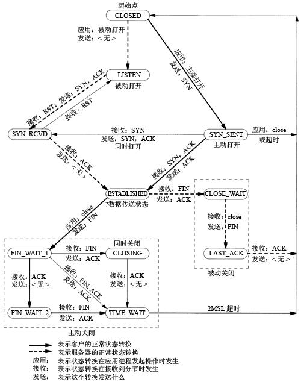

### 1 三次握手


1. 第一次握手：建立连接时发送SYN会选择一个初始序号（ISN），每个连接的ISN都是不同的。客户端发送数据包(SYN=1，seq=x)到服务器，
并进入SYN_SENT状态，等待服务器确认；
2. 第二次握手：服务器收到数据包包，必须确认客户的SYN（ACK=1，ack=x+1），同时自己也发送一个SYN包（SYN=1，seq=y），即SYN+ACK包，
此时服务器进入SYN_RECV状态；
3. 第三次握手：客户端收到服务器的SYN＋ACK包，向服务器发送确认包ACK=1(ack=y+1)，此包发送完毕，客户端和服务器进入ESTABLISHED状态，完成三次握手。

握手过程中传送的包里不包含数据，三次握手完毕后，客户端与服务器才正式开始传送数据。理想状态下，TCP连接一旦建立，
在通信双方中的任何一方主动关闭连接之前，TCP 连接都将被一直保持下去。

### 2 四次挥手

_注意: 中断连接端可以是客户端，也可以是服务器端. 下面仅以客户端断开连接举例, 反之亦然._


1. 第一次挥手：主动断开连接一方向被动断开连接发送FIN数据包，FIN=1,seq=u，告诉被动断开连接一方“我要跟你断开连接了，我不会再给你发送数据了”，
这时主动断开连接方式可以接受数据的，如果一直没有收到被动连接方的确认包，则可以重新发送这个包。此时，主动断开连接方处于FIN_WAIT_1状态
2. 第二次挥手：被动连接方接收到FIN包以后，发送确认包ACK=1,ack=u+1（FIN和SYN一样占用一个序列号），这个动作是告诉主动断开连接方我知道你要断开了，
但是我还有数据没有发送完，等发送完了所有的数据就进行第三次挥手，此时被动断开连接方处于CLOSE_WAIT状态，主动断开连接方处于FIN_WAIT_2状态  
**CLOSE_WAIT**：接收到FIN 之后，被动关闭的一方进入此状态。具体动作是接收到 FIN，同时发送 ACK。之所以叫 CLOSE_WAIT 可以理解为被动关闭的一方
此时正在等待上层应用程序发出关闭连接指令。前面已经说过，TCP关闭是全双工过程，这里客户端执行了主动关闭，被动方服务器端接收到FIN 后也需要调用 close 关闭，
这个 CLOSE_WAIT 就是处于这个状态，等待发送 FIN，发送了FIN 则进入 LAST_ACK 状态。
3. 第三次挥手：被动断开连接方发送FIN=1，seq=w包，用来停止向主动断开连接方发送数据，也就是告诉主动断开连接方，我的数据也发完了，
我也不给你发数据了，此时被动断开连接方处于LAST_ACK状态，主动断开连接方处于TIME_WAIT 状态
4. 第四次挥手：等过了一定时间（2MSL（Maximum Segment Lifetime，最大报文段生存时间）:为了保证最后ACK报文能够到达B，防止已失效连接请求报文段出现在此连接中）过后，主动断开连接方发送确认包ACK=1, ack=w+1，至此，四次挥手已经完成。

### TCP的三次握手过程？为什么会采用三次握手，若采用二次握手可以吗？

答：建立连接的过程是利用客户服务器模式，假设主机A为客户端，主机B为服务器端。  
（1）TCP的三次握手过程：主机A向B发送连接请求；主机B对收到的主机A的报文段进行确认；主机A再次对主机B的确认进行确认。  
（2）采用三次握手是 **为了防止失效的连接请求报文段突然又传送到主机B**，因而产生错误。失效的连接请求报文段是指：主机A发出的连接请求没有收到主机B的确认，
于是经过一段时间后，主机A又重新向主机B发送连接请求，且建立成功，顺序完成数据传输。考虑这样一种特殊情况，主机A第一次发送的连接请求并没有丢失，
而是因为网络节点导致延迟达到主机B，主机B以为是主机A又发起的新连接，于是主机B同意连接，并向主机A发回确认，但是此时主机A根本不会理会，主机B就一直在等待主机A发送数据，导致主机B的资源浪费。  
（3）采用两次握手不行，原因就是上面说的失效的连接请求的特殊情况。

### 四次挥手释放连接时，等待2MSL（TIME_WAIT）的意义？ 
1. 可靠地终止TCP连接
为了保证A发送的最后一个ACK报文段能够到达B。这个ACK报文段有可能丢失，处在LAST-ACK状态的B收不到对已发送的FIN和ACK报文段的确认。
B会超时重传这个FIN和ACK报文段，而A就能在2MSL时间内收到这个重传的ACK+FIN报文段。接着A重传一次确认。  
2. 确保新TCP连接和老TCP连接不会相互干扰
Linux下，一个TCP端口不能被同时打开两次以上。当一个TCP连接处于TIME-WAIT状时，我们将无法立即使用该连接占用的端口来建立一个新连接。如果不存在
TIME-WAIT状态，，应用程序再建立一个一样的连接，这时新连接又可能收到旧连接TCP报文段，这显然是不应该发生。
另外就是防止上面提到的已失效的连接请求报文段出现在本连接中，A在发送完最有一个ACK报文段后，再经过2MSL，就可以使本连接持续的时间内所产生的所有
报文段都从网络中消失。

### reuse问题
```
int option = 1;

if (setsockopt ( masterSocket, SOL_SOCKET, SO_REUSEADDR, &option, sizeof(option) ) < 0)
{
   die( "setsockopt" );
}
```
SO_REUSEADDR 这个套接字选项通知内核，如果端口忙，但TCP状态位于 TIME_WAIT ，可以重用端口。如果端口忙，而TCP状态位于其他状态，重用端口时依旧得到一个错误信息，
指明”地址已经使用中”。

## TCP流量控制和拥塞控制
[参考](http://www.cnblogs.com/way_testlife/archive/2010/10/11/1848241.html)

### TCP的流量控制  

#### 1.利用滑动窗口实现流量控制  
如果发送方把数据发送得过快，接收方可能会来不及接收，这就会造成数据的丢失。 **所谓流量控制就是让发送方的发送速率不要太快，
要让接收方来得及接收**。利用滑动窗口机制可以很方便地在TCP连接上实现对发送方的流量控制。

设A向B发送数据。在连接建立时，B告诉了A：“我的 **接收窗口是** rwnd = 400 ”(这里的 rwnd 表示 receiver window) 。
因此，发送方的发送窗口不能超过接收方给出的接收窗口的数值。请注意，TCP的窗口单位是 **字节**，不是报文段。TCP连接建立时的窗口协商过程
在图中没有显示出来。再设每一个报文段为100字节长，而数据报文段序号的初始值设为1。大写ACK表示首部中的确认位ACK，
小写ack表示确认字段的值ack。  
  
从图中可以看出，B进行了三次流量控制。第一次把窗口减少到 rwnd = 300 ，第二次又减到了 rwnd = 100 ，最后减到 rwnd = 0 ，
即不允许发送方再发送数据了。这种使发送方暂停发送的状态将持续到主机B重新发出一个新的窗口值为止。B向A发送的三个报文段
都设置了ACK=1 ，只有在ACK=1时确认号字段才有意义。  
TCP为每一个连接设有一个持续计时器(persistence timer)。只要TCP连接的一方收到对方的零窗口通知，就启动持续计时器。
若持续计时器设置的时间到期，就发送一个零窗口控测报文段（携1字节的数据），那么收到这个报文段的一方就重新设置持续计时器。  

#### 2.必须考虑传输速率  
可以用不同的机制来控制TCP报文段的 **发送时机**。如：
  
<1>. TCP维持一个变量，它等于最大报文段长度MSS(Maximum Segment Size)。只要缓存中存放的数据达到MSS字节时，就组装成一个TCP报文段发送出去。  
<2>. 由发送方的应用进程指明要求发送报文段，即TCP支持的推送( push )操作。  
<3>. 发送方的一个计时器期限到了，这时就把已有的缓存数据装入报文段(但长度不能超过MSS)发送出去。

Nagle算法：若发送应用进程把要发送的数据逐个字节地送到TCP的发送缓存，则发送方就把第一个数据字节先发送出去，
把后面到达的数据字节都缓存起来。当发送方接收对第一个数据字符的确认后，再把发送缓存中的所有数据组装成一个报文段再发送出去，
同时继续对随后到达的数据进行缓存。只有在收到对前一个报文段的确认后才继续发送下一个报文段。当数据到达较快而网络速率较慢时，
用这样的方法可明显地减少所用的网络带宽。Nagle算法还规定：当到达的数据已达到发送窗口大小的一半或已达到报文段的最大长度时，
就立即发送一个报文段。

另，糊涂窗口综合证： TCP接收方的缓存已满，而交互式的应用进程一次只从接收缓存中读取1字节（这样就使接收缓存空间仅腾出1字节），
然后向发送方发送确认，并把窗口设置为1个字节（但发送的数据报为40字节的的话）。发送方又发来1个字节的数据
（发送方的IP数据报是41字节）。接收方发回确认，仍然将窗口设置为1个字节。这样，网络的效率很低。要解决这个问题，
可让接收方等待一段时间，使得或者接收缓存已有足够空间容纳一个最长的报文段，或者等到接收方缓存已有一半空闲的空间。
只要出现这两种情况，接收方就发回确认报文，并向发送方通知当前的窗口大小。此外，发送方也不要发送太小的报文段，
而是把数据报积累成足够大的报文段，或达到接收方缓存的空间的一半大小。  

### TCP的拥塞控制  
#### 1.拥塞： 
**即对资源的需求超过了可用的资源(资源不足)**。若网络中许多资源同时供应不足，网络的性能就要明显变坏，整个网络的吞吐量随之负荷的增大而下降。

拥塞控制：防止过多的数据注入到网络中，这样可以使网络中的路由器或链路不致过载。拥塞控制所要做的都有一个前提：
网络能够承受现有的网络负荷。拥塞控制是一个 **全局性**的过程，涉及到所有的主机、路由器，以及与降低网络传输性能有关的所有因素。

流量控制：指点对点通信量的控制，是端到端的问题。流量控制所要做的就是抑制发送端发送数据的速率，以便使接收端来得及接收。

拥塞控制代价：需要获得网络内部流量分布的信息。在实施拥塞控制之前，还需要在结点之间交换信息和各种命令，以便选择控制的策略和实施控制。
这样就产生了额外的开销。拥塞控制还需要将一些资源分配给各个用户单独使用，使得网络资源不能更好地实现共享。  

#### 2.几种拥塞控制方法  
**慢开始( slow-start )、拥塞避免( congestion avoidance )、快重传( fast retransmit )和快恢复( fast recovery )。**

##### 2.1 慢开始和拥塞避免  
**发送方**维持一个拥塞窗口 cwnd ( congestion window )的状态变量。拥塞窗口的大小取决于网络的拥塞程度，并且动态地在变化。
**发送方让自己的发送窗口等于拥塞窗口**。

发送方控制拥塞窗口的 **原则**是：只要网络没有出现拥塞，拥塞窗口就再增大一些，以便把更多的分组发送出去。但只要网络出现拥塞，
拥塞窗口就减小一些，以减少注入到网络中的分组数。(动态贪心)

**慢开始算法**：当主机开始发送数据时，如果立即所大量数据字节注入到网络，那么就有可能引起网络拥塞，因为现在并不清楚网络的负荷情况。
因此，较好的方法是先探测一下，即由小到大逐渐增大发送窗口，也就是说，由小到大逐渐增大拥塞窗口数值。通常在刚刚开始发送报文段时，
先把拥塞窗口 cwnd 设置为一个最大报文段MSS的数值。而在每收到一个对新的报文段的确认后，把拥塞窗口增加至多一个MSS的数值。
用这样的方法逐步增大发送方的拥塞窗口 cwnd ，可以使分组注入到网络的速率更加合理。

  
每经过一个传输轮次，拥塞窗口 cwnd 就 **加倍**。一个传输轮次所经历的时间其实就是往返时间RTT。不过“传输轮次”更加强调：
把拥塞窗口cwnd所允许发送的报文段都连续发送出去，并收到了对已发送的最后一个字节的确认。

另，慢开始的“慢”并不是指cwnd的增长速率慢(开始慢），而是指在TCP开始发送报文段时 **先设置cwnd=1**，使得发送方在开始时只发送一个报文段
（目的是试探一下网络的拥塞情况），然后再逐渐增大cwnd。

为了防止拥塞窗口cwnd增长过大引起网络拥塞，还需要设置一个慢开始门限ssthresh状态变量（如何设置ssthresh）。
慢开始门限ssthresh的用法如下：  
当 cwnd < ssthresh 时，使用上述的慢开始算法。  
当 cwnd > ssthresh 时，停止使用慢开始算法而改用拥塞避免算法。  
当 cwnd = ssthresh 时，既可使用慢开始算法，也可使用拥塞控制避免算法。

**拥塞避免算法**：让拥塞窗口cwnd缓慢地增大，即每经过一个往返时间RTT就把发送方的拥塞窗口cwnd加1，而不是加倍。
这样拥塞窗口cwnd按线性规律缓慢增长，比慢开始算法的拥塞窗口增长速率缓慢得多。

无论在慢开始阶段还是在拥塞避免阶段，只要发送方判断网络出现拥塞（其根据就是 **没有收到确认**），就要把慢开始门限
ssthresh设置为出现拥塞时的发送方窗口值的一半（但不能小于2）。然后把拥塞窗口cwnd重新设置为1，执行慢开始算法。
这样做的目的就是要迅速减少主机发送到网络中的分组数，使得发生拥塞的路由器有足够时间把队列中积压的分组处理完毕。  
如下图，用具体数值说明了上述拥塞控制的过程。现在发送窗口的大小和拥塞窗口一样大。


<1>. 当TCP连接进行初始化时，把拥塞窗口cwnd置为1。前面已说过，为了便于理解，图中的窗口单位不使用字节而使用报文段的个数。
慢开始门限的初始值设置为16个报文段，即 ssthresh = 16 。

<2>. 在执行慢开始算法时，拥塞窗口 cwnd 的初始值为1。以后发送方每收到一个对新报文段的确认ACK，就把拥塞窗口值加倍，
然后开始下一轮的传输（图中横坐标为传输轮次）。因此拥塞窗口cwnd随着传输轮次按指数规律增长。当拥塞窗口cwnd增长到慢开始门限值
ssthresh时（即当cwnd=16时），就改为执行拥塞控制算法，拥塞窗口按线性规律增长。

<3>. 假定拥塞窗口的数值增长到24时，网络出现超时（这很可能就是网络发生拥塞了）。更新后的ssthresh值变为12
（即变为出现超时时的拥塞窗口数值24的一半），拥塞窗口再重新设置为1，并执行慢开始算法。当cwnd=ssthresh=12时改为执行
拥塞避免算法，拥塞窗口按线性规律增长，每经过一个往返时间增加一个MSS的大小。

强调：“拥塞避免”并非指完全能够避免了拥塞。利用以上的措施要完全避免网络拥塞还是不可能的。“拥塞避免”是说在拥塞避免阶段将
拥塞窗口控制为按线性规律增长，使网络比较不容易出现拥塞。

##### 2.2 快重传和快恢复  
如果发送方设置的超时计时器时限已到但还没有收到确认，那么很可能是网络出现了拥塞，致使报文段在网络中的某处被丢弃。这时，TCP马上把拥塞窗口
cwnd 减小到1，并执行慢开始算法，同时把慢开始门限值ssthresh减半。这是不使用快重传的情况。

快重传算法首先要求接收方每收到一个失序的报文段后就立即发出重复确认（为的是使发送方及早知道有报文段没有到达对方）
而不要等到自己发送数据时才进行捎带确认。

  
接收方收到了M1和M2后都分别发出了确认。现在假定接收方没有收到M3但接着收到了M4。显然，接收方不能确认M4，因为M4是收到的失序报文段。
根据可靠传输原理，接收方可以什么都不做，也可以在适当时机发送一次对M2的确认。但按照快重传算法的规定，接收方应及时发送对M2的重复确认，
这样做可以让发送方及早知道报文段M3没有到达接收方。发送方接着发送了M5和M6。接收方收到这两个报文后，也还要再次发出对M2的重复确认。
这样，发送方共收到了接收方的四个对M2的确认，其中后三个都是重复确认。快重传算法还规定， **发送方只要一连收到三个重复确认就应当立即重传**
对方尚未收到的报文段M3，而不必继续等待M3设置的重传计时器到期。由于发送方尽早重传未被确认的报文段，因此采用快重传后可以使整个
网络吞吐量提高约20%。

与快重传配合使用的还有快恢复算法，其过程有以下两个要点：  
<1>. 当发送方连续收到三个重复确认，就执行“乘法减小”算法，把慢开始门限ssthresh减半。这是为了预防网络发生拥塞。请注意：
 接下去不执行慢开始算法。  
<2>. 由于发送方现在认为网络很可能没有发生拥塞，因此与慢开始不同之处是现在不执行慢开始算法（即拥塞窗口cwnd现在不设置为1），
而是把cwnd值设置为慢开始门限ssthresh减半后的数值，然后开始执行拥塞避免算法（“加法增大”），使拥塞窗口缓慢地线性增大。

下图给出了快重传和快恢复的示意图，并标明了“TCP Reno版本”。  
区别：新的 TCP Reno 版本在快重传之后采用快恢复算法而不是采用慢开始算法。
 


也有的快重传实现是把开始时的拥塞窗口cwnd值再增大一点，即等于 ssthresh + 3 X MSS 。这样做的理由是：
既然发送方收到三个重复的确认，就表明有三个分组已经离开了网络。这三个分组不再消耗网络的资源而是停留在接收方的缓存中。
可见现在网络中并不是堆积了分组而是减少了三个分组。因此可以适当把拥塞窗口扩大了些。  
在采用快恢复算法时，慢开始算法只是在TCP连接建立时和网络出现超时时才使用。采用这样的拥塞控制方法使得TCP的性能有明显的改进。
接收方根据自己的接收能力设定了接收窗口rwnd，并把这个窗口值写入TCP首部中的窗口字段，传送给发送方。因此，接收窗口又称为通知窗口。
因此，从接收方对发送方的流量控制的角度考虑，发送方的发送窗口一定不能超过对方给出的接收窗口rwnd 。  
发送方窗口的上限值 = Min [ rwnd, cwnd ]  
当rwnd < cwnd 时，是接收方的接收能力限制发送方窗口的最大值。  
当cwnd < rwnd 时，则是网络的拥塞限制发送方窗口的最大值。  

## TCP套接字

[Linux Socket编程](https://www.cnblogs.com/skynet/archive/2010/12/12/1903949.html)

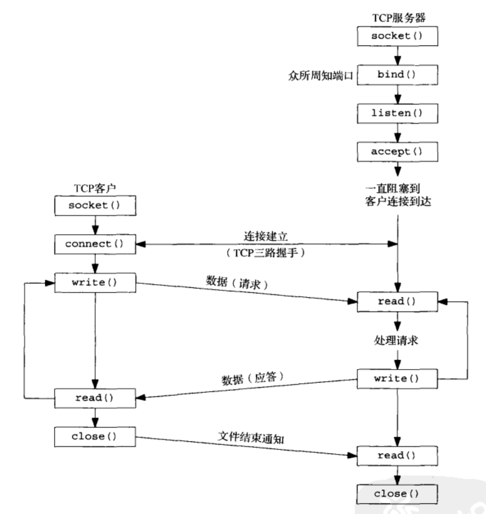

### socket()
```
#include<sys/socket.h>
int socket(int domain, int type, int protocol);
```

socket()用于创建一个socket描述符（socket descriptor），它唯一标识一个socket。这个socket描述字跟文件描述字一样，后续的操作都有用到它，
把它作为参数，通过它来进行一些读写操作。

创建socket的时候可以指定不同的参数创建不同的socket描述符，socket函数的三个参数分别为：

domain：即协议域，又称为协议族（family）。常用的协议族有，AF_INET、AF_INET6、AF_LOCAL（或称AF_UNIX，Unix域socket）、AF_ROUTE等等。
协议族决定了socket的地址类型，在通信中必须采用对应的地址，如AF_INET决定了要用ipv4地址（32位的）与端口号（16位的）的组合、AF_UNIX决定了要
用一个绝对路径名作为地址。

domain的值及含义

|名称	|含义	|
|----   |----   |
|AF_INET,PF_INET	|IPv4 Internet协议	|
|AF_INET6,PF_INET6	|IPv6 Internet协议	|
|AF_LOCAL	|Unix域协议	|
|AF_ROUTE	|路由套接字	|
AF_KEY	|秘钥套接字|

type：指定socket类型。常用的socket类型有，SOCK_STREAM、SOCK_DGRAM、SOCK_RAW、SOCK_PACKET、SOCK_SEQPACKET等等。

type的值及含义

|名称	|含义
|--     |--
|SOCK_STREAM	|Tcp连接，提供序列化的、可靠的、双向连接的字节流。支持带外数据传输
|SOCK_DGRAM	|支持UDP连接（无连接状态的消息）
|SOCK_SEQPACKET	|序列化包，提供一个序列化的、可靠的、双向的基本连接的数据传输通道，数据长度定常。每次调用读系统调用时数据需要将全部数据读出
|SOCK_RAW	|RAW类型，提供原始网络协议访问
|SOCK_RDM	|提供可靠的数据报文，不过可能数据会有乱序
|SOCK_PACKET	|这是一个专用类型，不能呢过在通用程序中使用

protocol：故名思意，就是指定协议。常用的协议有，IPPROTO_TCP、IPPTOTO_UDP、IPPROTO_SCTP、IPPROTO_TIPC等，它们分别对应TCP传输协议、UDP传输协议、
STCP传输协议、TIPC传输协议。函数socket()的第3个参数protocol用于制定某个协议的特定类型，即type类型中的某个类型。通常某协议中只有一种特定类型，
这样protocol参数仅能设置为0；但是有些协议有多种特定的类型，就需要设置这个参数来选择特定的类型。

注意：并不是上面的type和protocol可以随意组合的，如SOCK_STREAM不可以跟IPPROTO_UDP组合。当protocol为0时，会自动选择type类型对应的默认协议。

当我们调用socket创建一个socket时，返回的socket描述字它存在于协议族（address family，AF_XXX）空间中，但没有一个具体的地址。
如果想要给它赋值一个地址，就必须调用bind()函数，否则就当调用connect()、listen()时系统会自动随机分配一个端口。

建立一个流式套接字：

```
int sock = socket(AF_INET, SOCK_STREAM, 0);
```

### bind()

```
#include<sys/socket.h>
int bind(int sockfd, const struct sockaddr *addr, socklen_t addrlen);
```

函数的三个参数分别为： 

sockfd：即socket描述字，它是通过socket()函数创建了，唯一标识一个socket。bind()函数就是将给这个描述字绑定一个名字。

addr：一个const struct sockaddr *指针，指向要绑定给sockfd的协议地址。这个地址结构根据地址创建socket时的地址协议族的不同而不同

addrlen：对应的是地址的长度。

通常服务器在启动的时候都会绑定一个众所周知的地址（如ip地址+端口号），用于提供服务，客户就可以通过它来接连服务器；而客户端就不用指定，
由系统自动分配一个端口号和自身的ip地址组合。这就是为什么通常服务器端在listen之前会调用bind()，而客户端就不会调用，而是在connect()时由系统随机生成一个。

### listen()、connect()
如果作为一个服务器，在调用socket()、bind()之后就会调用listen()来监听这个socket，如果客户端这时调用connect()发出连接请求，服务器端就会接收到这个请求。

```
int listen(int sockfd, int backlog);
int connect(int sockfd, const struct sockaddr *addr, socklen_t addrlen);
```

listen函数的第一个参数即为要监听的socket描述字，第二个参数为相应socket可以排队的最大连接个数。socket()函数创建的socket默认是一个主动类型的，
listen函数将socket变为被动类型的，等待客户的连接请求。

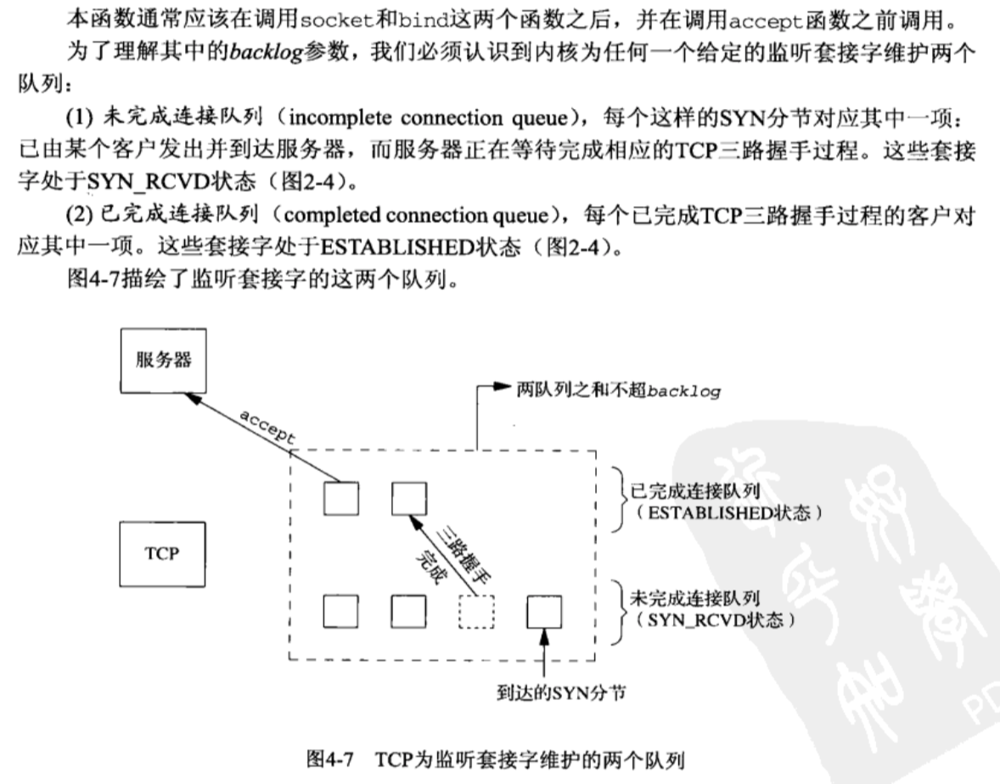

connect函数的第一个参数即为客户端的socket描述字，第二参数为服务器的socket地址，第三个参数为socket地址的长度。客户端通过调用connect函数来建立
与TCP服务器的连接。

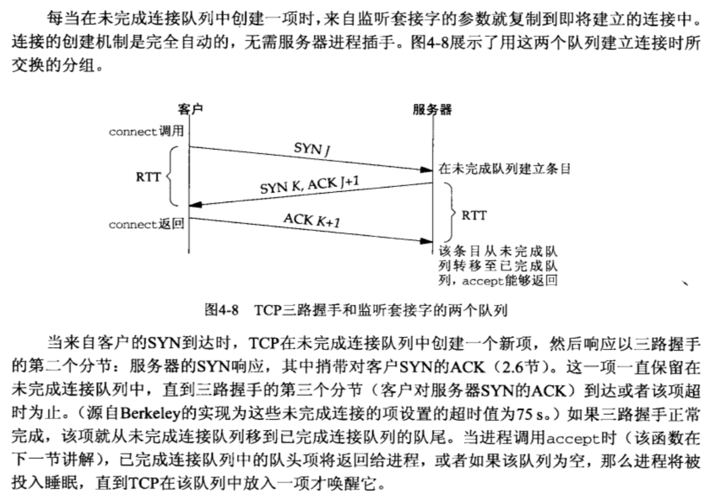

### accept()
TCP服务器端依次调用socket()、bind()、listen()之后，就会监听指定的socket地址了。TCP客户端依次调用socket()、connect()之后向TCP服务器
发送了一个连接请求。TCP服务器监听到这个请求之后，就会调用accept()函数取接收请求，这样连接就建立好了。之后就可以开始网络I/O操作了，
即类同于普通文件的读写I/O操作。

```
int accept(int sockfd, struct sockaddr *addr, socklen_t *addrlen);
```

accept函数的第一个参数为服务器的socket描述字，第二个参数为指向struct sockaddr *的指针，用于返回客户端的协议地址，第三个参数为协议地址的长度。
如果accpet成功，那么其返回值是由内核自动生成的一个全新的描述字，代表与返回客户的TCP连接。

注意：accept的第一个参数为服务器的socket描述字，是服务器开始调用socket()函数生成的，称为`监听socket描述字`；而accept函数返回的是已连接的
socket描述字。一个服务器通常通常仅仅只创建一个监听socket描述字，它在该服务器的生命周期内一直存在。内核为每个由服务器进程接受的客户连接创建了
一个已连接socket描述字，当服务器完成了对某个客户的服务，相应的已连接socket描述字就被关闭。

### fork()、exec()

在传统的Unix环境下，有两个基本的操作用于创建和修改进程： **函数fork( )用来创建一个新的进程，该进程几乎是当前进程的一个完全拷贝；函数族exec( )用来
启动另外的进程以取代当前运行的进程**。Linux的进程控制和传统的Unix进程控制基本一致，只在一些细节的地方有些区别，例如在Linux系统中调用vfork和fork完全相同，
而在有些版本的Unix系统中，vfork调用有不同的功能。由于这些差别几乎不影响我们大多数的编程，在这里我们不予考虑。

#### fork（）

```
#include <unistd.h>

pid_t fork(void);    # 返回：子进程返回0，父进程返回子进程ID，出错返回-1
```

fork在英文中是"分叉"的意思。为什么取这个名字呢？因为一个进程在运行中，如果使用了fork，就产生了另一个进程，于是进程就"分叉"了，所以这个名字取得很形象。
下面就看看如何具体使用fork，这段程序演示了使用fork的基本框架：

```
 1void main()
 2{
 3    int i;
 4    if ( fork() == 0 ) 
 5    {
 6       /* 子进程程序 */
 7       for ( i = 1; i <1000; i ++ ) 
 8          printf("This is child process\n");
 9    }
10    else 
11    {
12       /* 父进程程序*/
13       for ( i = 1; i <1000; i ++ ) 
14       printf("This is process process\n");
15    }
16}
```

程序运行后，你就能看到屏幕上交替出现子进程与父进程各打印出的一千条信息了。如果程序还在运行中，你用ps命令就能看到系统中有两个它在运行了。

那么调用这个fork函数时发生了什么呢？fork函数启动一个新的进程，前面我们说过，这个进程几乎是当前进程的一个拷贝： **子进程和父进程使用相同的代码段；
子进程复制父进程的堆栈段和数据段**。  
这样，父进程的所有数据都可以留给子进程，但是，子进程一旦开始运行，虽然它继承了父进程的一切数据，但实际上数据却已经分开，相互之间不再有影响了，
也就是说，它们之间不再共享任何数据了。它们再要交互信息时，只有通过进程间通信来实现。  
对于父进程， fork函数返回了子程序的进程号，而对于子程序，fork函数则返回零。在操作系统中，我们用ps函数就可以看到不同的进程号，
对父进程而言，它的进程号是由比它更低层的系统调用赋予的，而对于子进程而言，它的进程号即是fork函数对父进程的返回值。在程序设计中，父进程和子进程都要
调用函数fork()。

**copy on write** 如果一个大程序在运行中，它的数据段和堆栈都很大，一次fork就要复制一次，那么fork的系统开销不是很大吗？其实UNIX自有其解决的办法，大家知道，一般CPU
都是以"页"为单位来分配内存空间的，每一个页都是实际物理内存的一个映像，象INTEL的CPU，其一页在通常情况下是 4086字节大小，而无论是数据段还是堆栈段都是
由许多"页"构成的，fork函数复制这两个段，只是"逻辑"上的，并非"物理"上的，也就是说，实际执行fork时，物理空间上两个进程的数据段和堆栈段都还是共享着的，
当有一个进程写了某个数据时，这时两个进程之间的数据才有了区别，系统就将有区别的" 页"从物理上也分开。系统在空间上的开销就可以达到最小。

下面演示一个足以"搞死"Linux的小程序，其源代码非常简单：

```
1void main()
2{
3   for( ; ; )
4   {
5     fork();
6   }
7}
```

这个程序什么也不做，就是死循环地fork，其结果是程序不断产生进程，而这些进程又不断产生新的进程，很快，系统的进程就满了，系统就被这么多不断产生的
进程"撑死了"。当然只要系统管理员预先给每个用户设置可运行的最大进程数，这个恶意的程序就完成不了企图了。

#### exec( )函数族

下面我们来看看一个进程如何来启动另一个程序的执行。在Linux中要使用exec函数族。系统调用execve（）对当前进程进行替换，替换者为一个指定的程序，
其参数包括文件名（filename）、参数列表（argv）以及环境变量（envp）。exec函数族当然不止一个，但它们大致相同，在 Linux中，
它们分别是： **execl，execlp，execle，execv，execve和execvp**，下面以execlp为例，其它函数究竟与execlp有何区别，请通过man exec命令来了解它们的具体情况。

一个进程一旦调用exec类函数，它本身就"死亡"了，系统把代码段替换成新的程序的代码，废弃原有的数据段和堆栈段，并为新程序分配新的数据段与堆栈段，唯一留下的，
就是进程号，也就是说，对系统而言， **还是同一个进程**，不过已经是另一个程序了。（不过exec类函数中有的还允许继承环境变量之类的信息。）

那么如果程序想启动另一程序的执行但自己仍想继续运行的话，怎么办呢？那就是结合fork与exec的使用。下面一段代码显示如何启动运行其它程序：

```
 1#include <errno.h>
 2#include <stdio.h>
 3#include <stdlib.h>
 4
 5char command[256];
 6void main()
 7{
 8   int rtn; /*子进程的返回数值*/
 9   while(1) {
10       /* 从终端读取要执行的命令 */
11       printf( ">" );
12       fgets( command, 256, stdin );
13       command[strlen(command)-1] = 0;
14       if ( fork() == 0 ) {/* 子进程执行此命令 */
15          execlp( command, NULL );
16          /* 如果exec函数返回，表明没有正常执行命令，打印错误信息*/
17          perror( command );
18          exit( errno );
19       }
20       else {/* 父进程， 等待子进程结束，并打印子进程的返回值 */
21          wait ( &rtn );
22          printf( " child process return %d\n", rtn );
23       }
24   }
25}
```

此程序从终端读入命令并执行之，执行完成后，父进程继续等待从终端读入命令。

### read()、write()等函数
万事具备只欠东风，至此服务器与客户已经建立好连接了。可以调用网络I/O进行读写操作了，即实现了网咯中不同进程之间的通信！网络I/O操作有下面几组：

```
read()/write()
recv()/send()
readv()/writev()
recvmsg()/sendmsg()
recvfrom()/sendto()
```

推荐使用recvmsg()/sendmsg()函数，这两个函数是最通用的I/O函数，实际上可以把上面的其它函数都替换成这两个函数。它们的声明如下：

       #include <unistd.h>

       ssize_t read(int fd, void *buf, size_t count);
       ssize_t write(int fd, const void *buf, size_t count);

       #include <sys/types.h>
       #include <sys/socket.h>

       ssize_t send(int sockfd, const void *buf, size_t len, int flags);
       ssize_t recv(int sockfd, void *buf, size_t len, int flags);

       ssize_t sendto(int sockfd, const void *buf, size_t len, int flags,
                      const struct sockaddr *dest_addr, socklen_t addrlen);
       ssize_t recvfrom(int sockfd, void *buf, size_t len, int flags,
                        struct sockaddr *src_addr, socklen_t *addrlen);

       ssize_t sendmsg(int sockfd, const struct msghdr *msg, int flags);
       ssize_t recvmsg(int sockfd, struct msghdr *msg, int flags);
       
read函数是负责从fd中读取内容。当读成功时，read返回实际所读的字节数，如果返回的值是0表示已经读到文件的结束了，小于0表示出现了错误。如果错误为
EINTR说明读是由中断引起的，如果是ECONNREST表示网络连接出了问题。

write函数将buf中的nbytes字节内容写入文件描述符fd.成功时返回写的字节数。失败时返回-1，并设置errno变量。 在网络程序中，当我们向套接字文件描述符
写时有俩种可能。1)write的返回值大于0，表示写了部分或者是全部的数据。2)返回的值小于0，此时出现了错误。我们要根据错误类型来处理。如果错误为EINTR
表示在写的时候出现了中断错误。如果为EPIPE表示网络连接出现了问题(对方已经关闭了连接)。

### close()函数
在服务器与客户端建立连接之后，会进行一些读写操作，完成了读写操作就要关闭相应的socket描述字，好比操作完打开的文件要调用fclose关闭打开的文件。

```
#include <unistd.h>
int close(int fd);
```

close一个TCP socket的缺省行为时把该socket标记为以关闭，然后立即返回到调用进程。该描述字不能再由调用进程使用，也就是说不能再作为read或write的第一个参数。

注意：close操作只是使相应socket描述字的引用计数-1，只有当引用计数为0的时候，才会触发TCP客户端向服务器发送终止连接请求。

## 25 理解TCP backlog
TCP建立连接是要进行三次握手，但是否完成三次握手后，服务器就处理（accept）呢？  
　　客户端connect()返回不代表TCP连接建立成功，有可能此时服务器accept queue已满,OS会直接丢弃后续ACK请求；  
　　客户端以为连接已建立，开始后续调用(譬如send)等待直至超时；  
服务器则等待ACK超时，会重传SYN k, ACK J+1给客户端(重传次数受限net.ipv4.tcp_synack_retries)；  

注：accept queue溢出，即便SYN queue没有溢出，新连接请求的SYN也可能被drop  
　　backlog其实是一个连接队列，在linux 2.2以前，backlog大小包括了半连接状态和全连接状态两种队列大小。    
　　半连接状态为：服务器处于Listen状态时收到客户端SYN报文时放入半连接队列中，即SYN queue（服务器端口状态为：SYN_RCVD）。    
　　全连接状态为：TCP的连接状态从服务器（SYN+ACK）响应客户端后，到客户端的ACK报文到达服务器之前，则一直保留在半连接状态中；当服务器接收到客户端的ACK报文后，
该条目将从半连接队列搬到全连接队列尾部，即 accept queue （服务器端口状态为：ESTABLISHED）。

　　在Linux内核2.2之后，分离为两个backlog来分别限制半连接（SYN_RCVD状态）队列大小和全连接（ESTABLISHED状态 established）队列大小。  
　　SYN queue 队列长度由 /proc/sys/net/ipv4/tcp_max_syn_backlog 指定，默认为2048。  
　　Accept queue 队列长度由 /proc/sys/net/core/somaxconn 和使用listen函数时传入的参数，二者取最小值。默认为128。在Linux内核2.4.25之前，
是写死在代码常量 SOMAXCONN ，在Linux内核2.4.25之后，在配置文件 /proc/sys/net/core/somaxconn 中直接修改，或者在 /etc/sysctl.conf 中配置
net.core.somaxconn = 128 。

　　syn floods 攻击就是针对半连接队列的，攻击方不停地建连接，但是建连接的时候只做第一步，第二步中攻击方收到server的syn+ack后故意扔掉什么也不做，
导致server上这个队列满其它正常请求无法进来

　　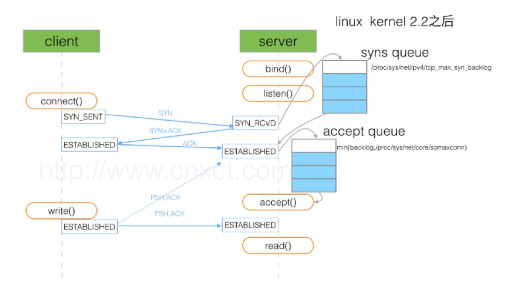

在How TCP backlog works in linux一文中，作者给出了比较详细的分析：  
　　第一种实现 方式在底层维护一个由backlog指定大小的队列。服务端收到SYN后，返回一个SYN/ACK，并把连接放入队列中，此时这个连接的状态是SYN_RECEIVED。
当客户端返回ACK后，此连接的状态变为ESTABLISHED。队列中只有ESTABLISHED状态的连接能够交由应用处理。第一种实现方式可以简单概括为：一个队列，两种状态。 
 
　　第二种实现 方式在底层维护一个SYN_RECEIVED队列和一个ESTABLISHED队列，当SYN_RECEIVED队列中的连接返回ACK后，将被移动到ESTABLISHED队列中。
backlog指的是ESTABLISHED队列的大小。
　　
　　传统的基于BSD的tcp实现第一种方式，在linux2.2之前，内核也实现第一种方式。当队列满了以后，服务端再收到SYN时，将不会返回SYN/ACK。比较优雅的处理方法
就是不处理这条连接，不返回RST，让客户端重试。  
　　在linux2.2后，选择第二种方式实现，SYN_RECEIVED队列的大小由proc/sys/net/ipv4/tcp_max_syn_backlog系统参数指定，ESTABLISHED队列由backlog和
/proc/sys/net/core/somaxconn中较小的指定。    
　　但是在windows server中，底层选择winsock API实现，backlog的定义是represents the maximum length of the queue of pending connections 
for the listener(这是一个比较模糊的定义……来源于BSD)，当队列满了后，将会返回RST。

　　考虑这样一种情况，当ESTABLISHED队列满了，此时收到一个连接的ACK，需要将此连接从SYN队列移到ESTABLISHED队列中，会发生什么？
linux底层的关键代码是:

```
listen_overflow:
	if (!sysctl_tcp_abort_on_overflow) {
		inet_rsk(req)->acked = 1;
		return NULL;
	}
```
	
　　除非系统的tcp_abort_on_overflow指定为1（将返回RST），否则底层将不会做任何事情……这是一种委婉的退让策略，在服务端处理不过来时，让客户端误以为ACK丢失，
继续重新发送ACK。这样，当服务端的处理能力恢复时，这条连接又可以重新被移动到ESTABLISHED队列中去。  

可以通过ss命令来显示

```
[root@localhost ~]# ss -l
State       Recv-Q Send-Q     Local Address:Port      Peer Address:Port     
LISTEN      129    128        *:http                  *:*       
LISTEN      0      128        :::ssh                  :::*       
LISTEN      0      128        *:ssh                   *:*       
LISTEN      0      100        ::1:smtp                :::*       
LISTEN      0      100        127.0.0.1:smtp          *:*
```

　　在LISTEN状态，其中 Send-Q 即为Accept queue的最大值，Recv-Q 则表示Accept queue中等待被服务器accept()。  
　　按照前面的理解，这个时候我们能看到有个端口上的服务全连接队列最大是128，但是现在有129个在队列中和等待进队列的，肯定有一个连接进不去队列要overflow掉  

　　另外客户端connect()返回不代表TCP连接建立成功，有可能此时accept queue 已满，系统会直接丢弃后续ACK请求；客户端误以为连接已建立，开始调用等待至超时；
服务器则等待ACK超时，会重传SYN+ACK 给客户端，重传次数受限 net.ipv4.tcp_synack_retries ，默认为5，表示重发5次，每次等待30~40秒，即半连接默认时间大约为
180秒，该参数可以在tcp被洪水攻击是临时启用这个参数。

查看SYN queue 溢出
　　比如下面看到的 667399 times ，表示全连接队列溢出的次数，隔几秒钟执行下，如果这个数字一直在增加的话肯定全连接队列偶尔满了。

```
[root@localhost ~]# netstat -s | egrep "listen|LISTEN" 
667399 times the listen queue of a socket overflowed
667399 SYNs to LISTEN sockets ignored

查看Accept queue 溢出

[root@localhost ~]# netstat -s | grep TCPBacklogDrop
TCPBacklogDrop: 2334
```

## 3 ARP协议

地址解析协议(Address Resolution Protocol)。它是IPv4网络层必不可少的协议，不过在IPv6中已不再适用，并被邻居发现协议（NDP）所替代。

**注意：ARP是解决同一个局域网上的主机和路由器ip和MAC地址的解析。**

1. 首先，每个主机都会在自己的`ARP缓冲区`中建立一个ARP列表，以表示IP地址和MAC地址之间的对应关系。
2. 当源主机要发送数据时，首先检查ARP列表中是否有对应IP地址的目的主机的MAC地址，如果有，则直接发送数据，如果没有，
就向本网段的所有主机发送ARP数据包，该数据包包括的内容有：源主机 IP地址，源主机MAC地址，目的主机的IP 地址。
3. 当本网络的所有主机收到该ARP数据包时，首先检查数据包中的IP地址是否是自己的IP地址，如果不是，则忽略该数据包，
如果是，则首先从数据包中取出源主机的IP和MAC地址写入到ARP列表中，如果已经存在，则覆盖，然后将自己的MAC地址写入ARP响应包中，
告诉源主机自己是它想要找的MAC地址。
4. 源主机收到ARP响应包后。将目的主机的IP和MAC地址写入ARP列表，并利用此信息发送数据。如果源主机一直没有收到ARP响应数据包，表示ARP查询失败。

**广播发送ARP请求，单播发送ARP响应。**

## ping过程解析

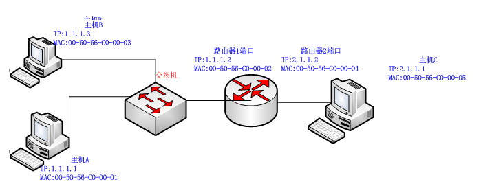 

在一个局域网中，计算机通信实际上是依赖于`MAC地址`进行通信的，那么ARP（Address Resolution Protocol）的作用就是根据IP地址查找出对应ip地址的MAC地址。
ping命令是依托于ICMP协议的，ICMP协议的存在就是为了更高效的转发IP数据报和提高交付成功的机会。

在这里讲ping的两情况：一种是同一网段内，一种是跨网段的ping。

### 同一网段内

首先，如果主机A，要去ping主机B，那么主机A，就要封装二层报文，他会先查自己的MAC地址表，如果没有B的MAC地址，就会向外发送一个ARP广播包，如图: 

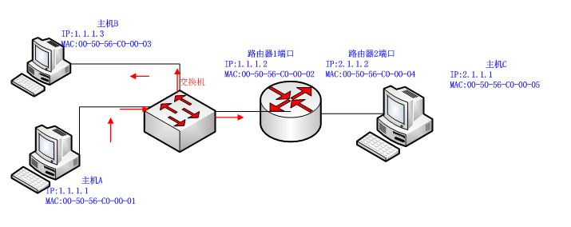 

其中ARP报文格式如下:

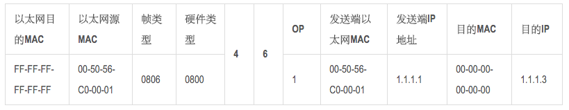 

其中OP 

1：表示ARP请求 

2：表示ARP应答 

3：表示RARP请求 

4：表示RARP应答

首先，交换机会收到这个报文后，交换机有学习MAC地址的功能，所以他会检索自己有没有保存主机B的MAC地址，如果有，就返回给主机A，如果没有，就会向所有端口发送ARP广播，
其它主机收到后，发现不是在找自己，就纷纷丢弃了该报文，不去理会。直到主机B收到了报文后，就立即响应，我的MAC地址是多少，同时学到主机A的MAC地址，并按同样的
ARP报文格式返回给主机A。如图：

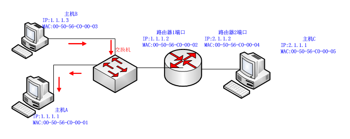 

ARP报文格式为：

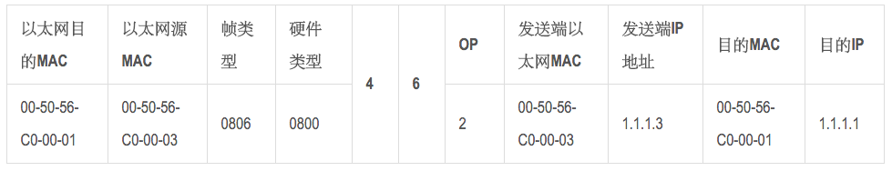 

这时候主机A学到了主机B的MAC地址，就把这个MAC地址封装到ICMP协议的二层报文中向主机B发送，报文格式如下： 

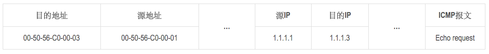 

当主机B收到了这个报文后，发现是主机A 的ICPM回显请求，就按同样的格式，返回一个值给主机A，这样就完成了同一网段内的ping过程。

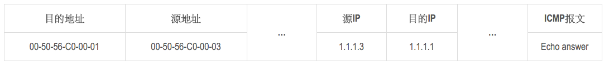 

在这里，讲了这么久的局域网内的PING，实际过程的发生不到1毫秒。

### 不同网段内

如果主机A要ping主机C，那么主机A发现主机C的IP和自己不是同一网段，他就去找网关转发，但是他也不知道网关的MAC地址情况下呢？他就会向之前那个步骤一样
先发送一个ARP广播，学到网关的MAC地址，再发封装ICMP报文给网关路由器.。报文格式如下：

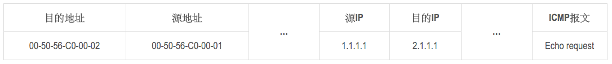 

当路由器收到主机A发过来的ICMP报文，发现自己的目的地址是其本身MAC地址，根据目的的IP2.1.1.1，查路由表，发现2.1.1.1/24的路由表项，得到一个出口指针，
去掉原来的MAC头部，加上自己的MAC地址向主机C转发。(如果网关也没有主机C的MAC地址，还是要向前面一个步骤一样，ARP广播一下即可相互学到。路由器2端口
能学到主机D的MAC地址，主机D也能学到路由器2端口的MAC地址。)报文格式如下：

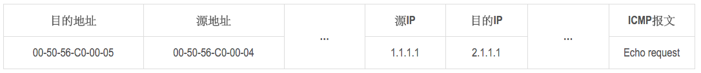 

最后，在主机C已学到路由器2端口MAC地址，路由器2端口转发给路由器1端口，路由1端口学到主机A的MAC地址的情况下，他们就不需要再做ARP解析，就将ICMP的回显请求回复过来。报文格式大致如下: 

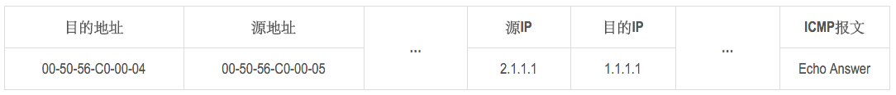 

## 4 urllib和urllib2的区别
这个面试官确实问过,当时答的urllib2可以Post而urllib不可以.

1. urllib提供urlencode方法用来GET查询字符串的产生，而urllib2没有。这是为何urllib常和urllib2一起使用的原因。
2. urllib2可以接受一个Request类的实例来设置URL请求的headers，urllib仅可以接受URL。这意味着，你不可以伪装你的User Agent字符串等。

urllib2 can accept a Request object to set the headers for a URL request, urllib accepts only a URL. That means, you cannot masquerade your User Agent string etc.  
urllib provides the urlencode method which is used for the generation of GET query strings, urllib2 doesn't have such a function. This is one of the reasons why urllib is often used along with urllib2.

## 如何理解HTTP协议的 “无连接，无状态”

HTTP 是一个属于应用层的面向对象的协议，HTTP 协议一共有五大特点： **1、支持客户/服务器模式；2、简单快速；3、灵活；4、无连接；5、无状态**。

### 无连接

**标准的http协议指的是不包括cookies、session、application的http协议**

无连接的含义是限制 **每次连接只处理一个请求。服务器处理完客户的请求，并收到客户的应答后，即断开连接**。采用这种方式可以节省传输时间。

早期这么做的原因是 HTTP 协议产生于互联网，因此服务器需要处理同时面向全世界数十万、上百万客户端的网页访问，但每个客户端（即浏览器）与服务器之间交换数据的间歇性
较大（即传输具有突发性、瞬时性），并且网页浏览的联想性、发散性导致两次传送的数据关联性很低，大部分通道实际上会很空闲、无端占用资源。因此 HTTP 的设计者有意利用
这种特点将协议设计为请求时建连接、请求完释放连接，以尽快将资源释放出来服务其他客户端。

随着时间的推移，网页变得越来越复杂，里面可能嵌入了很多图片，这时候每次访问图片都需要建立一次 TCP 连接就显得很低效。后来， **Keep-Alive** 被提出用来解决这效率低的问题。

Keep-Alive 功能使客户端到服务器端的连接持续有效，当出现对服务器的后继请求时，Keep-Alive 功能避免了建立或者重新建立连接。市场上的大部分 Web 服务器，包括 
iPlanet、IIS 和 Apache，都支持 HTTP Keep-Alive。对于提供静态内容的网站来说，这个功能通常很有用。但是，对于负担较重的网站来说，这里存在另外一个问题：
虽然为客户保留打开的连接有一定的好处，但它同样影响了性能，因为在处理暂停期间，本来可以释放的资源仍旧被占用。当Web服务器和应用服务器在同一台机器上运行时，
Keep-Alive 功能对资源利用的影响尤其突出。 

这样一来，客户端和服务器之间的 HTTP 连接就会被保持，不会断开（超过 Keep-Alive 规定的时间，意外断电等情况除外），当客户端发送另外一个请求时，就使用这条
已经建立的连接。

### 无状态

无状态是指 **协议对于事务处理没有记忆能力，服务器不知道客户端是什么状态**。即我们给服务器发送 HTTP 请求之后，服务器根据请求，会给我们发送数据过来，但是，
发送完，不会记录任何信息。

HTTP 是一个无状态协议，这意味着每个请求都是独立的，Keep-Alive 没能改变这个结果。

缺少状态意味着如果后续处理需要前面的信息，则它必须重传，这样可能导致每次连接传送的数据量增大。另一方面，在服务器不需要先前信息时它的应答就较快。

HTTP 协议这种特性有优点也有缺点，优点在于解放了服务器，每一次请求“点到为止”不会造成不必要连接占用，缺点在于每次请求会传输大量重复的内容信息。

客户端与服务器进行动态交互的 Web 应用程序出现之后，HTTP 无状态的特性严重阻碍了这些应用程序的实现，毕竟交互是需要承前启后的，简单的购物车程序也要知道用户
到底在之前选择了什么商品。于是，两种用于保持 HTTP 连接状态的技术就应运而生了，一个是 Cookie，而另一个则是 Session。

### Cookie 
Cookie可以保持登录信息到用户下次与服务器的会话，换句话说，下次访问同一网站时，用户会发现不必输入用户名和密码就已经登录了（当然，不排除用户手工删除Cookie）。
而还有一些Cookie在用户退出会话的时候就被删除了，这样可以有效保护个人隐私。

Cookies 最典型的应用是判定注册用户是否已经登录网站，用户可能会得到提示，是否在下一次进入此网站时保留用户信息以便简化登录手续，这些都是 Cookies 的功用。
另一个重要应用场合是“购物车”之类处理。用户可能会在一段时间内在同一家网站的不同页面中选择不同的商品，这些信息都会写入 Cookies，以便在最后付款时提取信息。

### Session
与 Cookie 相对的一个解决方案是 Session，它是通过服务器来保持状态的。

当客户端访问服务器时，服务器根据需求设置 Session，将会话信息保存在服务器上，同时将标示 Session 的 SessionId 传递给客户端浏览器，浏览器将这个 
SessionId 保存在内存中，我们称之为无过期时间的 Cookie。浏览器关闭后，这个 Cookie 就会被清掉，它不会存在于用户的 Cookie 临时文件。

以后浏览器每次请求都会额外加上这个参数值，服务器会根据这个 SessionId，就能取得客户端的数据信息。

如果客户端浏览器意外关闭，服务器保存的 Session 数据不是立即释放，此时数据还会存在，只要我们知道那个 SessionId，就可以继续通过请求获得此 Session 的信息，
因为此时后台的 Session 还存在，当然我们可以设置一个 Session 超时时间，一旦超过规定时间没有客户端请求时，服务器就会清除对应 SessionId 的 Session 信息。

## 6 Cookie和Session

||Cookie|Session|
|:--|:--|:--|
|储存位置|客户端|服务器端|
|目的|跟踪会话，也可以保存用户偏好设置或者保存用户名密码等|跟踪会话|
|安全性|不安全，别人可以分析存放在本地的COOKIE并进行COOKIE欺骗|安全|

session技术是要使用到cookie的，之所以出现session技术，主要是为了安全。

## 7 apache和nginx的区别

nginx 相对 apache 的优点：
* 轻量级，同样起web 服务，比apache 占用更少的内存及资源
* 抗并发，nginx 处理请求是异步非阻塞的，支持更多的并发连接，而apache 则是阻塞型的，在高并发下nginx 能保持低资源低消耗高性能
* 配置简洁
* 高度模块化的设计，编写模块相对简单
* 社区活跃

apache 相对nginx 的优点：
* rewrite ，比nginx 的rewrite 强大
* 模块超多，基本想到的都可以找到
* 少bug ，nginx 的bug 相对较多
* 超稳定

## 网站用户密码保存

1. 明文保存
2. 明文hash后保存,如md5
3. MD5+Salt方式,这个salt可以随机
4. 知乎使用了Bcrypy(好像)加密

## HTTP详解

[HTTP科普](https://www.jianshu.com/p/80e25cb1d81a)
### HTTP简介
HTTP协议是`Hyper Text Transfer Protocal`（超文本传输协议）的缩写,是用于从万维网（WWW:World Wide Web ）服务器传输超文本到本地浏览器的传送协议。

HTTP是一个基于TCP/IP通信协议来传递数据（HTML 文件, 图片文件, 查询结果等）。

HTTP是一个属于应用层的面向对象的协议，由于其简捷、快速的方式，适用于分布式超媒体信息系统。它于1990年提出，经过几年的使用与发展，得到不断地完善和扩展。
目前在WWW中使用的是HTTP/1.0的第六版，HTTP/1.1的规范化工作正在进行之中，而且HTTP-NG(Next Generation of HTTP)的建议已经提出。

HTTP协议基于 **客户端-服务端架构**。浏览器作为HTTP客户端通过URL向HTTP服务端即WEB服务器发送所有请求。Web服务器根据接收到的请求后，向客户端发送响应信息。  
  

### 主要特点

1. 简单快速：客户向服务器请求服务时，只需传送请求方法和路径。请求方法常用的有GET、HEAD、POST。每种方法规定了客户与服务器联系的类型不同。由于HTTP协议简单，
使得HTTP服务器的程序规模小，因而通信速度很快。
2. 灵活：HTTP允许传输任意类型的数据对象。正在传输的类型由Content-Type加以标记。
3. 无连接：无连接的含义是限制每次连接只处理一个请求。服务器处理完客户的请求，并收到客户的应答后，即断开连接。采用这种方式可以节省传输时间。
4. 无状态：HTTP协议是无状态协议。无状态是指协议对于事务处理没有记忆能力。缺少状态意味着如果后续处理需要前面的信息，则它必须重传，这样可能导致每次连接传送
的数据量增大。另一方面，在服务器不需要先前信息时应答快。
5. 支持B/S及C/S模式。

### HTTP之URL
HTTP使用统一资源标识符（Uniform Resource Identifiers, URI）来传输数据和建立连接。URL是一种特殊类型的URI，包含了用于查找某个资源的足够的信息

URL,全称是Uniform Resource Locator, 中文叫统一资源定位符,是互联网上用来标识某一处资源的地址。以下面这个URL为例，介绍下普通URL的各部分组成：  
`http://www.aspxfans.com:8080/news/index.asp?boardID=5&ID=24618&page=1#name`
从上面的URL可以看出，一个完整的URL包括以下几部分：

1. **协议部分**：该URL的协议部分为“http：”，这代表网页使用的是HTTP协议。在Internet中可以使用多种协议，如HTTP，FTP等等本例中使用的是HTTP协议。
在"HTTP"后面的“//”为分隔符
2. **域名部分**：该URL的域名部分为“`www.aspxfans.com`”。一个URL中，也可以使用IP地址作为域名使用
3. **端口部分**：跟在域名后面的是端口，域名和端口之间使用“:”作为分隔符。端口不是一个URL必须的部分，如果省略端口部分，将采用默认端口
4. **虚拟目录部分**：从域名后的第一个“/”开始到最后一个“/”为止，是虚拟目录部分。虚拟目录也不是一个URL必须的部分。本例中的虚拟目录是“/news/”
5. **文件名部分**：从域名后的最后一个“/”开始到“？”为止，是文件名部分，如果没有“?”,则是从域名后的最后一个“/”开始到“#”为止，是文件部分，如果
没有“？”和“#”，那么从域名后的最后一个“/”开始到结束，都是文件名部分。本例中的文件名是“index.asp”。文件名部分也不是一个URL必须的部分，如果省略该部分，则使用默认的文件名
6. **参数部分**：从“？”开始到“#”为止之间的部分为参数部分，又称搜索部分、查询部分。本例中的参数部分为“boardID=5&ID=24618&page=1”。参数可以允许
有多个参数，参数与参数之间用“&”作为分隔符。
7. **锚部分**：从“#”开始到最后，都是锚部分。本例中的锚部分是“name”。锚部分也不是一个URL必须的部分

### HTTP之请求消息Request
客户端发送一个HTTP请求到服务器的请求消息包括以下格式：

**请求行（request line）、请求头部（header）、空行和请求数据四个部分组成。**    
  
请求行以一个方法符号开头，以空格分开，后面跟着请求的URI和协议的版本。  
#### Get请求例子，使用Charles抓取的request：  
```
GET /562f25980001b1b106000338.jpg HTTP/1.1
Host    img.mukewang.com
User-Agent  Mozilla/5.0 (Windows NT 10.0; WOW64) AppleWebKit/537.36 (KHTML, like Gecko) Chrome/51.0.2704.106 Safari/537.36
Accept  image/webp,image/*,*/*;q=0.8
Referer http://www.imooc.com/
Accept-Encoding gzip, deflate, sdch
Accept-Language zh-CN,zh;q=0.8

```  
第一部分：请求行，用来说明请求类型,要访问的资源以及所使用的HTTP版本。  
GET说明请求类型为GET，`/562f25980001b1b106000338.jpg`为要访问的资源，该行的最后一部分说明使用的是HTTP1.1版本。

第二部分：请求头部，紧接着请求行（即第一行）之后的部分，用来说明服务器要使用的附加信息  
从第二行起为请求头部，HOST将指出请求的目的地.User-Agent,服务器端和客户端脚本都能访问它,它是浏览器类型检测逻辑的重要基础.该信息由你的浏览器来定义,
并且在每个请求中自动发送等等

第三部分：空行，请求头部后面的空行是必须的  
即使第四部分的请求数据为空，也必须有空行。

第四部分：请求数据也叫主体，可以添加任意的其他数据。  
这个例子的请求数据为空。

#### POST请求例子，使用Charles抓取的request：  
```
POST / HTTP1.1
Host:www.wrox.com
User-Agent:Mozilla/4.0 (compatible; MSIE 6.0; Windows NT 5.1; SV1; .NET CLR 2.0.50727; .NET CLR 3.0.04506.648; .NET CLR 3.5.21022)
Content-Type:application/x-www-form-urlencoded
Content-Length:40
Connection: Keep-Alive

name=Professional%20Ajax&publisher=Wiley
```  
第一部分：请求行，第一行说明是post请求，以及http1.1版本。  
第二部分：请求头部，第二行至第六行。  
第三部分：空行，第七行的空行。  
第四部分：请求数据，第八行。  

### HTTP之响应消息Response
一般情况下，服务器接收并处理客户端发过来的请求后会返回一个HTTP的响应消息。

HTTP响应也由四个部分组成，分别是： **状态行、消息报头、空行和响应正文**。  
  

例子  

```xml
HTTP/1.1 200 OK
Date: Fri, 22 May 2009 06:07:21 GMT
Content-Type: text/html; charset=UTF-8

<html>
      <head></head>
      <body>
            <!--body goes here-->
      </body>
</html>
```  

第一部分：状态行，由HTTP协议版本号， 状态码， 状态消息 三部分组成。
第一行为状态行，（HTTP/1.1）表明HTTP版本为1.1版本，状态码为200，状态消息为（ok）

第二部分：消息报头，用来说明客户端要使用的一些附加信息
第二行和第三行为消息报头，
Date:生成响应的日期和时间；Content-Type:指定了MIME类型的HTML(text/html),编码类型是UTF-8

第三部分：空行，消息报头后面的空行是必须的

第四部分：响应正文，服务器返回给客户端的文本信息。
空行后面的html部分为响应正文。

### HTTP之状态码
状态代码有三位数字组成，第一个数字定义了响应的类别，共分五种类别:  
```  
1xx：指示信息--表示请求已接收，继续处理
2xx：成功--表示请求已被成功接收、理解、接受
3xx：重定向--要完成请求必须进行更进一步的操作
4xx：客户端错误--请求有语法错误或请求无法实现
5xx：服务器端错误--服务器未能实现合法的请求
常见状态码：

200 OK                        //客户端请求成功
301	Moved Permanently	      //永久移动。请求的资源已被永久的移动到新URI，返回信息会包括新的URI，浏览器会自动定向到新URI。今后任何新的请求都应使用新的URI代替
302	Temporary Redirect/Found  //临时移动。与301类似。但资源只是临时被移动。客户端应继续使用原有URI
400 Bad Request               //客户端请求有语法错误，不能被服务器所理解
401 Unauthorized              //请求未经授权，这个状态代码必须和WWW-Authenticate报头域一起使用 
403 Forbidden                 //服务器收到请求，但是拒绝提供服务
404 Not Found                 //请求资源不存在，eg：输入了错误的URL
500 Internal Server Error     //服务器发生不可预期的错误
503 Server Unavailable        //临时的服务器维护/过载，服务器当前不能处理客户端的请求，一段时间后可能恢复正常
504	Gateway Time-out	      //请求超时 充当网关或代理的服务器，未及时从远端服务器获取请求(nginx或者后端配置不正确)
```  
[更多状态码](http://www.runoob.com/http/http-status-codes.html)

### HTTP请求方法
根据HTTP标准，HTTP请求可以使用多种请求方法。  
HTTP1.0定义了三种请求方法： GET, POST 和 HEAD方法。  
HTTP1.1新增了五种请求方法：OPTIONS, PUT, DELETE, TRACE 和 CONNECT 方法。  
```
GET      请求指定的页面信息，并返回实体主体。
HEAD     类似于get请求，只不过返回的响应中没有具体的内容，用于获取报头
POST     向指定资源提交数据进行处理请求（例如提交表单或者上传文件）。数据被包含在请求体中。POST请求可能会导致新的资源的建立和/或已有资源的修改。
PUT      从客户端向服务器传送的数据取代指定的文档的内容。
DELETE   请求服务器删除指定的页面。
CONNECT  HTTP/1.1协议中预留给能够将连接改为管道方式的代理服务器。
OPTIONS  允许客户端查看服务器的性能。
TRACE    回显服务器收到的请求，主要用于测试或诊断。
```

### HTTP工作原理
HTTP协议定义Web客户端如何从Web服务器请求Web页面，以及服务器如何把Web页面传送给客户端。HTTP协议采用了请求/响应模型。客户端向服务器发送一个请求报文，
请求报文包含请求的方法、URL、协议版本、请求头部和请求数据。服务器以一个状态行作为响应，响应的内容包括协议的版本、成功或者错误代码、服务器信息、响应头部和响应数据。

以下是 HTTP 请求/响应的步骤：  
#### 1、客户端连接到Web服务器
一个HTTP客户端，通常是浏览器，与Web服务器的HTTP端口（默认为80）建立一个TCP套接字连接。例如，`http://www.oakcms.cn`

#### 2、发送HTTP请求
通过TCP套接字，客户端向Web服务器发送一个文本的请求报文，一个请求报文由请求行、请求头部、空行和请求数据4部分组成。

#### 3、服务器接受请求并返回HTTP响应
Web服务器解析请求，定位请求资源。服务器将资源复本写到TCP套接字，由客户端读取。一个响应由状态行、响应头部、空行和响应数据4部分组成。

#### 4、释放连接TCP连接
若connection 模式为close，则服务器主动关闭TCP连接，客户端被动关闭连接，释放TCP连接;若connection 模式为keepalive，则该连接会保持一段时间，在该时间内可以继续接收请求;

#### 5、客户端浏览器解析HTML内容
客户端浏览器首先解析状态行，查看表明请求是否成功的状态代码。然后解析每一个响应头，响应头告知以下为若干字节的HTML文档和文档的字符集。客户端浏览器读取
响应数据HTML，根据HTML的语法对其进行格式化，并在浏览器窗口中显示。

例如：在浏览器地址栏键入URL，按下回车之后会经历以下流程：
  
1. 浏览器向 DNS 服务器请求解析该 URL 中的域名所对应的 IP 地址;
2. 解析出 IP 地址后，根据该 IP 地址和默认端口 80，和服务器建立TCP连接;
3. 浏览器发出读取文件(URL 中域名后面部分对应的文件)的HTTP 请求，该请求报文作为 TCP 三次握手的第三个报文的数据发送给服务器;
4. 服务器对浏览器请求作出响应，并把对应的 html 文本发送给浏览器;
5. 释放 TCP连接;
6. 浏览器将该 html 文本并显示内容;

### GET和POST请求的区别
get: [RFC 2616 - Hypertext Transfer Protocol -- HTTP/1.1](http://tools.ietf.org/html/rfc2616#section-9.3)  
post: [RFC 2616 - Hypertext Transfer Protocol -- HTTP/1.1](http://tools.ietf.org/html/rfc2616#section-9.5)

一个用于获取数据，一个用于修改数据。

GET请求  
```xml
GET /books/?sex=man&name=Professional HTTP/1.1
Host: www.wrox.com
User-Agent: Mozilla/5.0 (Windows; U; Windows NT 5.1; en-US; rv:1.7.6)
Gecko/20050225 Firefox/1.0.1
Connection: Keep-Alive

```  
注意最后一行是空行

POST请求  
```xml
POST / HTTP/1.1
Host: www.wrox.com
User-Agent: Mozilla/5.0 (Windows; U; Windows NT 5.1; en-US; rv:1.7.6)
Gecko/20050225 Firefox/1.0.1
Content-Type: application/x-www-form-urlencoded
Content-Length: 40
Connection: Keep-Alive

name=Professional%20Ajax&publisher=Wiley
```  

#### 1、数据显示
GET提交，请求的数据会附在URL之后（就是把数据放置在HTTP协议头中），以?分割URL和传输数据，多个参数用&连接；例如：
login.action?name=hyddd&password=idontknow&verify=%E4%BD%A0 %E5%A5%BD。如果数据是英文字母/数字，原样发送，如果是空格，转换为+，如果
是中文/其他字符，则直接把字符串用BASE64加密，得出如： %E4%BD%A0%E5%A5%BD，其中％XX中的XX为该符号以16进制表示的ASCII。

POST提交：把提交的数据放置在是HTTP包的包体中。上文示例中最后一行就是实际的传输数据

因此，GET提交的数据会在地址栏中显示出来，而POST提交，地址栏不会改变

#### 2、传输数据的大小
首先声明：HTTP协议没有对传输的数据大小进行限制，HTTP协议规范也没有对URL长度进行限制。

而在实际开发中存在的限制主要有：  
GET:特定浏览器和服务器对URL长度有限制，例如 IE对URL长度的限制是2083字节(2K+35)。对于其他浏览器，如Netscape、FireFox等，理论上没有长度限制，
其限制取决于操作系统的支持。因此对于GET提交时，传输数据就会受到URL长度的限制。

POST:由于不是通过URL传值，理论上数据不受限。但实际各个WEB服务器会规定对post提交数据大小进行限制，Apache、IIS6都有各自的配置。

#### 3、安全性

POST的安全性要比GET的安全性高。比如：通过GET提交数据，用户名和密码将明文出现在URL上，因为  
(1)登录页面有可能被浏览器缓存；  
(2)其他人查看浏览器的历史纪录，那么别人就可以拿到你的账号和密码了，  
除此之外，使用GET提交数据还可能会造成Cross-site request forgery攻击

#### 4、Http get,post,soap协议都是在http上运行的

（1）get：请求参数是作为一个key/value对的序列（查询字符串）附加到URL上的
查询字符串的长度受到web浏览器和web服务器的限制（如IE最多支持2048个字符），不适合传输大型数据集同时，它很不安全

（2）post：请求参数是在http标题的一个不同部分（名为entity body）传输的，这一部分用来传输表单信息，因此必须将Content-type设置为:
application/x-www-form-urlencoded。post设计用来支持web窗体上的用户字段，其参数也是作为key/value对传输。
但是：它不支持复杂数据类型，因为post没有定义传输数据结构的语义和规则。

（3）soap：是http post的一个专用版本，遵循一种特殊的xml消息格式
Content-type设置为: text/xml 任何数据都可以xml化。

Http协议定义了很多与服务器交互的方法，最基本的有4种，分别是GET,POST,PUT,DELETE. 一个URL地址用于描述一个网络上的资源，而HTTP中的GET, POST, 
PUT, DELETE就对应着对这个资源的查，改，增，删4个操作。 我们最常见的就是GET和POST了。GET一般用于获取/查询资源信息，而POST一般用于更新资源信息.

我们看看GET和POST的区别

GET提交的数据会放在URL之后，以?分割URL和传输数据，参数之间以&相连，如EditPosts.aspx?name=test1&id=123456. POST方法是把提交的数据放在HTTP包的Body中.

GET提交的数据大小有限制（因为浏览器对URL的长度有限制），而POST方法提交的数据没有限制.

GET方式需要使用Request.QueryString来取得变量的值，而POST方式通过Request.Form来获取变量的值。

GET方式提交数据，会带来安全问题，比如一个登录页面，通过GET方式提交数据时，用户名和密码将出现在URL上，如果页面可以被缓存或者其他人可以访问这台机器，就可以从历史记录获得该用户的账号和密码.

## HTTPS和HTTP的区别
[https工作原理](http://www.mahaixiang.cn/internet/1233.html)

HTTPS协议是由SSL(Secure Sockets Layer 安全套接层或其继任者传输层安全（Transport Layer Security，TLS）)+HTTP协议构建的可进行加密传输、身份认证的网络协议，要比http协议安全。

HTTPS和HTTP的区别主要如下：

1. https协议需要到ca申请证书，一般免费证书较少，因而需要一定费用。
2. http是超文本传输协议，信息是明文传输，https则是具有安全性的ssl加密传输协议。
3. http和https使用的是完全不同的连接方式，用的端口也不一样，前者是80，后者是443。
4. http的连接很简单，是无状态的；HTTPS协议是由SSL+HTTP协议构建的可进行加密传输、身份认证的网络协议，比http协议安全。

## 10 XSRF和XSS

* CSRF(Cross-site request forgery)跨站请求伪造
* XSS(Cross Site Scripting)跨站脚本攻击

CSRF重点在请求,XSS重点在脚本

## 11 幂等 Idempotence

HTTP方法的幂等性是指一次和多次请求某一个资源应该具有同样的**副作用**。(注意是副作用)

`GET http://www.bank.com/account/123456`，不会改变资源的状态，不论调用一次还是N次都没有副作用。请注意，这里强调的是一次和N次具有相同的副作用，而不是每次GET的结果相同。`GET http://www.news.com/latest-news`这个HTTP请求可能会每次得到不同的结果，但它本身并没有产生任何副作用，因而是满足幂等性的。

DELETE方法用于删除资源，有副作用，但它应该满足幂等性。比如：`DELETE http://www.forum.com/article/4231`，调用一次和N次对系统产生的副作用是相同的，即删掉id为4231的帖子；因此，调用者可以多次调用或刷新页面而不必担心引起错误。


POST所对应的URI并非创建的资源本身，而是资源的接收者。比如：`POST http://www.forum.com/articles`的语义是在`http://www.forum.com/articles`下创建一篇帖子，HTTP响应中应包含帖子的创建状态以及帖子的URI。两次相同的POST请求会在服务器端创建两份资源，它们具有不同的URI；所以，POST方法不具备幂等性。

PUT所对应的URI是要创建或更新的资源本身。比如：`PUT http://www.forum/articles/4231`的语义是创建或更新ID为4231的帖子。对同一URI进行多次PUT的副作用和一次PUT是相同的；因此，PUT方法具有幂等性。


## 12 RESTful架构(SOAP,RPC)

推荐: http://www.ruanyifeng.com/blog/2011/09/restful.html

Fielding将他对互联网软件的架构原则，定名为REST，即`Representational State Transfer`的缩写。我对这个词组的翻译是"表现层状态转化"。如果一个架构符合REST原则，就称它为RESTful架构。

总结一下什么是RESTful架构：

1. 每一个URI代表一种资源；
2. 客户端和服务器之间，传递这种资源的某种表现层；
3. 客户端通过四个HTTP动词，对服务器端资源进行操作，实现"表现层状态转化"。

## 13 SOAP

SOAP（原为Simple Object Access Protocol的首字母缩写，即简单对象访问协议）是交换数据的一种协议规范，使用在计算机网络Web服务（web service）中，交换带结构信息。SOAP为了简化网页服务器（Web Server）从XML数据库中提取数据时，节省去格式化页面时间，以及不同应用程序之间按照HTTP通信协议，遵从XML格式执行资料互换，使其抽象于语言实现、平台和硬件。

## 14 RPC

RPC（Remote Procedure Call Protocol）——远程过程调用协议，它是一种通过网络从远程计算机程序上请求服务，而不需要了解底层网络技术的协议。RPC协议假定某些传输协议的存在，如TCP或UDP，为通信程序之间携带信息数据。在OSI网络通信模型中，RPC跨越了传输层和应用层。RPC使得开发包括网络分布式多程序在内的应用程序更加容易。

总结:服务提供的两大流派.传统意义以方法调用为导向通称RPC。为了企业SOA,若干厂商联合推出webservice,制定了wsdl接口定义,传输soap.当互联网时代,臃肿SOA被简化为http+xml/json.但是简化出现各种混乱。以资源为导向,任何操作无非是对资源的增删改查，于是统一的REST出现了.

进化的顺序: RPC -> SOAP -> RESTful

## 15 CGI和WSGI
CGI是通用网关接口，是连接web服务器和应用程序的接口，用户通过CGI来获取动态数据或文件等。
CGI程序是一个独立的程序，它可以用几乎所有语言来写，包括perl，c，lua，python等等。

WSGI, Web Server Gateway Interface，是Python应用程序或框架和Web服务器之间的一种接口，WSGI的其中一个目的就是让用户可以用统一的语言(Python)编写前后端。

官方说明：[PEP-3333](https://www.python.org/dev/peps/pep-3333/)

## 16 中间人攻击

中间人攻击（Man-in-the-middle attack，通常缩写为MITM）是指攻击者与通讯的两端分别创建独立的联系，并交换其所收到的数据，使通讯的两端认为他们
正在通过一个私密的连接与对方直接对话，但事实上整个会话都被攻击者完全控制。  
关键是中间人用自己的密钥替换了消息中被攻击者的密钥

## 17 c10k问题

所谓c10k问题，指的是服务器同时支持成千上万个客户端的问题，也就是concurrent 10 000 connection（这也是c10k这个名字的由来）。
推荐: http://www.kegel.com/c10k.html   
[聊聊C10K问题及解决方案](https://my.oschina.net/xianggao/blog/664275)

## 18 socket

推荐: http://www.360doc.com/content/11/0609/15/5482098_122692444.shtml

### socket是什么
  

Socket=Ip address+ TCP/UDP + port  
Socket是应用层与TCP/IP协议族通信的中间软件抽象层，它是一组接口，它把复杂的TCP/IP协议族隐藏在Socket接口后面。

### socket工作原理


服务器端先初始化Socket，然后与端口绑定(bind)，对端口进行监听(listen)，调用accept阻塞，等待客户端连接。  
这时如果有个客户端初始化一个Socket，然后连接服务器(connect)，如果连接成功，这时客户端与服务器端的连接就建立了。  
客户端发送数据请求，服务器端接收请求并处理请求，然后把回应数据发送给客户端，客户端读取数据，最后关闭连接，一次交互结束。

## 19 浏览器缓存

推荐: http://www.cnblogs.com/skynet/archive/2012/11/28/2792503.html

## 20 HTTP1.0和HTTP1.1

推荐: http://blog.csdn.net/elifefly/article/details/3964766

1. 请求头Host字段,一个服务器多个网站
2. 长链接
3. 文件断点续传
3. 身份认证,状态管理,Cache缓存

## 21 Ajax
AJAX,Asynchronous JavaScript and XML（异步的 JavaScript 和 XML）, 是与在不重新加载整个页面的情况下，与服务器交换数据并更新部分网页的技术。

## 22 DNS
### 1、DNS的工作原理
DNS提供的服务是用来 **将域名转换为IP地址**的工作。TCP/IP协议详解中给的定义是：它是一种用于TCP/IP应用程序的分布式数据库，
它提供主机名字和IP地址之间的转换及有关电子邮件的选路信息。属于应用层协议。
它的基本工作原理如下图所示 ：


### 2、DNS的工作过程


* 在浏览器中输入www.qq.com域名，操作系统会先检查自己本地的hosts文件是否有这个网址映射关系，如果有，就先调用这个IP地址映射，
完成域名解析。
* 如果hosts里没有这个域名的映射，则查找本地DNS解析器缓存，是否有这个网址映射关系，如果有，直接返回，完成域名解析。
* 如果hosts与本地DNS解析器缓存都没有相应的网址映射关系，首先会找TCP/IP参数中设置的首选DNS服务器，在此我们叫它本地DNS服务器，
此服务器收到查询时，如果要查询的域名，包含在本地配置区域资源中，则返回解析结果给客户机，完成域名解析，此解析具有权威性。
* 如果要查询的域名，不由本地DNS服务器区域解析，但该服务器已缓存了此网址映射关系，则调用这个IP地址映射，完成域名解析，
此解析不具有权威性。
* 如果本地DNS服务器本地区域文件与缓存解析都失效，则根据本地DNS服务器的设置(是否设置转发器)进行查询，如果未用转发模式，
本地DNS就把请求发至13台根DNS，根DNS服务器收到请求后会判断这个域名(.com)是谁来授权管理，并会返回一个负责该顶级域名服务器的一个IP
。本地DNS服务器收到IP信息后，将会联系负责.com域的这台服务器。这台负责.com域的服务器收到请求后，如果自己无法解析，
它就会找一个管理.com域的下一级DNS服务器地址(qq.com)给本地DNS服务器。当本地DNS服务器收到这个地址后，就会找qq.com域服务器，
重复上面的动作，进行查询，直至找到www.qq.com主机。
* 如果用的是转发模式，此DNS服务器就会把请求转发至上一级DNS服务器，由上一级服务器进行解析，上一级服务器如果不能解析，
或找根DNS或把转请求转至上上级，以此循环。不管是本地DNS服务器用的是转发，还是根提示，最后都是把结果返回给本地DNS服务器，
由此DNS服务器再返回给客户机。

## 23 What really happens when you navigate to a URL？
[参考](http://igoro.com/archive/what-really-happens-when-you-navigate-to-a-url/)
