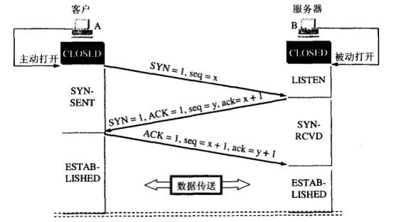

<!-- vim-markdown-toc GFM -->
* [网络](#网络)
    * [1 三次握手](#1-三次握手)
    * [2 四次挥手](#2-四次挥手)
    * [3 ARP协议](#3-arp协议)
    * [4 urllib和urllib2的区别](#4-urllib和urllib2的区别)
    * [5 Post和Get](#5-post和get)
    * [6 Cookie和Session](#6-cookie和session)
    * [7 apache和nginx的区别](#7-apache和nginx的区别)
    * [8 网站用户密码保存](#8-网站用户密码保存)
    * [9 HTTP和HTTPS](#9-http和https)
    * [10 XSRF和XSS](#10-xsrf和xss)
    * [11 幂等 Idempotence](#11-幂等-idempotence)
    * [12 RESTful架构(SOAP,RPC)](#12-restful架构soaprpc)
    * [13 SOAP](#13-soap)
    * [14 RPC](#14-rpc)
    * [15 CGI和WSGI](#15-cgi和wsgi)
    * [16 中间人攻击](#16-中间人攻击)
    * [17 c10k问题](#17-c10k问题)
    * [18 socket](#18-socket)
    * [19 浏览器缓存](#19-浏览器缓存)
    * [20 HTTP1.0和HTTP1.1](#20-http10和http11)
    * [21 Ajax](#21-ajax)
    * [22 DNS](#22-dns)
        * [1、DNS的工作原理](#1dns的工作原理)
        * [2、DNS的工作过程](#2dns的工作过程)
    * [23 What really happens when you navigate to a URL？](#23-what-really-happens-when-you-navigate-to-a-url)
    * [24 TCP流量控制和拥塞控制](#24-tcp流量控制和拥塞控制)
        * [TCP的流量控制](#tcp的流量控制)
        * [TCP的拥塞控制](#tcp的拥塞控制)

<!-- vim-markdown-toc -->
# 网络

## 1 三次握手

1. 第一次握手：建立连接时发送SYN会选择一个初始序号（ISN），每个连接的ISN都是不同的。客户端发送数据包(SYN=1，seq=x)到服务器，
并进入SYN_SENT状态，等待服务器确认；
2. 第二次握手：服务器收到数据包包，必须确认客户的SYN（ACK=1，ack=x+1），同时自己也发送一个SYN包（SYN=1，seq=y），即SYN+ACK包，
此时服务器进入SYN_RECV状态；
3. 第三次握手：客户端收到服务器的SYN＋ACK包，向服务器发送确认包ACK=1(ack=y+1)，此包发送完毕，客户端和服务器进入ESTABLISHED状态，完成三次握手。

握手过程中传送的包里不包含数据，三次握手完毕后，客户端与服务器才正式开始传送数据。理想状态下，TCP连接一旦建立，
在通信双方中的任何一方主动关闭连接之前，TCP 连接都将被一直保持下去。

## 2 四次挥手

_注意: 中断连接端可以是客户端，也可以是服务器端. 下面仅以客户端断开连接举例, 反之亦然._

1. 第一次挥手：主动断开连接一方向被动断开连接发送FIN数据包，FIN=1,seq=x，告诉被动断开连接一方“我要跟你断开连接了，我不会再给你发送数据了”，
这时主动断开连接方式可以接受数据的，如果一直没有收到被动连接方的确认包，则可以重新发送这个包。此时，主动断开连接方处于FIN_WAIT_1状态
2. 第二次挥手：被动连接方接收到FIN包以后，发送确认包ACK=1,ack=u+1（FIN和SYN一样占用一个序列号），这个动作是告诉主动断开连接方我知道你要断开了，
但是我还有数据没有发送完，等发送完了所有的数据就进行第三次挥手，此时被动断开连接方处于CLOSE_WAIT状态，主动断开连接方处于FIN_WAIT_2状态
3. 第三次挥手：被动断开连接方发送FIN=1，seq=w包，用来停止向主动断开连接方发送数据，也就是告诉主动断开连接方，我的数据也发完了，
我也不给你发数据了，此时被动断开连接方处于LAST_ACK状态，主动断开连接方处于TIME_WAIT 状态
4. 第四次挥手：等过了一定时间（2MSL（报文段最大生存时间）:为了保证最后ACK报文能够到达B，防止已失效连接请求报文段出现在此连接中）过后，
主动断开连接方发送确认包ACK=1, ack=w+1，至此，四次挥手已经完成。

* TCP的三次握手过程？为什么会采用三次握手，若采用二次握手可以吗？

答：建立连接的过程是利用客户服务器模式，假设主机A为客户端，主机B为服务器端。  
（1）TCP的三次握手过程：主机A向B发送连接请求；主机B对收到的主机A的报文段进行确认；主机A再次对主机B的确认进行确认。  
（2）采用三次握手是为了防止失效的连接请求报文段突然又传送到主机B，因而产生错误。失效的连接请求报文段是指：主机A发出的连接请求没有收到主机B的确认，
于是经过一段时间后，主机A又重新向主机B发送连接请求，且建立成功，顺序完成数据传输。考虑这样一种特殊情况，主机A第一次发送的连接请求并没有丢失，
而是因为网络节点导致延迟达到主机B，主机B以为是主机A又发起的新连接，于是主机B同意连接，并向主机A发回确认，但是此时主机A根本不会理会，主机B就一直在等待主机A发送数据，导致主机B的资源浪费。  
（3）采用两次握手不行，原因就是上面说的失效的连接请求的特殊情况。

* 四次挥手释放连接时，等待2MSL的意义？  
第 一，为了保证A发送的最后一个ACK报文段能够到达B。这个ACK报文段有可能丢失，处在LAST-ACK状态的B收不到对已发送的FIN和ACK报文段的确认。
B会超时重传这个FIN和ACK报文段，而A就能在2MSL时间内收到这个重传的ACK+FIN报文段。接着A重传一次确认。  
第二，就是防止上面提到的已失效的连接请求报文段出现在本连接中，A在发送完最有一个ACK报文段后，再经过2MSL，就可以使本连接持续的时间内所产生的所有报文段都从网络中消失。

## 3 ARP协议

地址解析协议(Address Resolution Protocol)。它是IPv4网络层必不可少的协议，不过在IPv6中已不再适用，并被邻居发现协议（NDP）所替代。

**注意：ARP是解决同一个局域网上的主机和路由器ip和MAC地址的解析。**

1. 首先，每个主机都会在自己的`ARP缓冲区`中建立一个ARP列表，以表示IP地址和MAC地址之间的对应关系。
2. 当源主机要发送数据时，首先检查ARP列表中是否有对应IP地址的目的主机的MAC地址，如果有，则直接发送数据，如果没有，
就向本网段的所有主机发送ARP数据包，该数据包包括的内容有：源主机 IP地址，源主机MAC地址，目的主机的IP 地址。
3. 当本网络的所有主机收到该ARP数据包时，首先检查数据包中的IP地址是否是自己的IP地址，如果不是，则忽略该数据包，
如果是，则首先从数据包中取出源主机的IP和MAC地址写入到ARP列表中，如果已经存在，则覆盖，然后将自己的MAC地址写入ARP响应包中，
告诉源主机自己是它想要找的MAC地址。
4. 源主机收到ARP响应包后。将目的主机的IP和MAC地址写入ARP列表，并利用此信息发送数据。如果源主机一直没有收到ARP响应数据包，表示ARP查询失败。

**广播发送ARP请求，单播发送ARP响应。**

## 4 urllib和urllib2的区别
这个面试官确实问过,当时答的urllib2可以Post而urllib不可以.

1. urllib提供urlencode方法用来GET查询字符串的产生，而urllib2没有。这是为何urllib常和urllib2一起使用的原因。
2. urllib2可以接受一个Request类的实例来设置URL请求的headers，urllib仅可以接受URL。这意味着，你不可以伪装你的User Agent字符串等。

urllib2 can accept a Request object to set the headers for a URL request, urllib accepts only a URL. That means, you cannot masquerade your User Agent string etc.  
urllib provides the urlencode method which is used for the generation of GET query strings, urllib2 doesn't have such a function. This is one of the reasons why urllib is often used along with urllib2.

## 5 Post和Get
[GET和POST有什么区别？及为什么网上的多数答案都是错的](http://www.cnblogs.com/nankezhishi/archive/2012/06/09/getandpost.html)
[知乎回答](https://www.zhihu.com/question/31640769?rf=37401322)

get: [RFC 2616 - Hypertext Transfer Protocol -- HTTP/1.1](http://tools.ietf.org/html/rfc2616#section-9.3)
post: [RFC 2616 - Hypertext Transfer Protocol -- HTTP/1.1](http://tools.ietf.org/html/rfc2616#section-9.5)

## 6 Cookie和Session

||Cookie|Session|
|:--|:--|:--|
|储存位置|客户端|服务器端|
|目的|跟踪会话，也可以保存用户偏好设置或者保存用户名密码等|跟踪会话|
|安全性|不安全|安全|

session技术是要使用到cookie的，之所以出现session技术，主要是为了安全。

## 7 apache和nginx的区别

nginx 相对 apache 的优点：
* 轻量级，同样起web 服务，比apache 占用更少的内存及资源
* 抗并发，nginx 处理请求是异步非阻塞的，支持更多的并发连接，而apache 则是阻塞型的，在高并发下nginx 能保持低资源低消耗高性能
* 配置简洁
* 高度模块化的设计，编写模块相对简单
* 社区活跃

apache 相对nginx 的优点：
* rewrite ，比nginx 的rewrite 强大
* 模块超多，基本想到的都可以找到
* 少bug ，nginx 的bug 相对较多
* 超稳定

## 8 网站用户密码保存

1. 明文保存
2. 明文hash后保存,如md5
3. MD5+Salt方式,这个salt可以随机
4. 知乎使用了Bcrypy(好像)加密

## 9 HTTP和HTTPS

|状态码|定义|
|:--|:--|
|1xx 报告|接收到请求，继续进程|
|2xx 成功|步骤成功接收，被理解，并被接受|
|3xx 重定向|为了完成请求,必须采取进一步措施|
|4xx 客户端出错|请求包括错的顺序或不能完成|
|5xx 服务器出错|服务器无法完成显然有效的请求|

403: Forbidden
404: Not Found

HTTPS握手,对称加密,非对称加密,TLS/SSL,RSA

## 10 XSRF和XSS

* CSRF(Cross-site request forgery)跨站请求伪造
* XSS(Cross Site Scripting)跨站脚本攻击

CSRF重点在请求,XSS重点在脚本

## 11 幂等 Idempotence

HTTP方法的幂等性是指一次和多次请求某一个资源应该具有同样的**副作用**。(注意是副作用)

`GET http://www.bank.com/account/123456`，不会改变资源的状态，不论调用一次还是N次都没有副作用。请注意，这里强调的是一次和N次具有相同的副作用，而不是每次GET的结果相同。`GET http://www.news.com/latest-news`这个HTTP请求可能会每次得到不同的结果，但它本身并没有产生任何副作用，因而是满足幂等性的。

DELETE方法用于删除资源，有副作用，但它应该满足幂等性。比如：`DELETE http://www.forum.com/article/4231`，调用一次和N次对系统产生的副作用是相同的，即删掉id为4231的帖子；因此，调用者可以多次调用或刷新页面而不必担心引起错误。

POST所对应的URI并非创建的资源本身，而是资源的接收者。比如：`POST http://www.forum.com/articles`的语义是在`http://www.forum.com/articles`下创建一篇帖子，HTTP响应中应包含帖子的创建状态以及帖子的URI。两次相同的POST请求会在服务器端创建两份资源，它们具有不同的URI；所以，POST方法不具备幂等性。

PUT所对应的URI是要创建或更新的资源本身。比如：`PUT http://www.forum/articles/4231`的语义是创建或更新ID为4231的帖子。对同一URI进行多次PUT的副作用和一次PUT是相同的；因此，PUT方法具有幂等性。

## 12 RESTful架构(SOAP,RPC)

推荐: http://www.ruanyifeng.com/blog/2011/09/restful.html

## 13 SOAP

SOAP（原为Simple Object Access Protocol的首字母缩写，即简单对象访问协议）是交换数据的一种协议规范，使用在计算机网络Web服务（web service）中，交换带结构信息。SOAP为了简化网页服务器（Web Server）从XML数据库中提取数据时，节省去格式化页面时间，以及不同应用程序之间按照HTTP通信协议，遵从XML格式执行资料互换，使其抽象于语言实现、平台和硬件。

## 14 RPC

RPC（Remote Procedure Call Protocol）——远程过程调用协议，它是一种通过网络从远程计算机程序上请求服务，而不需要了解底层网络技术的协议。RPC协议假定某些传输协议的存在，如TCP或UDP，为通信程序之间携带信息数据。在OSI网络通信模型中，RPC跨越了传输层和应用层。RPC使得开发包括网络分布式多程序在内的应用程序更加容易。

总结:服务提供的两大流派.传统意义以方法调用为导向通称RPC。为了企业SOA,若干厂商联合推出webservice,制定了wsdl接口定义,传输soap.当互联网时代,臃肿SOA被简化为http+xml/json.但是简化出现各种混乱。以资源为导向,任何操作无非是对资源的增删改查，于是统一的REST出现了.

进化的顺序: RPC -> SOAP -> RESTful

## 15 CGI和WSGI
CGI是通用网关接口，是连接web服务器和应用程序的接口，用户通过CGI来获取动态数据或文件等。
CGI程序是一个独立的程序，它可以用几乎所有语言来写，包括perl，c，lua，python等等。

WSGI, Web Server Gateway Interface，是Python应用程序或框架和Web服务器之间的一种接口，WSGI的其中一个目的就是让用户可以用统一的语言(Python)编写前后端。

官方说明：[PEP-3333](https://www.python.org/dev/peps/pep-3333/)

## 16 中间人攻击

在GFW里屡见不鲜的,呵呵.

中间人攻击（Man-in-the-middle attack，通常缩写为MITM）是指攻击者与通讯的两端分别创建独立的联系，并交换其所收到的数据，使通讯的两端认为他们正在通过一个私密的连接与对方直接对话，但事实上整个会话都被攻击者完全控制。

## 17 c10k问题

所谓c10k问题，指的是服务器同时支持成千上万个客户端的问题，也就是concurrent 10 000 connection（这也是c10k这个名字的由来）。
推荐: http://www.kegel.com/c10k.html

## 18 socket

推荐: http://www.360doc.com/content/11/0609/15/5482098_122692444.shtml

Socket=Ip address+ TCP/UDP + port

## 19 浏览器缓存

推荐: http://www.cnblogs.com/skynet/archive/2012/11/28/2792503.html

304 Not Modified

## 20 HTTP1.0和HTTP1.1

推荐: http://blog.csdn.net/elifefly/article/details/3964766

1. 请求头Host字段,一个服务器多个网站
2. 长链接
3. 文件断点续传
3. 身份认证,状态管理,Cache缓存

## 21 Ajax
AJAX,Asynchronous JavaScript and XML（异步的 JavaScript 和 XML）, 是与在不重新加载整个页面的情况下，与服务器交换数据并更新部分网页的技术。

## 22 DNS
### 1、DNS的工作原理
DNS提供的服务是用来 **将域名转换为IP地址**的工作。TCP/IP协议详解中给的定义是：它是一种用于TCP/IP应用程序的分布式数据库，
它提供主机名字和IP地址之间的转换及有关电子邮件的选路信息。属于应用层协议。
它的基本工作原理如下图所示 ：

### 2、DNS的工作过程

* 在浏览器中输入www.qq.com域名，操作系统会先检查自己本地的hosts文件是否有这个网址映射关系，如果有，就先调用这个IP地址映射，
完成域名解析。
* 如果hosts里没有这个域名的映射，则查找本地DNS解析器缓存，是否有这个网址映射关系，如果有，直接返回，完成域名解析。
* 如果hosts与本地DNS解析器缓存都没有相应的网址映射关系，首先会找TCP/IP参数中设置的首选DNS服务器，在此我们叫它本地DNS服务器，
此服务器收到查询时，如果要查询的域名，包含在本地配置区域资源中，则返回解析结果给客户机，完成域名解析，此解析具有权威性。
* 如果要查询的域名，不由本地DNS服务器区域解析，但该服务器已缓存了此网址映射关系，则调用这个IP地址映射，完成域名解析，
此解析不具有权威性。
* 如果本地DNS服务器本地区域文件与缓存解析都失效，则根据本地DNS服务器的设置(是否设置转发器)进行查询，如果未用转发模式，
本地DNS就把请求发至13台根DNS，根DNS服务器收到请求后会判断这个域名(.com)是谁来授权管理，并会返回一个负责该顶级域名服务器的一个IP
。本地DNS服务器收到IP信息后，将会联系负责.com域的这台服务器。这台负责.com域的服务器收到请求后，如果自己无法解析，
它就会找一个管理.com域的下一级DNS服务器地址(qq.com)给本地DNS服务器。当本地DNS服务器收到这个地址后，就会找qq.com域服务器，
重复上面的动作，进行查询，直至找到www.qq.com主机。
* 如果用的是转发模式，此DNS服务器就会把请求转发至上一级DNS服务器，由上一级服务器进行解析，上一级服务器如果不能解析，
或找根DNS或把转请求转至上上级，以此循环。不管是本地DNS服务器用的是转发，还是根提示，最后都是把结果返回给本地DNS服务器，
由此DNS服务器再返回给客户机。

## 23 What really happens when you navigate to a URL？
[参考](http://igoro.com/archive/what-really-happens-when-you-navigate-to-a-url/)

## 24 TCP流量控制和拥塞控制
[参考](http://www.cnblogs.com/way_testlife/archive/2010/10/11/1848241.html)

###TCP的流量控制  

1.利用滑动窗口实现流量控制  
如果发送方把数据发送得过快，接收方可能会来不及接收，这就会造成数据的丢失。 **所谓流量控制就是让发送方的发送速率不要太快，
要让接收方来得及接收**。利用滑动窗口机制可以很方便地在TCP连接上实现对发送方的流量控制。

设A向B发送数据。在连接建立时，B告诉了A：“我的接收窗口是 rwnd = 400 ”(这里的 rwnd 表示 receiver window) 。
因此，发送方的发送窗口不能超过接收方给出的接收窗口的数值。请注意，TCP的窗口单位是 **字节**，不是报文段。TCP连接建立时的窗口协商过程
在图中没有显示出来。再设每一个报文段为100字节长，而数据报文段序号的初始值设为1。大写ACK表示首部中的确认位ACK，
小写ack表示确认字段的值ack。  
  
从图中可以看出，B进行了三次流量控制。第一次把窗口减少到 rwnd = 300 ，第二次又减到了 rwnd = 100 ，最后减到 rwnd = 0 ，
即不允许发送方再发送数据了。这种使发送方暂停发送的状态将持续到主机B重新发出一个新的窗口值为止。B向A发送的三个报文段
都设置了ACK=1 ，只有在ACK=1时确认号字段才有意义。  
TCP为每一个连接设有一个持续计时器(persistence timer)。只要TCP连接的一方收到对方的零窗口通知，就启动持续计时器。
若持续计时器设置的时间到期，就发送一个零窗口控测报文段（携1字节的数据），那么收到这个报文段的一方就重新设置持续计时器。  

2.必须考虑传输速率  
可以用不同的机制来控制TCP报文段的发送时机。如：   
<1>. TCP维持一个变量，它等于最大报文段长度MSS。只要缓存中存放的数据达到MSS字节时，就组装成一个TCP报文段发送出去。  
<2>. 由发送方的应用进程指明要求发送报文段，即TCP支持的推送( push )操作。  
<3>. 发送方的一个计时器期限到了，这时就把已有的缓存数据装入报文段(但长度不能超过MSS)发送出去。

Nagle算法：若发送应用进程把要发送的数据逐个字节地送到TCP的发送缓存，则发送方就把第一个数据字节先发送出去，
把后面到达的数据字节都缓存起来。当发送方接收对第一个数据字符的确认后，再把发送缓存中的所有数据组装成一个报文段再发送出去，
同时继续对随后到达的数据进行缓存。只有在收到对前一个报文段的确认后才继续发送下一个报文段。当数据到达较快而网络速率较慢时，
用这样的方法可明显地减少所用的网络带宽。Nagle算法还规定：当到达的数据已达到发送窗口大小的一半或已达到报文段的最大长度时，
就立即发送一个报文段。

另，糊涂窗口综合证： TCP接收方的缓存已满，而交互式的应用进程一次只从接收缓存中读取1字节（这样就使接收缓存空间仅腾出1字节），
然后向发送方发送确认，并把窗口设置为1个字节（但发送的数据报为40字节的的话）。接收，发送方又发来1个字节的数据
（发送方的IP数据报是41字节）。接收方发回确认，仍然将窗口设置为1个字节。这样，网络的效率很低。要解决这个问题，
可让接收方等待一段时间，使得或者接收缓存已有足够空间容纳一个最长的报文段，或者等到接收方缓存已有一半空闲的空间。
只要出现这两种情况，接收方就发回确认报文，并向发送方通知当前的窗口大小。此外，发送方也不要发送太小的报文段，
而是把数据报积累成足够大的报文段，或达到接收方缓存的空间的一半大小。  

### TCP的拥塞控制  
1.拥塞： **即对资源的需求超过了可用的资源**。若网络中许多资源同时供应不足，网络的性能就要明显变坏，整个网络的吞吐量随之负荷的增大而下降。

拥塞控制：防止过多的数据注入到网络中，这样可以使网络中的路由器或链路不致过载。拥塞控制所要做的都有一个前提：
网络能够承受现有的网络负荷。拥塞控制是一个 **全局性**的过程，涉及到所有的主机、路由器，以及与降低网络传输性能有关的所有因素。

流量控制：指点对点通信量的控制，是端到端的问题。流量控制所要做的就是抑制发送端发送数据的速率，以便使接收端来得及接收。

拥塞控制代价：需要获得网络内部流量分布的信息。在实施拥塞控制之前，还需要在结点之间交换信息和各种命令，以便选择控制的策略和实施控制。
这样就产生了额外的开销。拥塞控制还需要将一些资源分配给各个用户单独使用，使得网络资源不能更好地实现共享。  

2.几种拥塞控制方法  
慢开始( slow-start )、拥塞避免( congestion avoidance )、快重传( fast retransmit )和快恢复( fast recovery )。

2.1 慢开始和拥塞避免  
发送方维持一个拥塞窗口 cwnd ( congestion window )的状态变量。拥塞窗口的大小取决于网络的拥塞程度，并且动态地在变化。
**发送方让自己的发送窗口等于拥塞窗口**。

发送方控制拥塞窗口的 **原则**是：只要网络没有出现拥塞，拥塞窗口就再增大一些，以便把更多的分组发送出去。但只要网络出现拥塞，
拥塞窗口就减小一些，以减少注入到网络中的分组数。

**慢开始算法**：当主机开始发送数据时，如果立即所大量数据字节注入到网络，那么就有可能引起网络拥塞，因为现在并不清楚网络的负荷情况。
因此，较好的方法是先探测一下，即由小到大逐渐增大发送窗口，也就是说，由小到大逐渐增大拥塞窗口数值。通常在刚刚开始发送报文段时，
先把拥塞窗口 cwnd 设置为一个最大报文段MSS的数值。而在每收到一个对新的报文段的确认后，把拥塞窗口增加至多一个MSS的数值。
用这样的方法逐步增大发送方的拥塞窗口 cwnd ，可以使分组注入到网络的速率更加合理。

  
每经过一个传输轮次，拥塞窗口 cwnd 就 **加倍**。一个传输轮次所经历的时间其实就是往返时间RTT。不过“传输轮次”更加强调：
把拥塞窗口cwnd所允许发送的报文段都连续发送出去，并收到了对已发送的最后一个字节的确认。

另，慢开始的“慢”并不是指cwnd的增长速率慢( **开始慢**），而是指在TCP开始发送报文段时先设置cwnd=1，使得发送方在开始时只发送一个报文段
（目的是试探一下网络的拥塞情况），然后再逐渐增大cwnd。

为了防止拥塞窗口cwnd增长过大引起网络拥塞，还需要设置一个慢开始门限ssthresh状态变量（如何设置ssthresh）。
慢开始门限ssthresh的用法如下：  
当 cwnd < ssthresh 时，使用上述的慢开始算法。  
当 cwnd > ssthresh 时，停止使用慢开始算法而改用拥塞避免算法。  
当 cwnd = ssthresh 时，既可使用慢开始算法，也可使用拥塞控制避免算法。

**拥塞避免算法**：让拥塞窗口cwnd缓慢地增大，即每经过一个往返时间RTT就把发送方的拥塞窗口cwnd加1，而不是加倍。
这样拥塞窗口cwnd按线性规律缓慢增长，比慢开始算法的拥塞窗口增长速率缓慢得多。

无论在慢开始阶段还是在拥塞避免阶段，只要发送方判断网络出现拥塞（其根据就是 **没有收到确认**），就要把慢开始门限
ssthresh设置为出现拥塞时的发送方窗口值的一半（但不能小于2）。然后把拥塞窗口cwnd重新设置为1，执行慢开始算法。
这样做的目的就是要迅速减少主机发送到网络中的分组数，使得发生拥塞的路由器有足够时间把队列中积压的分组处理完毕。  
如下图，用具体数值说明了上述拥塞控制的过程。现在发送窗口的大小和拥塞窗口一样大。

<1>. 当TCP连接进行初始化时，把拥塞窗口cwnd置为1。前面已说过，为了便于理解，图中的窗口单位不使用字节而使用报文段的个数。
慢开始门限的初始值设置为16个报文段，即 cwnd = 16 。

<2>. 在执行慢开始算法时，拥塞窗口 cwnd 的初始值为1。以后发送方每收到一个对新报文段的确认ACK，就把拥塞窗口值加倍，
然后开始下一轮的传输（图中横坐标为传输轮次）。因此拥塞窗口cwnd随着传输轮次按指数规律增长。当拥塞窗口cwnd增长到慢开始门限值
ssthresh时（即当cwnd=16时），就改为执行拥塞控制算法，拥塞窗口按线性规律增长。

<3>. 假定拥塞窗口的数值增长到24时，网络出现超时（这很可能就是网络发生拥塞了）。更新后的ssthresh值变为12
（即变为出现超时时的拥塞窗口数值24的一半），拥塞窗口再重新设置为1，并执行慢开始算法。当cwnd=ssthresh=12时改为执行
拥塞避免算法，拥塞窗口按线性规律增长，每经过一个往返时间增加一个MSS的大小。

强调：“拥塞避免”并非指完全能够避免了拥塞。利用以上的措施要完全避免网络拥塞还是不可能的。“拥塞避免”是说在拥塞避免阶段将
拥塞窗口控制为按线性规律增长，使网络比较不容易出现拥塞。

2.2 快重传和快恢复  
如果发送方设置的超时计时器时限已到但还没有收到确认，那么很可能是网络出现了拥塞，致使报文段在网络中的某处被丢弃。这时，
TCP马上把拥塞窗口 cwnd 减小到1，并执行慢开始算法，同时把慢开始门限值ssthresh减半。这是不使用快重传的情况。

快重传算法首先要求接收方每收到一个失序的报文段后就立即发出重复确认（为的是使发送方及早知道有报文段没有到达对方）
而不要等到自己发送数据时才进行捎带确认。

  
接收方收到了M1和M2后都分别发出了确认。现在假定接收方没有收到M3但接着收到了M4。显然，接收方不能确认M4，因为M4是收到的失序报文段。
根据可靠传输原理，接收方可以什么都不做，也可以在适当时机发送一次对M2的确认。但按照快重传算法的规定，接收方应及时发送对M2的重复确认，
这样做可以让发送方及早知道报文段M3没有到达接收方。发送方接着发送了M5和M6。接收方收到这两个报文后，也还要再次发出对M2的重复确认。
这样，发送方共收到了接收方的四个对M2的确认，其中后三个都是重复确认。快重传算法还规定， **发送方只要一连收到三个重复确认就应当立即重传**
对方尚未收到的报文段M3，而不必继续等待M3设置的重传计时器到期。由于发送方尽早重传未被确认的报文段，因此采用快重传后可以使整个
网络吞吐量提高约20%。

与快重传配合使用的还有快恢复算法，其过程有以下两个要点：  
 <1>. 当发送方连续收到三个重复确认，就执行“乘法减小”算法，把慢开始门限ssthresh减半。这是为了预防网络发生拥塞。请注意：
 接下去不执行慢开始算法。  
<2>. 由于发送方现在认为网络很可能没有发生拥塞，因此与慢开始不同之处是现在不执行慢开始算法（即拥塞窗口cwnd现在不设置为1），
而是把cwnd值设置为慢开始门限ssthresh减半后的数值，然后开始执行拥塞避免算法（“加法增大”），使拥塞窗口缓慢地线性增大。

下图给出了快重传和快恢复的示意图，并标明了“TCP Reno版本”。  
区别：新的 TCP Reno 版本在快重传之后采用快恢复算法而不是采用慢开始算法。
 

也有的快重传实现是把开始时的拥塞窗口cwnd值再增大一点，即等于 ssthresh + 3 X MSS 。这样做的理由是：
既然发送方收到三个重复的确认，就表明有三个分组已经离开了网络。这三个分组不再消耗网络的资源而是停留在接收方的缓存中。
可见现在网络中并不是堆积了分组而是减少了三个分组。因此可以适当把拥塞窗口扩大了些。  
在采用快恢复算法时，慢开始算法只是在TCP连接建立时和网络出现超时时才使用。采用这样的拥塞控制方法使得TCP的性能有明显的改进。
接收方根据自己的接收能力设定了接收窗口rwnd，并把这个窗口值写入TCP首部中的窗口字段，传送给发送方。因此，接收窗口又称为通知窗口。
因此，从接收方对发送方的流量控制的角度考虑，发送方的发送窗口一定不能超过对方给出的接收窗口rwnd 。  
发送方窗口的上限值 = Min [ rwnd, cwnd ]  
当rwnd < cwnd 时，是接收方的接收能力限制发送方窗口的最大值。  
当cwnd < rwnd 时，则是网络的拥塞限制发送方窗口的最大值。  
