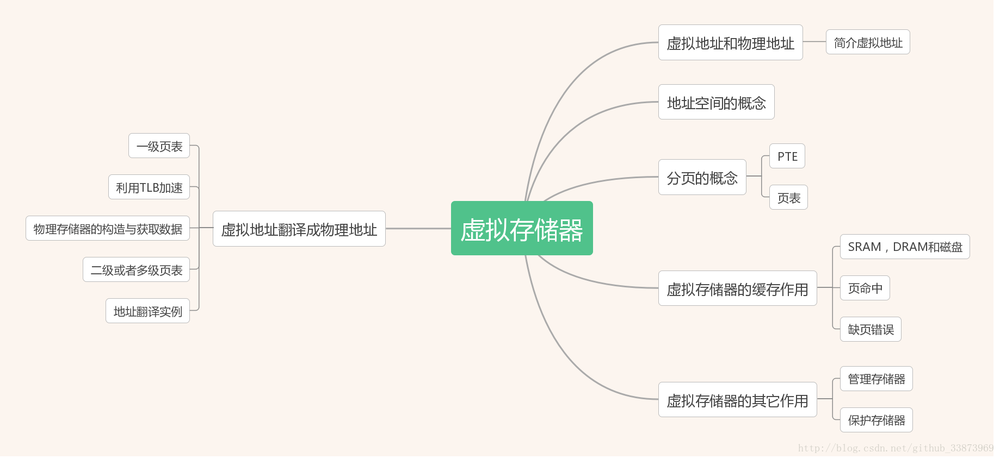

<!-- vim-markdown-toc GFM -->

* [操作系统](#操作系统)
    * [进程与线程](#进程与线程)
        * [多进程](#多进程)
        * [多线程](#多线程)
        * [为何引入线程](#为何引入线程)
        * [同一进程间的线程究竟共享哪些资源呢，而又各自独享哪些资源呢？](#同一进程间的线程究竟共享哪些资源呢而又各自独享哪些资源呢)
        * [线程和进程各自有什么区别和优劣呢？](#线程和进程各自有什么区别和优劣呢)
    * [2 调度算法](#2-调度算法)
    * [3 死锁](#3-死锁)
    * [4 程序编译与链接](#4-程序编译与链接)
        * [1 预处理](#1-预处理)
        * [2 编译](#2-编译)
        * [3 汇编](#3-汇编)
        * [4 链接](#4-链接)
    * [5 静态链接和动态链接](#5-静态链接和动态链接)
    * [6 虚拟存储器](#6-虚拟存储器)
        * [虚拟存储器概念](#虚拟存储器概念)
        * [虚拟存储器作用](#虚拟存储器作用)
        * [虚拟存储器总结](#虚拟存储器总结)
    * [7 分页和分段](#7-分页和分段)
        * [分页与分段的主要区别](#分页与分段的主要区别)
    * [8 页面置换算法](#8-页面置换算法)
    * [9 边沿触发和水平触发](#9-边沿触发和水平触发)
    * [10 Free List](#10-free-list)
        * [一、介绍](#一介绍)
        * [二、C++实现](#二c实现)

<!-- vim-markdown-toc -->

# 操作系统

## 进程与线程
### 多进程
**进程是资源（CPU、内存等）分配的基本单位，它是程序执行时的一个实例**。程序运行时系统就会创建一个进程，并为它分配资源，然后把该进程放入进程就绪队列，
进程调度器选中它的时候就会为它分配CPU时间，程序开始真正运行。

Linux系统函数fork()可以在父进程中创建一个子进程，这样的话，在一个进程接到来自客户端新的请求时就可以复制出一个子进程让其来处理，父进程只需负责监控请求的到来，
然后创建子进程让其去处理，这样就能做到并发处理。

```
# -*- coding:utf-8 -*-
import os

print('当前进程:%s 启动中 ....' % os.getpid())
pid = os.fork()
if pid == 0:
    print('子进程:%s,父进程是:%s' % (os.getpid(), os.getppid()))
else:
    print('进程:%s 创建了子进程:%s' % (os.getpid(),pid ))
输出结果：

当前进程:27223 启动中 ....
进程:27223 创建了子进程:27224
子进程:27224,父进程是:27223
```

fork函数会返回两次结果，因为操作系统会把当前进程的数据复制一遍，然后程序就分两个进程继续运行后面的代码，fork分别在父进程和子进程中返回，
在子进程返回的值pid永远是0，在父进程返回的是子进程的进程id。

### 多线程
线程是程序执行时的最小单位，它是进程的一个执行流， **是CPU调度和分派的基本单位**，一个进程可以由很多个线程组成，线程间共享进程的所有资源，
每个线程有自己的堆栈和局部变量。线程由CPU独立调度执行，在多CPU环境下就允许多个线程同时运行。同样多线程也可以实现并发操作，每个请求分配一个线程来处理。

### 为何引入线程

1. 应用的需要（实现不同的功能）。比如打开一个浏览器，我想一边浏览网页，一边下载文件，一边播放音乐。如果一个浏览器是一个进程，那么这样的需求需要线程机制。

2. 开销的考虑。在进程内创建、终止线程比创建、终止进程要快。同一进程内的线程间切换比进程间的切换要快,尤其是用户级线程间的切换。线程之间相互通信无须通过内核
（同一进程内的线程共享内存和文件）

3. 性能的考虑。多个线程中，任务功能不同（有的负责计算，有的负责I/O）,如果有多个处理器，一个进程就可以有很多的任务同时在执行。

### 同一进程间的线程究竟共享哪些资源呢，而又各自独享哪些资源呢？
共享的资源有  

1. 堆  由于堆是在进程空间中开辟出来的，所以它是理所当然地被共享的；因此new出来的都是共享的（16位平台上分全局堆和局部堆，局部堆是独享的）
2. 全局变量 它是与具体某一函数无关的，所以也与特定线程无关；因此也是共享的
3. 静态变量 虽然对于局部变量来说，它在代码中是“放”在某一函数中的，但是其存放位置和全局变量一样，存于堆中开辟的.bss和.data段，是共享的
4. 文件等公用资源  这个是共享的，使用这些公共资源的线程必须同步。Win32 提供了几种同步资源的方式，包括信号、临界区、事件和互斥体。

独享的资源有

1. 栈 栈是独享的
2. 寄存器  这个可能会误解，因为电脑的寄存器是物理的，每个线程去取值难道不一样吗？其实线程里存放的是副本，包括程序计数器PC

线程共享的环境包括：进程代码段、进程的公有数据(利用这些共享的数据，线程很容易的实现相互之间的通讯)、进程打开的文件描述符、信号的处理器、
进程的当前目录和进程用户ID与进程组ID。

### 线程和进程各自有什么区别和优劣呢？

* 进程是资源分配的基本单位，线程是程序执行（CPU调度）的基本单位。
* 进程有自己的 **独立地址空间**，每启动一个进程，系统就会为它分配地址空间，建立数据表来维护代码段、堆栈段和数据段，这种操作非常昂贵。而线程是共享进程中的数据的，
使用相同的地址空间，因此CPU切换一个线程的花费远比进程要小很多，同时创建一个线程的开销也比进程要小很多。
* 线程之间的通信更方便，同一进程下的线程共享全局变量、静态变量等数据，而进程之间的通信需要以通信的方式（IPC)进行。不过如何处理好同步与互斥是编写多线程程序的难点。
* 但是多进程程序更健壮。多线程环境中，父线程终止，全部子线程被迫终止(没有了资源)。而任何一个子线程终止一般不会影响其他线程，除非子线程执行了exit()系统调用。
任何一个子线程执行exit()，全部线程同时灭亡；一个进程死掉并不会对另外一个进程造成影响，因为进程有自己独立的地址空间。

《Unix网络编程》的原话是这么说的---：

fork is expensive. Memory is copied from the parent to the child, all descriptors are duplicated in the child, and so on. 
Current implementations use a technique called copy-on-write, which avoids a copy of the parent's data space to the child until 
the child needs its own copy. But, regardless of this optimization, fork is expensive.

IPC is required to pass information between the parent and child after the fork. Passing information from the parent to the child 
before the fork is easy, since the child starts with a copy of the parent's data space and with a copy of all the parent's descriptors. 
But, returning information from the child to the parent takes more work.

Threads help with both problems. Threads are sometimes called lightweight processes since a thread is "lighter weight" than a process. 
That is, thread creation can be 10–100 times faster than process creation.

All threads within a process share the same global memory. This makes the sharing of information easy between the threads, 
but along with this simplicity comes the problem

## 2 调度算法

1. 先来先服务(FCFS, First Come First Serve)
2. 短作业优先(SJF, Shortest Job First)
3. 最高优先权调度(Priority Scheduling)
4. 时间片轮转(RR, Round Robin)
5. 多级反馈队列调度(multilevel feedback queue scheduling)

实时调度算法:

1. 最早截至时间优先 EDF
2. 最低松弛度优先 LLF

## 3 死锁
原因:

1. 竞争资源
2. 程序推进顺序不当

必要条件:

1. 互斥条件
2. 请求和保持条件
3. 不剥夺条件
4. 环路等待条件

处理死锁基本方法:

1. 预防死锁(摒弃除1以外的条件)
2. 避免死锁(银行家算法)
3. 检测死锁(资源分配图)
4. 解除死锁
    1. 剥夺资源
    2. 撤销进程


## 4 程序编译与链接

推荐: http://www.ruanyifeng.com/blog/2014/11/compiler.html

Bulid过程可以分解为4个步骤:预处理(Prepressing), 编译(Compilation)、汇编(Assembly)、链接(Linking)

以c语言为例:

### 1 预处理

预编译过程主要处理那些源文件中的以“#”开始的预编译指令，主要处理规则有：

1. 将所有的“#define”删除，并展开所用的宏定义
2. 处理所有条件预编译指令，比如“#if”、“#ifdef”、 “#elif”、“#endif”
3. 处理“#include”预编译指令，将被包含的文件插入到该编译指令的位置，注：此过程是递归进行的
4. 删除所有注释
5. 添加行号和文件名标识，以便于编译时编译器产生调试用的行号信息以及用于编译时产生编译错误或警告时可显示行号
6. 保留所有的#pragma编译器指令。

### 2 编译

编译过程就是把预处理完的文件进行一系列的词法分析、语法分析、语义分析及优化后生成相应的汇编代码文件。这个过程是整个程序构建的核心部分。

### 3 汇编

汇编器是将汇编代码转化成机器可以执行的指令，每一条汇编语句几乎都是一条机器指令。经过编译、链接、汇编输出的文件成为目标文件(Object File)

### 4 链接

链接的主要内容就是把各个模块之间相互引用的部分处理好，使各个模块可以正确的拼接。
链接的主要过程包块 地址和空间的分配（Address and Storage Allocation）、符号决议(Symbol Resolution)和重定位(Relocation)等步骤。

## 5 静态链接和动态链接

静态链接方法：静态链接的时候，载入代码就会把程序会用到的动态代码或动态代码的地址确定下来
静态库的链接可以使用静态链接，动态链接库也可以使用这种方法链接导入库

动态链接方法：使用这种方式的程序并不在一开始就完成动态链接，而是直到真正调用动态库代码时，载入程序才计算(被调用的那部分)动态代码的逻辑地址，然后等到某个时候，程序又需要调用另外某块动态代码时，载入程序又去计算这部分代码的逻辑地址，所以，这种方式使程序初始化时间较短，但运行期间的性能比不上静态链接的程序

## 6 虚拟存储器

[深入理解虚拟存储器](https://blog.csdn.net/github_33873969/article/details/78460522)

### 虚拟存储器概念
**虚拟存储器是对主存的一个抽象**。支持虚拟存储器的处理器通过使用一种叫做虚拟寻址的间接形式来引用主存。处理器产生一个虚拟地址，在被发送到主存之前，这个地址
被翻译成一个物理地址。从虚拟地址空间到物理地址空间的地址翻译要求硬件和软件紧密合作。专门的硬件通过使用页表来翻译虚拟地址，而页表的内容是由操作系统提供的。

### 虚拟存储器作用

1. 它将主存看成是一个存储在磁盘上的地址空间的高速缓存，在主存中只保存活动区域，并根据需要在磁盘和主存之间来回传送数据，通过这种方式，它高效地使用了主存。
2. 它为每个进程提供了 **一致的地址空间**，从而简化了存储器管理，进而又简化了链接、在进程间共享数据、进程的存储器分配以及程序加载。
3. 它保护了每个进程的地址空间不被其他进程破坏。虚拟存储器通过在每条页表条目中加入 **保护位**，从而简化了存储器保护。

### 虚拟存储器总结



## 7 分页和分段

分页: 用户程序的地址空间被划分成若干固定大小的区域，称为“页”，相应地，内存空间分成若干个物理块，页和块的大小相等。可将用户程序的任一页放在内存的任一块中，实现了离散分配。

分段: 将用户程序地址空间分成若干个大小不等的段，每段可以定义一组相对完整的逻辑信息。存储分配时，以段为单位，段与段在内存中可以不相邻接，也实现了离散分配。

### 分页与分段的主要区别

1. 页是信息的物理单位,分页是为了实现非连续分配,以便解决内存碎片问题,或者说分页是由于系统管理的需要.段是信息的逻辑单位,它含有一组意义相对完整的信息,分段的目的是为了更好地实现共享,满足用户的需要.
2. 页的大小固定,由系统确定,将逻辑地址划分为页号和页内地址是由机器硬件实现的.而段的长度却不固定,决定于用户所编写的程序,通常由编译程序在对源程序进行编译时根据信息的性质来划分.
3. 分页的作业地址空间是一维的.分段的地址空间是二维的.

## 8 页面置换算法

1. 最佳置换算法OPT:不可能实现
2. 先进先出FIFO
3. 最近最久未使用算法LRU:最近一段时间里最久没有使用过的页面予以置换.
4. clock算法

## 9 边沿触发和水平触发

边缘触发是指每当状态变化时发生一个 io 事件，条件触发是只要满足条件就发生一个 io 事件

## 10 Free List
原题
常常会有频繁申请、释放内存的需求，比如在发送网络报文时，每次都要分配内存以存储报文，等报文发送完成后又需要删除报文。

为了避免频繁的new/delete对系统带来的开销，需要实现一个通用的FreeList机制。使用者总是从free list中分配内存，如果存在没有使用的内存块就直接摘出来使用，如果没有的话再从系统中分配。使用完毕后并不去直接delete该内存块，而是交给FreeList保管。

要求：

实现一个对固定大小内存块进行管理的通用FreeList类，给出定义和实现。要求不能使用STL中的容器类。定义类的接口和实现时注意通用性、健壮性和可测试性。
如果该类的对象可能会被多个thread同时访问，请描述如何怎样保证线程安全。有没有办法在保证线程安全的同时尽可能增大并发度？如果有也请描述你的思路。


### 一、介绍
“可利用空间表” 是 **动态内存管理**的一种方法。通过把空闲内存划分成固定大小的数据块，而且利用指针字段把这些数据块链接起来，并使用一个指针指向首结点，这样就形成了一个单链表，即可利用空间表（free list）。

当用户请求分配时，系统从可利用空间表中删除一个结点分配之；当用户释放其所占内存时，系统即回收并将它插入到可利用空间表中，因此，可利用空间表亦称为“存储池”。

可利用空间表有三种结点结构：

**结点大小相同**：把内存分为大小相同的若干块，将各块链接起来，分配时从头上摘取，用完后插入到头上，这实际是链式栈。

**结点有若干规格**：当用户所需内存量不同，但只允许在几种规格间选取。这种情况下，可利用空间表中可以维护几条链表，同一链表中的结点大小相同。如大小为2、4、8字节，可以构造3个链表。

**结点大小不等**：内存块大小不固定，只有一个链表。通常操作系统的可利用空间表属于此类。即可利用空间表中只有一个大小为整个存储区的结点。随着分配和回收的进行，可利用空间表的结点大小和个数也随之而变化。—— 由于结点的大小不同，在分配时并不是可利用空间表中的任一结点都能满足，而需要按照申请的长度在可利用空间表中进行检索，找到其长度大于等于申请长度的结点，从中截取合适的长度。这就涉及到分配策略：

   **首次适配法**：从链表头指针开始查找，找到第一个大于等于所需空间的结点即分配。（分配时查询，释放时插入表头）

   **最佳适配法**：要求结点从小到大排列，找到第一个大于等于所需空间的结点即分配。（分配和回收时都需要查询）

   **最差适配法**：要求结点从大到小排列，总从第一个结点开始分配。（分配时不需查询，回收时查询）

三种分配策略适合于不同的情况，首次适配法的优点是速度快，缺点是可能把较大块拆分成较小的块，导致后来对大块的申请难以满足 —— 这种分配策略适合于系统事先不掌握运行期间可能出现的请求分配和释放的信息的情况。最佳适配法的优点是使无法满足大请求块的可能性降到最低，但可能导致严重的外部碎片问题 —— 这种分配策略适合请求分配内存大小范围较广的系统。最差适配法的优点是使得空闲块长度趋于一致，适合于分配请求长度比较均匀的情况。


### 二、C++实现
根据题目要求，实现一个对固定大小内存块进行管理的通用FreeList类，即结点大小相同。其实这是最简单的一种实现，注意几个实现要点：

一个静态成员指针static FreeList* freelist，用来指向可利用空间表。

重载 new 和 delete。

示例代码：
```
template <typename Elem>
class FreeList
{
private:
	static FreeList<Elem> *freelist;
public:
	Elem element;
	FreeList *next;
	FreeList(const Elem& elem, FreeList* next=NULL);
	FreeList(FreeList* next=NULL);
	void* operator new(size_t);    // 重载new
	void operator delete(void*);   // 重载delete
};


template <typename Elem>
FreeList<Elem>* FreeList<Elem>::freelist = NULL;

template <typename Elem>
FreeList<Elem>::FreeList(const Elem& elem, FreeList* next)
{
	this->element = elem;
	this->next = next;
}

template <typename Elem>
FreeList<Elem>::FreeList(FreeList* next)
{
	this->next = next;
}

template <typename Elem>
void* FreeList<Elem>::operator new(size_t)
{
	/*freelist没有可用空间，就从系统分配*/
	if(freelist == NULL)  
		return ::new FreeList;

	/*否则，从freelist表头摘取结点*/
	FreeList<Elem>* temp = freelist;
	freelist = freelist->next;
	return temp;
}

template <typename Elem>
void FreeList<Elem>::operator delete(void* ptr)
{
	/*把要释放的结点空间加入到freelist中*/
	((FreeList<Elem>*)ptr)->next = freelist;
	freelist = (FreeList<Elem>*)ptr;
}
```

至于线程安全的问题，在多线程的环境下，线程同步的方式有多种： **临界区、事件、互斥量、信号量**。比如，我们可以把访问该类对象的代码段设置为 Critical Section，
这样同一时间就只有一个线程可以执行这段代码。为了尽可能增大并发度，更好的方式是将代码改造成对临界数据的保护而不是对临界代码的保护，这样就可以令不会同时访问相同临界数据
的线程完全并行地执行。
