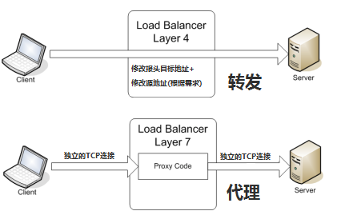

<!-- vim-markdown-toc GFM -->

* [负载均衡算法及主流算法](#负载均衡算法及主流算法)
    * [负载均衡](#负载均衡)
    * [负载均衡分类](#负载均衡分类)
        * [DNS域名解析负载均衡](#dns域名解析负载均衡)
        * [二层负载均衡](#二层负载均衡)
        * [三层负载均衡](#三层负载均衡)
        * [四层负载均衡](#四层负载均衡)
        * [七层负载均衡](#七层负载均衡)
        * [四层、七层负载均衡区别](#四层七层负载均衡区别)
    * [负载均衡算法](#负载均衡算法)
        * [随机（Random）法](#随机random法)
        * [加权随机（Weight Random）法](#加权随机weight-random法)
        * [轮询（Round Robin）法](#轮询round-robin法)
        * [加权轮询（Weight Round Robin）法](#加权轮询weight-round-robin法)
        * [源地址哈希（Hash）法](#源地址哈希hash法)
        * [最小连接数（Least Connections）法](#最小连接数least-connections法)
* [Nginx](#nginx)
    * [概述](#概述)
    * [Nginx特点](#nginx特点)
    * [Nginx工作模式](#nginx工作模式)
    * [Nginx参数配置demo](#nginx参数配置demo)
* [Nginx流量控制](#nginx流量控制)
    * [限流算法](#限流算法)
        * [令牌桶算法](#令牌桶算法)
        * [漏桶算法（leaky bucket）](#漏桶算法leaky-bucket)
    * [Nginx限流算法](#nginx限流算法)
        * [常规配置](#常规配置)
        * [处理突发](#处理突发)
        * [无延迟的排队](#无延迟的排队)
* [Zookeeper](#zookeeper)
    * [定义](#定义)
    * [重要概念](#重要概念)
    * [ZooKeeper 特点](#zookeeper-特点)
    * [ZooKeeper 集群角色介绍](#zookeeper-集群角色介绍)

<!-- vim-markdown-toc -->
# 负载均衡算法及主流算法

[负载均衡算法及手段](https://segmentfault.com/a/1190000004492447#articleHeader12)  
[几种简单的负载均衡算法及其Java代码实现](https://www.cnblogs.com/xrq730/p/5154340.html)

## 负载均衡
**负载平衡（Load balancing）** 是一种计算机技术，用来在多个计算机（计算机集群）、网络连接、CPU、磁盘驱动器或其他资源中分配负载，以达到
**最优化资源使用、最大化吞吐率、最小化响应时间、同时避免过载**的目的。   
使用带有负载平衡的多个服务器组件，取代单一的组件，可以 **通过冗余提高可靠性**。负载平衡服务通常是由专用软件和硬件来完成。 主要作用是将大量作业
合理地分摊到多个操作单元上进行执行，用于解决互联网架构中的 **高并发和高可用**的问题。

## 负载均衡分类

**最常用的是四层和七层负载均衡**

[四层、七层负载均衡的区别](https://cloud.tencent.com/developer/article/1082047)  

[四层、七层负载均衡的区别](https://www.jianshu.com/p/fa937b8e6712)


### DNS域名解析负载均衡


在DNS服务器中应该配置了多个A记录，如：  
      www.apusapp.com IN A 114.100.20.201;  
      www.apusapp.com IN A 114.100.20.202;  
      www.apusapp.com IN A 114.100.20.203;  
因此，每次域名解析请求都会根据对应的负载均衡算法计算出一个不同的IP地址并返回，这样A记录中配置多个服务器就可以构成一个集群，并可以实现负载均衡。

### 二层负载均衡


负载均衡服务器对外提供一个VIP（虚IP），集群中不同的机器采用相同IP地址，但是机器的MAC地址不一样。当负载均衡服务器接受到请求之后，通过改写报文的
目标MAC地址的方式将请求转发到目标机器实现负载均衡。

### 三层负载均衡


和二层负载均衡类似，负载均衡服务器对外依然提供一个VIP（虚IP），但是集群中不同的机器采用不同的IP地址。当负载均衡服务器接受到请求之后，根据不同的
负载均衡算法，通过IP将请求转发至不同的真实服务器。

### 四层负载均衡



四层负载均衡工作在OSI模型的传输层，由于在传输层，只有TCP/UDP协议，这两种协议中除了包含源IP、目标IP以外，还包含源端口号及目的端口号。四层
负载均衡服务器在接受到客户端请求后，以后通过修改数据包的地址信息（IP+端口号）将流量转发到应用服务器。

### 七层负载均衡

七层负载均衡工作在OSI模型的应用层，应用层协议较多，常用http、radius、dns等。七层负载就可以基于这些协议来负载。这些应用层协议中会包含很多
有意义的内容。比如同一个Web服务器的负载均衡，除了根据IP加端口进行负载外，还可根据七层的URL、浏览器类别、语言来决定是否要进行负载均衡。

对于一般的应用来说，有了Nginx就够了。Nginx可以用于七层负载均衡。但是对于一些大的网站，一般会采用DNS+四层负载+七层负载的方式进行多层次负载均衡。

### 四层、七层负载均衡区别

负载均衡器通常称为四层交换机或七层交换机。

四层交换机主要分析 IP 层及 TCP/UDP 层，实现四层 **流量**负载均衡。  
七层交换机除了支持四层负载均衡以外，还有分析应用层的信息，如 HTTP 协议 URI 或 Cookie 信息。

负载均衡分为 L4 Switch（四层交换），即在 OSI 第 4 层工作，就是 TCP 层。此种 Load Balancer 不理解应用协议（如 HTTP/FTP/MySQL 等等）。例子：LVS，F5。

另一种叫做 L7 Switch（七层交换），OSI 的最高层，应用层。此时，该 Load Balancer 能理解应用协议。例子： HAProxy，MySQL Proxy。

**4层负载均衡本质是转发，而7层负载本质是内容交换和代理**，具体说明如下：

**所谓四层负载均衡，也就是主要通过报文中的目标地址和端口，再加上负载均衡设备设置的服务器选择方式，决定最终选择的内部服务器。**

以常见的 TCP 为例，负载均衡设备在接收到第一个来自客户端的 SYN 请求时，即通过上述方式选择一个最佳的服务器， 并对报文中的目标 IP 地址进行
修改(改为后端服务器IP），直接转发给该服务器。TCP 的连接建立，即三次握手是客户端和服务器直接建立的，负载均衡设备只是起到一个类似路由器的转发动作。

在某些部署情况下，为保证服务器回包可以正确返回给负载均衡设备，在转发报文的同时可能还会对报文原来的源地址进行修改。

**所谓七层负载均衡，也称为“内容交换”，也就是主要通过报文中的真正有意义的应用层内容，再加上负载均衡设备设置的服务器选择方式，决定最终选择的内部服务器。** 

以常见的TCP为例，负载均衡设备如果要根据真正的应用层内容再选择服务器，只能先代理最终的服务器和客户端建立连接（TCP 三次握手）后，才可能接收到客户端
发送的真正应用层内容的报文， 然后再根据该报文中的特定字段，再加上负载均衡设备设置的服务器选择方式，决定最终选择的内部服务器。

负载均衡设备在这种情况下，更类似于一个代理服务器。负载均衡和前端的客户端以及后端的服务器会分别建立 TCP 连接。所以从这个技术原理上来看，七层负载均衡
明显地对负载均衡设备的要求更高，处理七层的能力也必然会低于四层模式的部署方式。  

七层应用负载均衡的好处，是使得整个网络更“智能化”, 例如访问一个网站的用户流量，可以通过七层的方式，将对图片类的请求转发到特定的图片服务器并可以
使用缓存技术；将对文字类的请求可以转发到特定的文字服务器并可以使用压缩技术。

## 负载均衡算法

### 随机（Random）法
基于概率统计的理论，吞吐量越大，随机算法的效果越接近于轮询算法的效果。

### 加权随机（Weight Random）法
根据后端服务器不同的配置和负载情况来配置不同的权重

### 轮询（Round Robin）法

轮询法的优点在于：试图做到请求转移的绝对均衡。

轮询法的缺点在于：为了做到请求转移的绝对均衡，必须付出相当大的代价，因为为了保证当前轮询的位置变量pos修改的互斥性，需要引入重量级的悲观锁synchronized，
这将会导致该段轮询代码的并发吞吐量发生明显的下降。

### 加权轮询（Weight Round Robin）法
不同的服务器可能机器配置和当前系统的负载并不相同，因此它们的抗压能力也不尽相同，给配置高、负载低的机器配置更高的权重，让其处理更多的请求，
而低配置、高负载的机器，则给其分配较低的权重，降低其系统负载。

实现方式：根据权重的大小，将地址重复地增加到服务器地址列表中，权重越大，该服务器每轮所获得的请求数量越多。比如服务器1权重1，服务器2权重2，
服务器3权重3，则顺序为1-2-2-3-3-3-1-2-2-3-3-3- ......

### 源地址哈希（Hash）法
优点：保证了相同客户端IP地址将会被哈希到同一台后端服务器，直到后端服务器列表变更。根据此特性可以在服务消费者与服务提供者之间建立有状态的session会话。

缺点：除非集群中服务器的非常稳定，基本不会上下线，否则一旦有服务器上线、下线，那么通过源地址哈希算法路由到的服务器是服务器上线、下线前路由到的
服务器的概率非常低，如果是session则取不到session，如果是缓存则可能引发"雪崩"

### 最小连接数（Least Connections）法
以后端服务器的视角来观察系统的负载，而非请求发起方来观察。

根据后端服务器当前的连接情况，动态地选取其中当前积压连接数最少的一台服务器来处理当前请求，尽可能地提高后端服务器的利用效率，将负载合理地分流到每一台机器

# Nginx

[8分钟带你深入浅出搞懂Nginx](https://zhuanlan.zhihu.com/p/34943332)

[Nginx详解-服务器集群](https://www.cnblogs.com/jiekzou/p/4486447.html)


## 概述
Nginx（发音同engine x）是异步框架的网页服务器，也可以用作反向代理、负载平衡器和HTTP缓存。该软件由伊戈尔·赛索耶夫创建并于2004年首次公开发布。
由于它的内存占用少，启动极快，高并发能力强，在互联网项目中广泛应用。

## Nginx特点

* 跨平台：Nginx 可以在大多数 Unix like OS编译运行，而且也有Windows的移植版本。
* 配置异常简单：非常容易上手。
* 非阻塞、高并发连接：数据复制时，磁盘I/O的第一阶段是非阻塞的。官方测试能够支撑5万并发连接，在实际生产环境中跑到2～3万并发连接数.(这得益于Nginx使用了最新的epoll模型)
* 事件驱动：通信机制采用epoll模型，支持更大的并发连接。

* nginx代理和后端web服务器间无需长连接；
* 接收用户请求是异步的，即先将用户请求全部接收下来，再一次性发送后后端web服务器，极大的减轻后端web服务器的压力
* 发送响应报文时，是边接收来自后端web服务器的数据，边发送给客户端的
* 网络依赖型低。NGINX对网络的依赖程度非常低，理论上讲，只要能够ping通就可以实施负载均衡，而且可以有效区分内网和外网流量
* 支持服务器检测。NGINX能够根据应用服务器处理页面返回的状态码、超时信息等检测服务器是否出现故障，并及时返回错误的请求重新提交到其它节点上

## Nginx工作模式


nginx是以多进程的方式来工作的，当然nginx也是支持多线程的方式的,只是我们主流的方式还是多进程的方式，也是nginx的默认方式。nginx采用多进程的方式有诸多好处。

1. nginx在启动后，会有一个master进程和多个worker进程。master进程主要用来管理worker进程，包含：接收来自外界的信号，向各worker进程发送信号，
监控 worker进程的运行状态,当worker进程退出后(异常情况下)，会自动重新启动新的worker进程。而基本的网络事件，则是放在worker进程中来处理了。
多个worker进程之间是对等的，他们同等竞争来自客户端的请求，各进程互相之间是独立的 。一个请求，只可能在一个worker进程中处理，一个worker进程，
不可能处理其它进程的请求。 worker进程的个数是可以设置的，一般我们会设置与机器cpu核数一致，这里面的原因与nginx的进程模型以及事件处理模型是分不开的。

2. Master接收到信号以后怎样进行处理（./nginx -s reload ）?首先master进程在接到信号后，会先重新加载配置文件，然后再启动新的进程，
并向所有老的进程发送信号，告诉他们可以光荣退休了。新的进程在启动后，就开始接收新的请求，而老的进程在收到来自master的信号后，就不再接收新的请求，
并且在当前进程中的所有未处理完的请求处理完成后，再退出。

3. worker进程又是如何处理请求的呢？我们前面有提到，worker进程之间是平等的，每个进程，处理请求的机会也是一样的。当我们提供80端口的http服务时，
一个连接请求过来，每个进程都有可能处理这个连接，怎么做到的呢？首先，每个worker进程都是从master进程fork过来，在master进程里面，先建立好需要
listen的socket之后，然后再fork出多个worker进程，这样每个worker进程都可以去accept这个socket(当然不是同一个socket，只是每个进程的这个
socket会监控在同一个ip地址与端口，这个在网络协议里面是允许的)。一般来说，当一个连接进来后，所有在accept在这个socket上面的进程，都会收到通知，
而只有一个进程可以accept这个连接，其它的则accept失败，这是所谓的惊群现象。当然，nginx也不会视而不见，所以nginx提供了一个accept_mutex这个东西，
从名字上，我们可以看这是一个加在accept上的一把共享锁。有了这把锁之后，同一时刻，就只会有一个进程在accpet连接，这样就不会有惊群问题了。
accept_mutex是一个可控选项，我们可以显示地关掉，默认是打开的。当一个worker进程在accept这个连接之后，就开始读取请求，解析请求，处理请求，产生数据后，
再返回给客户端，最后才断开连接，这样一个完整的请求就是这样的了。我们可以看到，一个请求，完全由worker进程来处理，而且只在一个worker进程中处理。

4. nginx采用这种进程模型有什么好处呢？采用独立的进程，可以互相之间不会影响，一个进程退出后，其它进程还在工作，服务不会中断，master进程则很快
重新启动新的worker进程。当然，worker进程的异常退出，肯定是程序有bug了，异常退出，会导致当前worker上的所有请求失败，不过不会影响到所有请求，
所以降低了风险。当然，好处还有很多，大家可以慢慢体会。

5. 有人可能要问了，nginx采用多worker的方式来处理请求，每个worker里面只有一个主线程，那能够处理的并发数很有限啊，多少个worker就能处理多少个并发，
何来高并发呢？非也，这就是nginx的高明之处，nginx采用了异步非阻塞的方式来处理请求，也就是说，nginx是可以同时处理成千上万个请求的 .
我们之前说过，推荐设置worker的个数为cpu的核数，在这里就很容易理解了，更多的worker数，只会导致进程来竞争cpu资源了，从而带来不必要的上下文切换。
而且，nginx为了更好的利用多核特性，提供了cpu亲缘性的绑定选项，我们可以将某一个进程绑定在某一个核上，这样就不会因为进程的切换带来cache的失效。
 
 

## Nginx参数配置demo

```
#定义Nginx运行的用户和用户组        
    user www www;              
    #nginx进程数，建议设置为等于CPU总核心数。        
    worker_processes 8;        
      
    #全局错误日志定义类型，[ debug | info | notice | warn | error | crit ]  
      
    error_log ar/loginx/error.log info;  
             
    #进程文件  
      
    pid ar/runinx.pid;        
       
    #一个nginx进程打开的最多文件描述符数目，理论值应该是最多打开文件数（系统的值ulimit -n）与nginx进程数相除，但是nginx分配请求并不均匀，  
    所以建议与ulimit -n的值保持一致。  
      
    worker_rlimit_nofile 65535;               
      
    #工作模式与连接数上限        
    events        
    {        
    #参考事件模型，use [ kqueue | rtsig | epoll | /dev/poll | select | poll ]; epoll模型是Linux 2.6以上版本内核中的高性能网络I/O模型，  
    如果跑在FreeBSD上面，就用kqueue模型。  
      
    use epoll;        
    #单个进程最大连接数（最大连接数=连接数*进程数）       
    worker_connections 65535;        
    }  
             
    #设定http服务器        
    http        
    {        
    include mime.types; #文件扩展名与文件类型映射表       
    default_type application/octet-stream; #默认文件类型        
    #charset utf-8; #默认编码        
    server_names_hash_bucket_size 128; #服务器名字的hash表大小        
    client_header_buffer_size 32k; #上传文件大小限制        
    large_client_header_buffers 4 64k; #设定请求缓冲       
    client_max_body_size 8m; #设定请求缓冲        
    sendfile on; #开启高效文件传输模式，sendfile指令指定nginx是否调用sendfile函数（zero copy 方式）来输出文件，对于普通应用设为 on，如果用来进行下载等应用磁盘IO重负载应用，  
    可设置为off，以平衡磁盘与网络I/O处理速度，降低系统的负载。注意：如果图片显示不正常把这个改成off。        
    autoindex on; #开启目录列表访问，合适下载服务器，默认关闭。        
    tcp_nopush on; #防止网络阻塞        
    tcp_nodelay on; #防止网络阻塞        
    keepalive_timeout 120; #长连接超时时间，单位是秒       
            
    #FastCGI相关参数是为了改善网站的性能：减少资源占用，提高访问速度。下面参数看字面意思都能理解。        
    fastcgi_connect_timeout 300;        
    fastcgi_send_timeout 300;        
    fastcgi_read_timeout 300;        
    fastcgi_buffer_size 64k;        
    fastcgi_buffers 4 64k;        
    fastcgi_busy_buffers_size 128k;        
    fastcgi_temp_file_write_size 128k;         
      
    #gzip模块设置        
    gzip on; #开启gzip压缩输出        
    gzip_min_length 1k; #最小压缩文件大小        
    gzip_buffers 4 16k; #压缩缓冲区        
    gzip_http_version 1.0; #压缩版本（默认1.1，前端如果是squid2.5请使用1.0）        
    gzip_comp_level 2; #压缩等级        
    gzip_types text/plain application/x-javascript text/css application/xml;  
      
    #压缩类型，默认就已经包含textml，所以下面就不用再写了，写上去也不会有问题，但是会有一个warn。        
    gzip_vary on;        
    #limit_zone crawler $binary_remote_addr 10m; #开启限制IP连接数的时候需要使用        
       
      
    upstream blog.ha97.com {        
    #upstream的负载均衡，weight是权重，可以根据机器配置定义权重。weigth参数表示权值，权值越高被分配到的几率越大。        
    server 192.168.80.121:80 weight=3;        
    server 192.168.80.122:80 weight=2;        
    server 192.168.80.123:80 weight=3;        
    }               
      
    #虚拟主机的配置        
    server       
    {        
    #监听端口        
    listen 80;        
    #域名可以有多个，用空格隔开        
    server_name www.ha97.com ha97.com;       
    index index.html index.htm index.php;        
    root /data/www/ha97;        
    location ~ .*.(php|php5)?$        
    {        
    fastcgi_pass 127.0.0.1:9000;        
    fastcgi_index index.php;        
    include fastcgi.conf;        
    }        
    #图片缓存时间设置        
    location ~ .*.(gif|jpg|jpeg|png|bmp|swf)$        
    {        
    expires 10d;        
    }        
    #JS和CSS缓存时间设置        
    location ~ .*.(js|css)?$        
    {        
    expires 1h;        
    }        
    #日志格式设定        
    log_format access '$remote_addr - $remote_user [$time_local] "$request" '        
    '$status $body_bytes_sent "$http_referer" '        
    '"$http_user_agent" $http_x_forwarded_for';  
      
    #定义本虚拟主机的访问日志       
    access_log ar/loginx/ha97access.log access;               
      
    #对 "/" 启用反向代理        
    location / {        
    proxy_pass http://127.0.0.1:88;        
    proxy_redirect off;        
    proxy_set_header X-Real-IP $remote_addr;  
      
    #后端的Web服务器可以通过X-Forwarded-For获取用户真实IP        
    proxy_set_header X-Forwarded-For $proxy_add_x_forwarded_for;  
      
    #以下是一些反向代理的配置，可选。  
      
    proxy_set_header Host $host;        
    client_max_body_size 10m; #允许客户端请求的最大单文件字节数        
    client_body_buffer_size 128k; #缓冲区代理缓冲用户端请求的最大字节数，        
    proxy_connect_timeout 90; #nginx跟后端服务器连接超时时间(代理连接超时)        
    proxy_send_timeout 90; #后端服务器数据回传时间(代理发送超时)        
    proxy_read_timeout 90; #连接成功后，后端服务器响应时间(代理接收超时)        
    proxy_buffer_size 4k; #设置代理服务器（nginx）保存用户头信息的缓冲区大小        
    proxy_buffers 4 32k; #proxy_buffers缓冲区，网页平均在32k以下的设置        
    proxy_busy_buffers_size 64k; #高负荷下缓冲大小（proxy_buffers*2）        
    proxy_temp_file_write_size 64k;  
      
    #设定缓存文件夹大小，大于这个值，将从upstream服务器传        
    }  
                 
    #设定查看Nginx状态的地址        
    location /NginxStatus {        
    stub_status on;        
    access_log on;        
    auth_basic "NginxStatus";        
    auth_basic_user_file confpasswd;        
    #htpasswd文件的内容可以用apache提供的htpasswd工具来产生。        
    }  
                   
    #本地动静分离反向代理配置        
    #所有jsp的页面均交由tomcat或resin处理        
    location ~ .(jsp|jspx|do)?$ {        
    proxy_set_header Host $host;        
    proxy_set_header X-Real-IP $remote_addr;        
    proxy_set_header X-Forwarded-For $proxy_add_x_forwarded_for;        
    proxy_pass http://127.0.0.1:8080;        
    }  
      
    #所有静态文件由nginx直接读取不经过tomcat或resin        
    location ~ .*.(htm|html|gif|jpg|jpeg|png|bmp|swf|ioc|rar|zip|txt|flv|mid|doc|ppt|pdf|xls|mp3|wma)$        
    { expires 15d; }        
    location ~ .*.(js|css)?$        
    { expires 1h; }        
    }        
    }
```   

# Nginx流量控制

[Nginx如何做流量控制](https://cloud.tencent.com/developer/article/1182207)

[nginx 限流配置](https://www.cnblogs.com/biglittleant/p/8979915.html)

## 限流算法

### 令牌桶算法


算法思想是：

* 令牌以固定速率产生，并缓存到令牌桶中； 
* 令牌桶放满时，多余的令牌被丢弃； 
* 请求要消耗等比例的令牌才能被处理； 
* 令牌不够时，请求被缓存。

### 漏桶算法（leaky bucket）


算法思想是：

* 水（请求）从上方倒入水桶，从水桶下方流出（被处理）；
* 来不及流出的水存在水桶中（缓冲），以固定速率流出；
* 水桶满后水溢出（丢弃）。

这个算法的核心是：缓存请求、匀速处理、多余的请求直接丢弃。

从作用上来说，漏桶和令牌桶算法最明显的区别就是是否允许突发流量(burst)的处理，漏桶算法能够强行限制数据的实时传输（处理）速率，对突发流量不做额外处理；
而令牌桶算法能够在限制数据的平均传输速率的同时允许某种程度的突发传输。

## Nginx限流算法

Nginx按请求速率限速模块使用的是 **漏桶算法**，即能够强行保证请求的实时处理速度不会超过设置的阈值。

### 常规配置

“流量限制”配置两个主要的指令，limit_req_zone和limit_req，如下所示：

```
limit_req_zone $binary_remote_addr zone=mylimit:10m rate=10r/s;

server {
    location /login/ {
        limit_req zone=mylimit;

        proxy_pass http://my_upstream;
    }
}
```

limit_req_zone指令定义了流量限制相关的参数，而limit_req指令在出现的上下文中启用流量限制(示例中，对于”/login/”的所有请求)。

limit_req_zone指令通常在HTTP块中定义，使其可在多个上下文中使用，它需要以下三个参数：

* Key - 定义应用限制的请求特性。示例中的Nginx变量$binary_remote_addr，保存客户端IP地址的二进制形式。这意味着，我们可以将每个不同的
IP地址限制到，通过第三个参数设置的请求速率。(使用该变量是因为比字符串形式的客户端IP地址$remote_addr，占用更少的空间)

* Zone - 定义用于存储每个IP地址状态以及被限制请求URL访问频率的 **共享内存区域**。保存在内存共享区域的信息，意味着可以在Nginx的worker进程之间共享。
定义分为两个部分：通过zone=keyword标识区域的名字，以及冒号后面跟区域大小。16000个IP地址的状态信息，大约需要1MB，所以示例中区域可以存储160000个IP地址。

* Rate - 定义最大请求速率。在示例中，速率不能超过每秒10个请求。Nginx实际上以毫秒的粒度来跟踪请求，所以速率限制相当于每100毫秒1个请求。
因为不允许”突发情况”(见下一章节)，这意味着在前一个请求100毫秒内到达的请求将被拒绝。

limit_req_zone指令设置流量限制和共享内存区域的参数，但实际上并不限制请求速率。所以需要通过添加limit_req指令，将流量限制应用在特定的location或者server块。在上面示例中，我们对/login/请求进行流量限制。

现在每个IP地址被限制为每秒只能请求10次/login/，更准确地说，在前一个请求的100毫秒内不能请求该URL。

### 处理突发
如果我们在100毫秒内接收到2个请求，怎么办？对于第二个请求，Nginx将给客户端返回状态码503。这可能并不是我们想要的结果，因为应用本质上趋向于突发性。
相反地，我们希望缓冲任何超额的请求，然后及时地处理它们。我们更新下配置，在limit_req中使用burst参数：

```
location /login/ {
    limit_req zone=mylimit burst=20;
    proxy_pass http://my_upstream;
}
```

burst参数定义了超出zone指定速率的情况下(示例中的mylimit区域，速率限制在每秒10个请求，或每100毫秒一个请求)，客户端还能发起多少请求。上一个请求
100毫秒内到达的请求将会被放入队列，我们将队列大小设置为20。

这意味着，如果从一个给定IP地址发送21个请求，Nginx会立即将第一个请求发送到上游服务器群，然后将余下20个请求放在队列中。然后每100毫秒转发一个排队的请求，
只有当传入请求使队列中排队的请求数超过20时，Nginx才会向客户端返回503。

### 无延迟的排队
配置burst参数将会使通讯更流畅，但是可能会不太实用，因为该配置会使站点看起来很慢。在上面的示例中，队列中的第20个包需要等待2秒才能被转发，此时
返回给客户端的响应可能不再有用。要解决这个情况，可以在burst参数后添加nodelay参数：

```
location /login/ {
    limit_req zone=mylimit burst=20 nodelay;

    proxy_pass http://my_upstream;
}
```

使用nodelay参数，Nginx仍将根据burst参数分配队列中的位置，并应用已配置的速率限制，而不是清理队列中等待转发的请求。相反地，当一个请求到达“太早”时，
只要在队列中能分配位置，Nginx将 **立即转发**这个请求。将队列中的该位置标记为”taken”(占据)，并且不会被释放以供另一个请求使用，直到一段时间后才会被
释放(在这个示例中是，100毫秒后)。

假设如前所述，队列中有20个空位，从给定的IP地址发出的21个请求同时到达。Nginx会立即转发这个21个请求，并且标记队列中占据的20个位置，然后每100毫秒
释放一个位置。如果是25个请求同时到达，Nginx将会立即转发其中的21个请求，标记队列中占据的20个位置，并且返回503状态码来拒绝剩下的4个请求。

现在假设，第一组请求被转发后101毫秒，另20个请求同时到达。队列中只会有一个位置被释放，所以Nginx转发一个请求并返回503状态码来拒绝其他19个请求。
如果在20个新请求到达之前已经过去了501毫秒，5个位置被释放，所以Nginx立即转发5个请求并拒绝另外15个。

效果相当于每秒10个请求的“流量限制”。如果希望不限制两个请求间允许间隔的情况下实施“流量限制”，nodelay参数是很实用的。

注意：对于大部分部署，我们建议使用burst和nodelay参数来配置limit_req指令。

# Zookeeper

[可能是全网把 ZooKeeper 概念讲的最清楚的一篇文章](https://segmentfault.com/a/1190000016349824#articleHeader9)

[ZooKeeper基础](https://steflerjiang.github.io/2017/04/14/ZooKeeper%E5%9F%BA%E7%A1%80/)

## 定义
ZooKeeper 是一个开源的分布式协调服务。设计目标是将那些复杂且容易出错的分布式一致性服务封装起来，构成一个高效可靠的原语集，并以一系列简单易用的
接口提供给用户使用。

ZooKeeper 是一个典型的分布式数据一致性解决方案，分布式应用程序可以基于 ZooKeeper 实现诸如数据发布/订阅、负载均衡、命名服务、分布式协调/通知、
集群管理、Master 选举、分布式锁和分布式队列等功能。

## 重要概念

* ZooKeeper  本身就是一个分布式程序（只要半数以上节点存活，ZooKeeper  就能正常服务）。
* 为了保证高可用，最好是以集群形态来部署 ZooKeeper，这样只要集群中大部分机器是可用的（能够容忍一定的机器故障），那么 ZooKeeper 本身仍然是可用的。
*  ZooKeeper  将数据保存在内存中，这也就保证了 高吞吐量和低延迟（但是内存限制了能够存储的容量不太大，此限制也是保持znode中存储的数据量较小的进一步原因）。
*  ZooKeeper 是高性能的。 在“读”多于“写”的应用程序中尤其地高性能，因为“写”会导致所有的服务器间同步状态。（“读”多于“写”是协调服务的典型场景。）
* ZooKeeper有临时节点的概念。 当创建临时节点的客户端会话一直保持活动，瞬时节点就一直存在。而当会话终结时，瞬时节点被删除。持久节点是指一旦这个ZNode被创建了，除非主动进行ZNode的移除操作，否则这个ZNode将一直保存在Zookeeper上。
* ZooKeeper 底层其实只提供了两个功能：①管理（存储、读取）用户程序提交的数据；②为用户程序提交数据节点监听服务。

## ZooKeeper 特点
*  顺序一致性： 从同一客户端发起的事务请求，最终将会严格地按照顺序被应用到 ZooKeeper 中去。
*  原子性： 所有事务请求的处理结果在整个集群中所有机器上的应用情况是一致的，也就是说，要么整个集群中所有的机器都成功应用了某一个事务，要么都没有应用。
*  单一视图 ： 无论客户端连到哪一个 ZooKeeper 服务器上，其看到的服务端数据模型都是一致的。
*  可靠性： 一旦一次更改请求被应用，更改的结果就会被持久化，直到被下一次更改覆盖。

## ZooKeeper 集群角色介绍
ZooKeeper 中没有选择传统的 Master/Slave 概念，而是引入了Leader、Follower 和 Observer 三种角色。如下图所示


ZooKeeper 集群中的所有机器通过一个 Leader 选举过程来选定一台称为 “Leader” 的机器，Leader 既可以为客户端提供写服务又能提供读服务。
除了 Leader 外，Follower 和 Observer 都只能提供读服务。Follower 和 Observer 唯一的区别在于 Observer 机器不参与 Leader 的选举过程，
也不参与写操作的“过半写成功”策略，因此 Observer 机器可以在不影响写性能的情况下提升集群的读性能。


